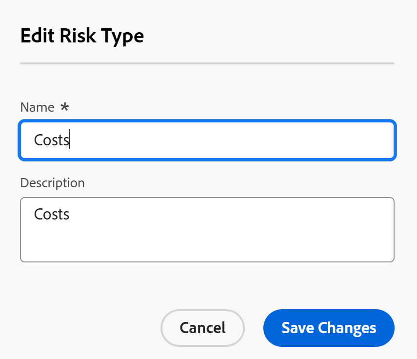
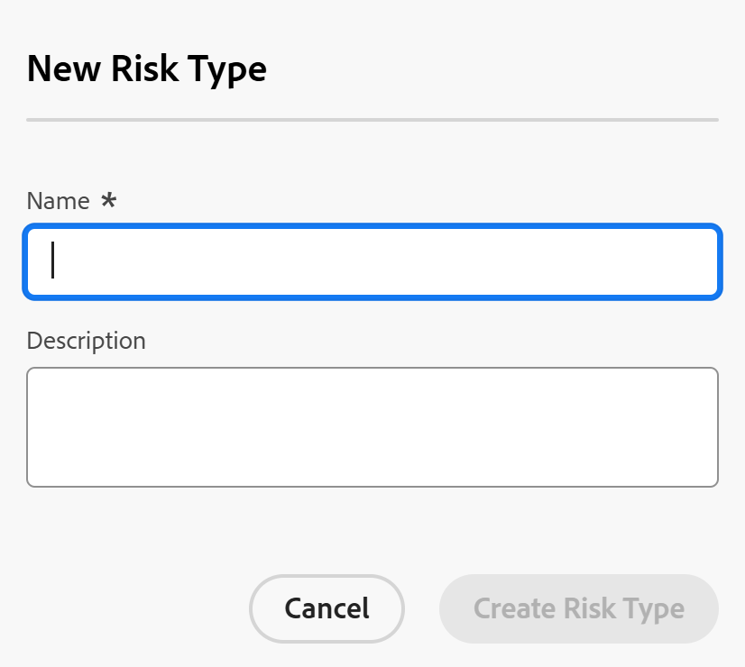

# 编辑和创建风险类型

<!--Audited: 03/2025-->

<!--DON'T DELETE, DRAFT OR HIDE THIS ARTICLE. IT IS LINKED TO THE PRODUCT, THROUGH THE CONTEXT SENSITIVE HELP LINKS.-->

<!--remove preview and production references-->

此页面上的信息引用了尚未公开的功能。 它仅在“预览”环境中对所有客户可用。 在发布到“预览”版之后，启用了“快速发布”的客户的生产环境中每月还会提供相同的功能。

有关快速发布的信息，请参阅[为您的组织启用或禁用快速发布](/help/quicksilver/administration-and-setup/set-up-workfront/configure-system-defaults/enable-fast-release-process.md)。

Adobe Workfront具有许多默认风险类型，您可以在计划阶段与项目关联，以在批准任何工作之前确定潜在障碍。

风险是可能会阻止项目按时完成或在预算内完成的事件。

除了默认风险类型之外，您还可以添加新的风险类型以反映组织中的需求。

您可以将风险类型与项目风险关联，以识别项目可能遇到的风险类型。

## 访问权限要求

+++ 展开可查看本文所述功能的访问权限要求。

<table style="table-layout:auto"> 
 <col> 
 <col> 
 <tbody> 
  <tr> 
   <td>[!DNL Adobe Workfront] 包</td> 
   <td>
“任一”
</td> 
  </tr> 
  <tr> 
   <td>[!DNL Adobe Workfront] 许可证</td> 
   <td>
[！UICONTROL标准版]

       
[！UICONTROL计划]
</td>
  </tr> 
  <tr> 
   <td>访问级别配置</td> 
   <td>[！UICONTROL系统管理员]</td> 
  </tr> 
 </tbody> 
</table>

有关信息，请参阅Workfront文档中的[访问要求](/help/quicksilver/administration-and-setup/add-users/access-levels-and-object-permissions/access-level-requirements-in-documentation.md)。

+++

## 风险类型

风险类型是用于风险分类的标签，用于对它们进行分类以用于报告目的。

作为[!DNL Workfront]管理员，您可以在&#x200B;[!UICONTROL **设置**]&#x200B;区域中创建[!UICONTROL 风险类型]。

设置风险类型后，它们对于您的系统通用。

所有项目所有者均可为他们的项目使用相同的风险类型。

## 编辑和创建风险类型

默认情况下，[!DNL Workfront]中已存在某些风险类型。

您可以执行以下操作来增加Workfront实例中的风险类型数量：

* [编辑现有风险类型](#edit-existing-risk-types)
* [创建风险类型](#create-risk-types)

### 编辑现有风险类型 {#edit-existing-risk-types}

{{step-1-to-setup}}

1. 单击&#x200B;**[!UICONTROL 风险类型]**。
1. 选择要编辑的风险类型。
1. 单击&#x200B;**[!UICONTROL 编辑]**&#x200B;图标。

   将打开&#x200B;[!UICONTROL **编辑风险类型**]&#x200B;框。

   

   >[!TIP]
   >
   >在风险类型列表中双击风险类型的名称或描述时，可以内联编辑风险类型信息。

1. （可选）更改风险类型的名称和描述。

   **[!UICONTROL Name]**&#x200B;和&#x200B;**[!UICONTROL Description]**&#x200B;字段的字符限制为50个字符。

1. 单击&#x200B;**[!UICONTROL 保存更改]。**

1. （可选）要删除风险类型，请在列表中选择该风险类型，单击&#x200B;[!UICONTROL **删除**]&#x200B;图标，然后单击&#x200B;[!UICONTROL **是，删除它**]。 风险类型已删除，无法恢复。

1. （可选）要导出风险类型列表，请单击&#x200B;[!UICONTROL **导出**]&#x200B;图标。 您可以导出到以下文件类型：

   <!--* In the Production environment:-->

   * PDF
   * Excel
   * Excel (xlsx)
   * 制表符分隔
   * CSV

   <!--
    PM confirmed that these lists should be the same: https://workfront.slack.com/archives/C05DPT67BD3/p1788465805975249?thread_ts=1788436678.273019&cid=C05DPT67BD3 
    

    * In the Preview environment: 

      * CSV
      * XLSX 
    

    -->

   >[!TIP]
   >
   >   在“生产”环境中，您可以首先选择有限数量的风险类型，然后将它们导出为较小的列表。
   >
   > 此功能已从预览环境中删除。 <!--not sure if this should be logged as a bug because it's not working with the new Gtable list in Preview??-->

### 创建风险类型 {#create-risk-types}

除了默认风险类型外，您还可以创建其他风险类型。

{{step-1-to-setup}}

1. 单击&#x200B;**[!UICONTROL 风险类型]**。

1. 单击&#x200B;**[!UICONTROL 新建风险类型]**&#x200B;以打开&#x200B;[!UICONTROL **新建风险类型**]&#x200B;框

   或

   单击风险类型列表左下角的&#x200B;[!UICONTROL **添加更多风险类型**]&#x200B;以内联添加风险类型。

   将打开&#x200B;**新风险类型**&#x200B;框。

   

1. 为风险类型添加&#x200B;**[!UICONTROL Name]**（必需）和&#x200B;**[!UICONTROL Description]**（可选）。

   **[!UICONTROL Name]**&#x200B;和&#x200B;**[!UICONTROL Description]**&#x200B;字段的字符限制为50个字符。

1. 单击&#x200B;**[!UICONTROL 创建风险类型]**，

   或者，如果您使用内联编辑来添加风险类型，请在完成时单击&#x200B;**[!UICONTROL Enter]**。

   >[!TIP]
   >
   >要编辑自定义风险类型，请参阅本文中的[[!UICONTROL 编辑现有]风险类型](#edit-existing-risk-types)部分。

## 将风险与项目中的风险类型相附加

您可以使用风险类型来标记添加到项目的风险。

有关如何向项目添加风险的更多信息，请参阅[创建和编辑项目中的风险](../../../manage-work/projects/define-a-business-case/create-edit-risks-on-projects.md)。
