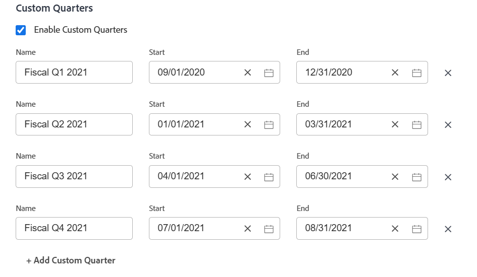

# 为项目启用自定义季度

出于报告目的，如果贵组织的季度基于日历日期以外的特定标准（如工作日或购物日），则可能需要创建自定义季度。

您最多可以为您的[!DNL Adobe Workfront]系统配置八个自定义季度。

## 访问要求

+++ 展开以查看本文中各项功能的访问要求。

您必须具有以下权限才能执行本文中的步骤：

<table style="table-layout:auto"> 
 <col> 
 <col> 
 <tbody> 
  <tr> 
   <td role="rowheader">[!DNL Adobe Workfront] 计划</td> 
   <td>任何</td> 
  </tr> 
  <tr> 
   <td role="rowheader">[!DNL Adobe Workfront] 许可证</td> 
   <td>[！UICONTROL计划]</td> 
  </tr> 
  <tr> 
   <td role="rowheader">访问级别配置</td> 
   <td> 
您必须是[!DNL Workfront]管理员。
 
<b>注意</b>：如果您仍然没有访问权限，请询问您的[!DNL Workfront]管理员是否对您的访问级别设置了其他限制。 有关[!DNL Workfront]管理员如何修改访问级别的信息，请参阅<a href="../../../administration-and-setup/add-users/configure-and-grant-access/create-modify-access-levels.md" class="MCXref xref">创建或修改自定义访问级别</a>。
 </td> 
  </tr> 
 </tbody> 
</table>

+++

## 为您的[!DNL Workfront]系统设置自定义季度

{{step-1-to-setup}}

1. 单击&#x200B;**[!UICONTROL 项目首选项]** > **[!UICONTROL 项目].**

1. 在&#x200B;**[!UICONTROL 时间线]**&#x200B;部分中，选择&#x200B;**[!UICONTROL 启用自定义季度]**。

1. 键入自定义季度的名称，如“Fiscal Q1 2021”。
1. 选择自定义季度的开始和结束日期。

   

1. （可选）单击&#x200B;**[!UICONTROL 添加自定义季度]**&#x200B;可向系统中添加其他自定义季度。
1. （可选）创建引用会计季度的报表元素。

   **示例：**&#x200B;为[!UICONTROL 项目]列表创建过滤器，并包含引用自定义季度项目的计划完成日期。

   

   对“本季度”、“下一季度”和“上一季度”的引用将替换为对自定义季度的新引用。

   有关报表元素的信息，请参阅[报表元素：筛选器、视图和分组](../../../reports-and-dashboards/reports/reporting-elements/reporting-elements-filters-views-groupings.md)。

   有关创建筛选器的信息，请参阅[在 [!DNL Adobe Workfront]](../../../reports-and-dashboards/reports/reporting-elements/create-filters.md)中创建或编辑筛选器。
