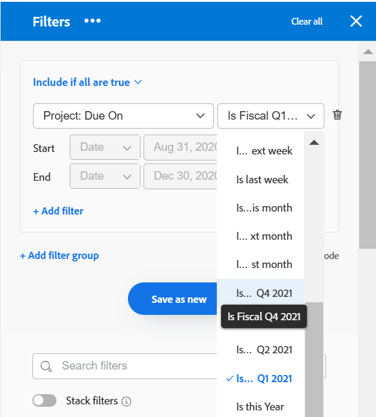

# 启用自定义季度

<!--Audited: 11/2024-->

此页面上高亮显示的信息引用了尚未公开的功能。 它仅在“预览”环境中对已购买[!DNL Adobe Workfront Planning]的所有客户可用。 在每月发布到生产环境后，生产环境中为启用快速发布的客户提供了相同的功能。

有关快速发布的信息，请参阅[为您的组织启用或禁用快速发布](/help/quicksilver/administration-and-setup/set-up-workfront/configure-system-defaults/enable-fast-release-process.md)。

出于报告目的，如果贵组织的季度基于日历日期以外的特定标准（如工作日或购物日），则可能需要创建自定义季度。

根据贵公司已购买的产品，您可以在Workfront设置区域中配置以下季度数：

* 仅购买[!DNL Workfront]的客户最多可以为[!DNL Adobe Workfront]系统配置八个自定义季度。
* 购买[!DNL Workfront]和[!DNL Workfront Planning]的客户可以为[!DNL Workfront]系统配置最多100个季度，这些季度也在[!DNL Planning]中提供。

## 访问要求

+++ 展开以查看本文中各项功能的访问要求。

您必须具有以下权限才能执行本文中的步骤：

<table style="table-layout:auto"> 
 <col> 
 <col> 
 <tbody> 
  <tr> 
   <td role="rowheader">[!DNL Adobe Workfront] 计划</td> 
   <td>任何</td> 
  </tr> 
  <tr> 
   <td role="rowheader">[!DNL Adobe Workfront] 许可证</td> 
   <td>
新文档： [!UICONTROL Standard]

   或
   
当前： [!UICONTROL 计划]

   </td> 
  </tr> 
  <tr> 
   <td role="rowheader">访问级别配置</td> 
   <td>[!UICONTROL 系统管理员]</td>
  </tr> 
 </tbody> 
</table>

有关此表中信息的更多详细信息，请参阅Workfront文档中的[访问要求](/help/quicksilver/administration-and-setup/add-users/access-levels-and-object-permissions/access-level-requirements-in-documentation.md)。

+++

## 为您的[!DNL Workfront]系统设置自定义季度

{{step-1-to-setup}}

1. 单击&#x200B;**[!UICONTROL 项目首选项]** > **[!UICONTROL 项目].**

1. 在&#x200B;**[!UICONTROL 时间线]**&#x200B;部分中，选择&#x200B;**[!UICONTROL 启用自定义季度]**。

1. 键入自定义季度的名称，如“Fiscal Q1 2021”。
1. 选择自定义季度的开始和结束日期。

   

1. （可选）单击&#x200B;**[!UICONTROL 添加自定义季度]**&#x200B;可向系统中添加其他自定义季度。

   >[!IMPORTANT]
   >
   > 如果贵公司购买了[!DNL Workfront Planning]，则当季度之间存在间隔或重叠时，您无法保存自定义季度。
   >
   >季度之间的间隔和重叠仅允许[!DNL Workfront]个客户使用。

1. （可选且有条件）如果贵公司只购买了[!DNL Workfront]，而没有购买[!DNL Workfront Planning]，请创建引用会计季度的报表元素。

   **示例：**&#x200B;为[!UICONTROL 项目]列表创建过滤器，并包含引用自定义季度项目的计划完成日期。

   

   对“本季度”、“下一季度”和“上一季度”的引用将替换为对自定义季度的新引用。

   有关报表元素的信息，请参阅[报表元素：筛选器、视图和分组](../../../reports-and-dashboards/reports/reporting-elements/reporting-elements-filters-views-groupings.md)。

   有关创建筛选器的信息，请参阅[在 [!DNL Adobe Workfront]](../../../reports-and-dashboards/reports/reporting-elements/create-filters.md)中创建或编辑筛选器。
1. （可选且有条件）如果您有权访问[!DNL Workfront Planning]，请转到记录类型页面并打开时间线视图。 视图将显示新的自定义季度。
