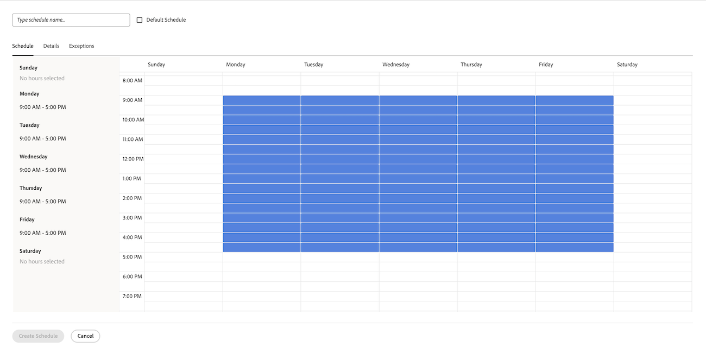

# 创建计划

<!--DON'T DELETE, DRAFT OR HIDE THIS ARTICLE. IT IS LINKED TO THE PRODUCT, THROUGH THE CONTEXT SENSITIVE HELP LINKS. 
Linked to Editing Users, Editing Projects, Creating and managing groups
-->

作为 [!DNL Adobe Workfront] 管理员，您可以使用计划定义工作周。 您可以将计划与用户或项目关联。 这允许 [!DNL Workfront] 计算时间轴和用户可用性。

当用户在不同时区工作时，请在每个时区中创建计划并将其与这些用户关联，可确保他们的工作记录在 [!DNL Workfront] 并且其可用性始终根据工作时间而准确无误。

有关将计划与用户和项目关联的信息，请参阅以下文章：

* [编辑用户的配置文件](../../../administration-and-setup/add-users/create-and-manage-users/edit-a-users-profile.md)
* [编辑项目](../../../manage-work/projects/manage-projects/edit-projects.md)

组管理员还可以创建与他们管理的组关联的计划。 有关更多信息，请参阅 [创建和修改组的计划](../../../administration-and-setup/manage-groups/work-with-group-objects/create-and-modify-a-groups-schedules.md).

有关使用计划帮助用户在 [!DNL Workfront] 跨时区，请参阅 [跨时区工作](../../../workfront-basics/tips-tricks-and-troubleshooting/working-across-timezones.md).

## 访问要求

您必须具有以下访问权限才能执行本文中的步骤：

<table style="table-layout:auto"> 
 <col> 
 <col> 
 <tbody> 
  <tr> 
   <td role="rowheader">[!UICONTROL Adobe Workfront]计划</td> 
   <td>任意</td> 
  </tr> 
  <tr> 
   <td role="rowheader">[!DNL Adobe Workfront] 许可证</td> 
   <td>[!UICONTROL计划]</td> 
  </tr> 
  <tr> 
   <td role="rowheader">访问级别配置</td> 
   <td> 
你必须是 [!DNL Workfront] 管理员。
 
<b>注意</b>:如果您仍无权访问，请咨询您的 [!DNL Workfront] 管理员。 有关如何 [!DNL Workfront] 管理员可以修改您的访问级别，请参阅 <a href="../../../administration-and-setup/add-users/configure-and-grant-access/create-modify-access-levels.md" class="MCXref xref">创建或修改自定义访问级别</a>.
 </td> 
  </tr> 
 </tbody> 
</table>

## 创建计划

1. 单击 **[!UICONTROL 主菜单]** 图标  的右上角 [!DNL Adobe] Workfront，然后单击 **[!UICONTROL 设置]** .
1. 单击 **[!UICONTROL 计划]**.
1. 单击 **[!UICONTROL 新计划]**.
1. 指定计划的名称。
1. （可选）选择 **[!UICONTROL 默认计划]** 将此计划标识为默认计划。

   您可以在 [!DNL Workfront]，但您只能有一个默认计划。

   您必须在 [!DNL Workfront]. 如果您只有一个，则指定为默认计划。

   >[!NOTE]
   >
   >如果您是群组管理员，则不能将计划指定为默认计划。 仅a [!DNL Workfront] 管理员可以将计划指定为系统的默认计划。

   

1. 在 **[!UICONTROL 计划]** 选项卡，通过在小时块中拖动蓝色边框来突出显示它们来选择每日计划。

   我们建议您在9小时内选择8个1小时的块。 这可供午餐或其他休息时间使用。

   

1. 在 **[!UICONTROL 详细信息]** 选项卡，请指定以下信息：

   <table style="table-layout:auto">
    <tr>
     <td>[！具有管理访问权限的UICONTROL组]</td>
     <td>
指示其管理员有权编辑此计划的组。

     
<b>重要信息</b>:

      <ul>
       <li>
       
如果您是创建计划的组管理员，则此字段为必填字段。

       
作为组管理员，只有在为指定为管理员的组或子组指定计划时，才能创建计划。

       
如果仅管理一个群组，则默认情况下会在此字段中选择该群组。

       
如果管理多个组，则必须在此字段中选择一个组，然后才能保存计划。
</li>
       <li>如果您是 [!DNL Workfront] 管理员创建计划时，此字段为可选字段。 在创建计划而不将其与组关联时，该计划将另存为系统级别的计划，任何组的组管理员都无法对其进行管理。
       
分配给帐户或项目的计划对能够编辑这些对象的所有用户都可见。 对于系统级别和组级别的计划，都是如此。

       </li>
       
为计划指定具有管理访问权限的组不会将计划分配给组中的用户；它仅允许群组中的群组管理员编辑、删除和复制计划。

       
群组管理员无法编辑、删除或复制系统级别的计划。 有关更多信息，请参阅 <a href="../../../administration-and-setup/manage-groups/group-roles/group-administrators.md" class="MCXref xref">组管理员</a>.
     </td>
    </tr>
    <tr>
     <td>[！具有视图访问权限的UICONTROL组]</td>
     <td>
选择具有[!UICONTROL视图]访问权限且此计划对其可见的组。

     
只有此处指定的组中的用户在将计划分配给用户或项目时，才能在下拉菜单中找到计划。
</tr>
    <tr>
     <td>[!UICONTROL时区]</td>
     <td>
选择计划的时区。

     
如果将计划与用户关联，我们建议计划的时区与用户的时区匹配。有关用户时区的信息，请参阅 <a href="../../../administration-and-setup/add-users/create-and-manage-users/edit-a-users-profile.md" class="MCXref xref">编辑用户的配置文件。
     </td>
    </tr>
   </table>

1. 在 **[!UICONTROL 例外]** 选项卡，指定计划例外。

   例外为全天或半天，需要从计划中排除，例如节假日或公司事件。

   >[!NOTE]
   >
   >如果您已经知道定期计划例外是什么，则可以定义将来许多年的计划例外。

   可以从工作计划中排除完整或部分天数。 单击日期以将其选为例外，然后选择 **[!UICONTROL 整天]** 字段来指示例外是否为一整天。

   

1. 指定部分日期例外的开始时间和结束时间。

   

1. 单击 **[!UICONTROL 保存]**，然后单击 **[!UICONTROL 保存] 更改**.

1. （可选）将计划与用户关联。

   有关信息，请参阅 [编辑用户的配置文件](../../../administration-and-setup/add-users/create-and-manage-users/edit-a-users-profile.md).

1. （可选）将计划与项目关联。

   有关信息，请参阅 [编辑项目](../../../manage-work/projects/manage-projects/edit-projects.md).
