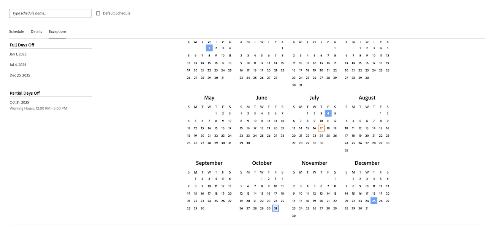

# 创建计划

<!--Audited: 01/2024-->

<!--DON'T DELETE, DRAFT OR HIDE THIS ARTICLE. IT IS LINKED TO THE PRODUCT, THROUGH THE CONTEXT SENSITIVE HELP LINKS. 
Linked to Editing Users, Editing Projects, Creating and managing groups
-->

作为[!DNL Adobe Workfront]管理员，您可以使用计划定义工作周。 您可以将时间表与用户或项目关联。 这允许[!DNL Workfront]计算时间表和用户可用性。

如果您的用户在不同时区工作，则在每个时区创建一个时间表并将其与这些用户关联可确保实时记录[!DNL Workfront]的工作，并且其可用性始终根据其工作时间准确无误。

有关将计划与用户和项目关联的信息，请参阅[编辑用户的配置文件](../../../administration-and-setup/add-users/create-and-manage-users/edit-a-users-profile.md)和[编辑项目](../../../manage-work/projects/manage-projects/edit-projects.md)。

组管理员还可以创建与其管理的组相关联的计划。 有关详细信息，请参阅[创建和修改组的计划](../../../administration-and-setup/manage-groups/work-with-group-objects/create-and-modify-a-groups-schedules.md)。

有关使用计划帮助用户在跨时区[!DNL Workfront]中进行协作的信息，请参阅[跨时区工作](../../../workfront-basics/tips-tricks-and-troubleshooting/working-across-timezones.md)。

有关如何在资源计划中使用计划的信息，请参阅[计划概述](/help/quicksilver/administration-and-setup/set-up-workfront/configure-timesheets-schedules/schedules-overview.md)和[资源规划者概述](/help/quicksilver/resource-mgmt/resource-planning/get-started-resource-planner.md)。

## 访问要求

+++ 展开以查看本文中各项功能的访问要求。

<table style="table-layout:auto"> 
 <col> 
 <col> 
 <tbody> 
  <tr> 
   <td>[!DNL Adobe Workfront] 包</td> 
   <td>
任何
</td> 
  </tr> 
  <tr> 
   <td>[!DNL Adobe Workfront] 许可证</td> 
   <td>
[!UICONTROL 标准版]

       
[!UICONTROL 计划]
</td>
  </tr> 
  <tr> 
   <td>访问级别配置</td> 
   <td>[!UICONTROL 系统管理员]</td> 
  </tr> 
 </tbody> 
</table>

有关信息，请参阅Workfront文档中的[访问要求](/help/quicksilver/administration-and-setup/add-users/access-levels-and-object-permissions/access-level-requirements-in-documentation.md)。

+++

## 创建计划

{{step-1-to-setup}}

1. 单击&#x200B;**[!UICONTROL 计划]**。
1. 单击&#x200B;**[!UICONTROL 新建计划]**。
1. 输入计划的名称。
1. （可选）选择&#x200B;**[!UICONTROL 默认计划]**&#x200B;以将此计划标识为默认值。

   [!DNL Workfront]中必须至少有一个计划。 如果只有一个，则将其指定为默认计划。

   您可以有多个计划，但只能有一个默认计划。

   >[!NOTE]
   >
   >如果您是组管理员，则不能将调度指定为默认调度。 只有[!DNL Workfront]管理员才能指定计划作为系统的默认计划。

   

1. 在&#x200B;**[!UICONTROL 计划]**&#x200B;选项卡上，通过跨小时块拖动蓝色轮廓以突出显示它们来选择每日计划。

   我们建议您在9小时的时间段内选择8个一小时块。 这适合午餐或其他休息时间。

   

1. 在&#x200B;**[!UICONTROL 详细信息]**&#x200B;选项卡上，输入以下信息：

   <table style="table-layout:auto">
    <tr>
     <td>具有管理访问权限的[!UICONTROL 组]</td>
     <td>
选择其管理员有权编辑此计划的组。

     
<b>重要信息</b>：

      <ul>
       <li>
       
如果您是创建计划的组管理员，则此字段为必填字段。

       
作为组管理员，仅当为指定为管理员的组或子组指定调度时，才能创建调度。

       
如果您只管理一个组，则默认情况下会在此字段中选择该组。

       
如果管理多个组，则必须先在此字段中选择一个组，然后才能保存计划。
</li>
       <li>如果您是创建计划的[!DNL Workfront]管理员，则此字段为可选字段。 如果创建调度时没有将其与组相关联，则该调度将保存为系统级调度，任何组的组管理员都无法对其进行管理。
       
分配给帐户或项目的计划对可以编辑这些对象的所有用户可见。 对于系统级别和组级别的时间表都是如此。

       </li>
       
为调度指定具有管理访问权限的组不会将调度分配给组中的用户；它仅允许组中的组管理员编辑、删除和复制调度。

       
组管理员无法编辑、删除或复制系统级计划。 有关详细信息，请参阅<a href="../../../administration-and-setup/manage-groups/group-roles/group-administrators.md" class="MCXref xref">组管理员</a>。
     </td>
    </tr>
    <tr>
     <td>[!UICONTROL 组具有视图访问权限]</td>
     <td>
选择具有[!UICONTROL 视图]访问权限的组，这些组可以查看此计划。

     
只有此处指定的组中的用户在将其分配给用户或项目时，才能在下拉菜单中找到计划。
</tr>
    <tr>
     <td>[!UICONTROL 时区]</td>
     <td>
选择计划的时区。

     
如果将时间表与用户关联，我们建议时间表的时区与用户的时区匹配。 有关用户时区的信息，请参阅<a href="../../../administration-and-setup/add-users/create-and-manage-users/edit-a-users-profile.md" class="MCXref xref">编辑用户配置文件。
     </td>
    </tr>
   </table>

1. 在&#x200B;**[!UICONTROL 例外]**&#x200B;选项卡上，指定计划的任何例外。

   例外情况是需要从时间表中排除的全天或半天，例如假日或公司活动。

   >[!NOTE]
   >
   >如果您已经知道定期计划例外是什么，则可以定义未来许多年的计划例外。

   可以将全部或部分天数从工作表中排除。 单击日期以将其选为异常，然后选择&#x200B;**[!UICONTROL 全天]**&#x200B;字段以指示异常是否为全天。

   

1. 输入部分日期例外的开始和结束时间。

   

1. 单击&#x200B;**[!UICONTROL 保存]**，然后单击&#x200B;**[!UICONTROL 保存]更改**。

1. （可选）将计划与用户关联。

   有关信息，请参阅[编辑用户配置文件](../../../administration-and-setup/add-users/create-and-manage-users/edit-a-users-profile.md)。

1. （可选）将计划与项目关联。

   有关信息，请参阅[编辑项目](../../../manage-work/projects/manage-projects/edit-projects.md)。
