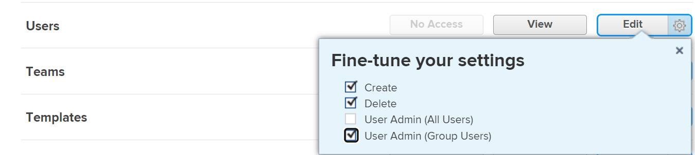

# 停用或重新激活公司

您可以停用不再使用的公司，同时保留其所有关联的历史数据。 如果停用系统中某个位置已在使用的公司，则该公司的功能会像往常一样继续运行。 未将其删除或阻止。

## 访问要求

您必须具备以下条件才能管理[!DNL Workfront]中的公司：

<table style="table-layout:auto"> 
 <col data-mc-conditions=""> 
 <col data-mc-conditions=""> 
 <tbody> 
  <tr> 
   <td role="rowheader"> 
[!DNL Workfront] 计划*
 </td> 
   <td>[！UICONTROL Team]或更高版本</td> 
  </tr> 
  <tr> 
   <td role="rowheader"> 
[!DNL Adobe Workfront] 许可证*
 </td> 
   <td>[！UICONTROL计划]</td> 
  </tr> 
  <tr data-mc-conditions=""> 
   <td role="rowheader"><strong>访问级别配置*</strong> </td> 
   <td> 
下列选项之一：
 
    <ul> 
     <li> 
[！UICONTROL系统管理员]访问级别，允许您编辑系统中的任何公司。 有关详细信息，请参阅<a href="../../../administration-and-setup/add-users/configure-and-grant-access/grant-a-user-full-administrative-access.md" class="MCXref xref">授予用户完全管理访问权限</a>。 
 </li> 
     <li> 
管理公司的管理权限，允许您编辑系统中的任何公司。 有关详细信息，请参阅<a href="../../../administration-and-setup/add-users/configure-and-grant-access/grant-users-admin-access-certain-areas.md" class="MCXref xref">授予用户对特定区域的管理访问权限</a>。
 </li> 
    </ul> 
<b>注释</b>：  
     <ul> 
      <li> 
您还可以管理与您被分配为组管理员的任何组关联的公司。
 </li> 
      <li> 
若要在[!DNL Workfront]系统中添加和删除用户，您必须具备以下任一项：
 
       <ul> 
        <li> 
[！UICONTROL系统管理员]访问级别。 有关详细信息，请参阅<a href="../../../administration-and-setup/add-users/configure-and-grant-access/grant-a-user-full-administrative-access.md" class="MCXref xref">授予用户完全管理访问权限</a>。 
 </li> 
        <li> 
在访问级别中，必须为[！UICONTROL用户]设置选择[！UICONTROL编辑] 。 此外，对于[！UICONTROL用户]设置，在[！UICONTROL微调设置] 下，必须启用[！UICONTROL创建]选项以及两个[！UICONTROL用户管理]选项中的至少一个。 
 
  
 
如果您使用[！UICONTROL用户管理员（组用户）]选项，您必须是用户所属组的组管理员。
 </li> 
       </ul> 
有关访问级别中的用户设置的信息，请参阅<a href="../../../administration-and-setup/add-users/configure-and-grant-access/grant-access-other-users.md" class="MCXref xref">授予用户访问权限</a>。
 </li> 
     </ul> 
 </td> 
  </tr> 
 </tbody> 
</table>

&#42;要了解您拥有什么计划、许可证类型或访问级别配置，请与[!DNL Workfront]管理员联系。

## 停用或重新激活公司

1. 单击[!DNL Adobe] Workfront右上角的&#x200B;**[!UICONTROL 主菜单]**&#x200B;图标，然后单击&#x200B;**[!UICONTROL 设置]** 。

1. 在左侧面板中，单击&#x200B;**[!UICONTROL 公司]** 。

1. 选择一个或多个要停用或重新激活的公司。
1. 单击&#x200B;**[!UICONTROL 编辑]**。
1. 对于单个公司，禁用&#x200B;**[!UICONTROL 处于活动状态]**&#x200B;选项以将其停用，或启用该选项以将其激活。

   或

   对于多个公司，从&#x200B;**[!UICONTROL 处于活动状态]**&#x200B;下拉菜单中选择&#x200B;**[!UICONTROL 否]**&#x200B;以停用它们，或选择&#x200B;**[!UICONTROL 是]**&#x200B;以激活它们。

1. 单击&#x200B;**[!UICONTROL 保存更改]**。
