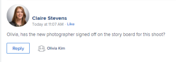

# 系统跟踪更新

<!-- Audited: April, 2024-->

<!--
The highlighted information on this page refers to functionality not yet generally available. It is available only in the Preview environment for all customers, or in the Production environment for customers who enabled fast releases.

For information about fast releases, see [Enable or disable fast releases for your organization](/help/quicksilver/administration-and-setup/set-up-workfront/configure-system-defaults/enable-fast-release-process.md).

For information about the current release, see [Second Quarter 2024 release overview](/help/quicksilver/product-announcements/product-releases/24-q2-release-activity/24-q2-release-overview.md).-->

[!DNL Adobe Workfront] 通过在对象的 [!UICONTROL 更新] 部分。

有关“更新”部分的信息，请参阅 [更新部分概述](/help/quicksilver/workfront-basics/updating-work-items-and-viewing-updates/updates-tab-overview.md).

此 [!UICONTROL 更新] 区域包含以下类型的更新：

* **用户更新：** 由用户手动输入。 也称为评论、回复和注释。 用户更新显示在对象的“更新”部分的“注释”和“所有”选项卡中。

  有关配置用户更新的更多信息，请参阅 [配置用户更新的首选项](../../../administration-and-setup/set-up-workfront/system-tracked-update-feeds/configure-preferences-user-updates.md).

  

* **系统更新：** 由系统自动生成。 系统更新包括一个简要注释，描述该项发生了什么类型的更改。 系统更新显示在对象的“系统活动”和“更新”部分的“所有”选项卡中。

  有关系统更新源以及如何启用它们的详细信息，请参阅 [配置系统更新](../../../administration-and-setup/set-up-workfront/system-tracked-update-feeds/configure-system-updates.md).

  

  <!--
  DRAFTED IN FLARE:
  Timestamps for system updates are based on your operating system's timezone.
  
  -->

## 有关系统跟踪更新的注意事项

系统跟踪更新不适用于具有“更新”区域的所有对象。

* 此 [!UICONTROL 更新] 区域可用于以下对象：

   * [!UICONTROL 项目]
   * [!UICONTROL 任务]
   * [!UICONTROL 问题]
   * [!UICONTROL Portfolio]
   * [!UICONTROL 项目]
   * [!UICONTROL 用户]
   * [!UICONTROL 模板]
   * [!UICONTROL 模板任务]
   * [!UICONTROL 团队]
   * [!UICONTROL 文档]
   * [!UICONTROL 工时表]
   * [!UICONTROL Story]

     在 [!DNL Workfront]，故事是任务。
   * [!UICONTROL 迭代]
   * [!UICONTROL 目标]

     您必须拥有额外的许可证才能访问 [!UICONTROL 目标] 区域。 有关信息，请参阅 [使用Workfront Goals的要求](../../../workfront-goals/goal-management/access-needed-for-wf-goals.md).
   * [!UICONTROL 卡片] 在展示板上

     有关信息卡更新的更多信息，请参阅 [在展示板上使用连接的信息卡](../../../agile/get-started-with-boards/connected-cards.md).

* [!DNL Workfront] 不跟踪以下对象的系统更新：

   * [!UICONTROL 团队]
   * [!UICONTROL 模板]
   * [!UICONTROL 模板任务]
   * 临时 [!UICONTROL 卡片]
   * [!UICONTROL 迭代]

<!--hiding this bit because this is not true, at this time (August 2023). Users with a Work or Review license can see system updates by default as well.

Your [!DNL Workfront] license determines whether system updates display by default in the [!UICONTROL Updates] area of objects. [!DNL Workfront] users with a [!UICONTROL Plan] license have system updates displayed in the [!UICONTROL Updates] area by default. However, users can filter out system updates, as described in the [Enable or disable system updates](../../../workfront-basics/updating-work-items-and-viewing-updates/update-work.md#enable) section in [Update work](../../../workfront-basics/updating-work-items-and-viewing-updates/update-work.md). All other [!DNL Workfront] licenses filter system updates by default.
-->

* 用户更新显示在“注释”选项卡中，系统更新显示在“系统活动”和“全部”选项卡中。

  有关没有“系统活动”或“全部”选项卡的对象列表，请参阅 [更新部分概述](/help/quicksilver/workfront-basics/updating-work-items-and-viewing-updates/updates-tab-overview.md)

* 您无法向系统更新添加回复。 但是，对2024年4月11日之前旧版注释体验中的系统活动记录所做的任何回复都将以只读形式填充到“系统活动”选项卡中。

<!--
* The following are differences between the new and the legacy commenting experience: 

   * When using the new commenting experience, user updates display in the Comments tab and system updates display in the System Activity and the All tabs.  

      For more information about the new commenting experience, see [New commenting experience](../../../product-announcements/betas/new-commenting-experience-beta/unified-commenting-experience.md).

      For a list of objects that do not have the System Activity or the All tabs, see [Update section overview](/help/quicksilver/workfront-basics/updating-work-items-and-viewing-updates/updates-tab-overview.md)

   * When using the new commenting experience, you cannot add a comment to a system update. However, any replies made to system activity records in the legacy commenting experience are populated on the System Activity tab as read-only in the new commenting experience.
   * When using the legacy commenting experience, the system and user updates display in one continuous feed. 

   * When using the legacy commenting experience, users can view system updates by default or they can choose to not display them. Disabling system updates is not possible when using the new commenting experience. 

      For information about disabling the display of system updates, see the section [Enable or disable system updates](../../../workfront-basics/updating-work-items-and-viewing-updates/update-work.md#enable) in the article [Update work](../../../workfront-basics/updating-work-items-and-viewing-updates/update-work.md).  

   * The legacy commenting experience has been disabled in the Preview environment. For more information, see [Second Quarter 2024 Update stream and notification enhancements](/help/quicksilver/product-announcements/product-releases/24-q2-release-activity/24-q2-update-stream-enhancements.md).
-->

* [!DNL Workfront] 管理员可以定义系统应跟踪的更改类型 [!UICONTROL 更新] 区域。 并非所有具有 [!UICONTROL 更新] 区域也可供配置 [!UICONTROL 更新] 信息源。 以下对象具有 [!UICONTROL 更新] 捕获系统跟踪的更新馈送，但没有可配置的更新馈送的区域：

   * [!UICONTROL 文档]
   * [!UICONTROL 工时表]
   * [!UICONTROL 迭代]
   * [!UICONTROL 目标]

