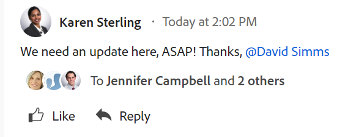

# 系统跟踪的更新

[!DNL Adobe Workfront] 通过记录对象中的状态信息，捕获某些对象上发生的活动 [!UICONTROL 更新] 的上界。

的 [!UICONTROL 更新] 区域包含以下类型的更新：

* **用户更新：** 由用户手动输入。 也称为评论、回复和注释。

   

* **系统更新：** 由系统自动制作。 系统更新包括描述该项目发生的更改类型的简短说明。

   <!--
  DRAFTED IN FLARE:
  Timestamps for system updates are based on your operating system's timezone.
  
  -->

以下对象可以有更新：

* 项目
* 任务
* 问题
* 项目组合
* 项目群
* 用户
* 模板
* 模板任务
* 文档
* 时间表

您的 [!DNL Workfront] 许可证确定系统更新是否默认显示在 [!UICONTROL 更新] 对象区域。 [!DNL Workfront] 具有 [!UICONTROL 计划] 许可证中显示了系统更新 [!UICONTROL 更新] 的上界。 但是，用户可以过滤掉系统更新，如 [[!UICONTROL 启用] 或禁用系统更新](../../../workfront-basics/updating-work-items-and-viewing-updates/update-work.md#enable) 部分 [更新工作](../../../workfront-basics/updating-work-items-and-viewing-updates/update-work.md). 所有其他 [!DNL Workfront] 默认情况下，许可证会过滤系统更新。

[!DNL Workfront] 管理员可以定义系统应在 [!UICONTROL 更新] 的上界。 并非所有对象都可配置 [!UICONTROL 更新] 状态馈送。 以下对象具有 [!UICONTROL 更新] 可捕获系统跟踪的更新馈送，但没有可配置的更新状态馈送的区域：

* 模板
* 模板任务
* 文档
* 时间表

有关系统更新信息源以及如何启用它们的更多信息，请参阅 [配置系统更新](../../../administration-and-setup/set-up-workfront/system-tracked-update-feeds/configure-system-updates.md). 有关配置用户更新的更多信息，请参阅 [配置用户更新的首选项](../../../administration-and-setup/set-up-workfront/system-tracked-update-feeds/configure-preferences-user-updates.md).
