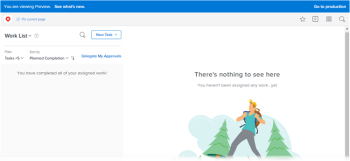

# [!DNL Adobe Workfront]预览Sandbox环境

<!-- Audited: 12/2023 -->

[!DNL Workfront]有两个测试环境，它们是[!DNL Workfront]生产环境的副本：

* 预览沙盒

  预览沙盒是一个测试环境，用作实时环境的副本，每个周末由[!DNL Workfront]刷新。 在星期五添加到实时环境的数据会在下星期一之前显示在预览Sandbox中。

  所有支持包都有权访问预览沙盒。

* 自定义刷新沙盒

  自定义刷新沙盒是一个单独的测试环境，由您手动刷新。 获取自定义刷新沙盒需要额外付费。 有关此环境的详细信息，请参阅[自定义刷新沙盒环境 [!DNL Adobe Workfront] ](../../../administration-and-setup/set-up-workfront/workfront-testing-environments/wf-custom-refresh-sandbox-environment.md)。

<table style="table-layout:auto"> 
 <col> 
 <col> 
 <col> 
 <thead> 
  <tr> 
   <th> 
 
 </th> 
   <th> 
<strong>[！UICONTROL Standard]支持包</strong> 
 </th> 
   <th> 
<strong>[！UICONTROL Plus]、[！UICONTROL Preferred]和[！UICONTROL Enterprise]支持包</strong> 
 </th> 
  </tr> 
 </thead> 
 <tbody> 
  <tr> 
   <td scope="col"> 
预览沙盒
 </td> 
   <td scope="col"> 
✔
 </td> 
   <td scope="col"> 
✔
 </td> 
  </tr> 
  <tr> 
   <td scope="col"> 
自定义刷新沙盒
 </td> 
   <td scope="col"> 
 
 </td> 
   <td scope="col"> 
✔
 </td> 
  </tr> 
 </tbody> 
</table>

## 预览沙盒

预览Sandbox用作一种环境，贵组织中的用户可以在其中安全地测试和处理生产环境中的数据，而不会影响生产环境。

预览沙盒包含您的实际生产数据；但是，它每个周末都会刷新，以便数据最多可滞后于生产环境一周。 在上次刷新后创建的项目会一直位于预览沙盒环境中，直到下次刷新为止。

数据会单向地从生产环境流向预览环境，而不是反向流动。 [!DNL Workfront]始终计划每个周末刷新“预览”环境。

预览沙盒还允许[!DNL Workfront]在准备部署到生产环境之前，在安全环境中部署新功能。 您可以通过访问预览Sandbox来测试新功能并就[!DNL Workfront]的功能提供反馈。 因此，预览沙盒的代码始终位于生产代码之前，尽管您的数据每周都会刷新。

预览环境非常适用于运行培训、测试新功能和确定设置功能。

>[!NOTE]
>
>当您访问预览沙盒时，请注意屏幕顶部的蓝色横幅。 在此环境中工作时，无法删除横幅。
>
>您正在访问的环境的名称（预览），且代码的发行版本会显示在横幅上。 单击&#x200B;**[!UICONTROL 查看新增功能]**&#x200B;以了解有关该版本的信息。
>
>

## 访问预览沙盒

默认情况下，作为[!DNL Workfront]管理员，您有权访问[!UICONTROL 预览]沙盒环境。 如果您无法按本节所述访问[!UICONTROL 预览]沙盒环境，请联系您的[!DNL Workfront]管理员或我们的客户支持团队。

### 从[!DNL Workfront]界面访问预览沙盒 {#accessing-the-preview-sandbox-from-the-workfront-interface}

作为[!DNL Workfront]管理员，您可以通过[!DNL Workfront]界面访问“预览沙盒”。

要访问预览沙盒，请执行以下操作：

{{step-1-to-setup}}

1. 单击&#x200B;**[!UICONTROL 系统]** > **[!UICONTROL 首选项]**。

1. 在&#x200B;**[!UICONTROL 测试环境]**&#x200B;分区中，单击&#x200B;**[!UICONTROL 沙盒预览]**。

1. 使用预览凭据登录。

   这些凭据应与生产凭据相同，除非您在发生预览刷新后在生产环境中更改了这些凭据。 只有在刷新时才会同步登录。 它们不会自动同步。

### 使用URL访问预览沙盒 {#accessing-the-preview-sandbox-using-a-url}

您可以使用URL访问预览Sandbox。

#### 访问群集1、2、3和5上帐户的预览沙盒 {#accessing-the-preview-sandbox-for-accounts-on-cluster-1-2-3-and-5}

预览Sandbox的URL为： `https://companyname.preview.workfront.com/`。

>[!NOTE]
>
>如果您有书签链接到“预览沙盒”的旧URL，请记录此更改并更新书签中的URL。

要使用URL登录预览Sandbox，请执行以下操作：

1. 导航到此URL： `https://companyname.preview.workfront.com/`。

   如果您是EMEA客户并且您的帐户位于群集4上，请参阅下面的访问群集4上的帐户的预览沙盒（EMEA帐户）部分。

1. 使用预览凭据登录。

   >[!TIP]
   >
   >您的预览凭据应与生产凭据相同，除非您在发生预览刷新后在生产环境中更改了这些凭据。 只有在刷新时才会同步登录。 它们不会自动同步。

#### 访问群集4上帐户的预览沙盒（EMEA帐户） {#accessing-the-preview-sandbox-for-accounts-on-cluster-4-emea-accounts}

要使用URL登录预览Sandbox，请执行以下操作：

1. 导航到此URL： `https://companyname.preview.workfront.com/`。

   您还可以通过转到[https://cl04.preview.workfront.com/login](https://cl04.preview.workfront.com/login)来访问“预览沙盒”。

1. 使用预览凭据登录。

   您的预览凭据应与生产凭据相同，除非您在发生预览刷新后在生产环境中更改了这些凭据。 只有在刷新时才会同步登录。 它们不会自动同步。

## 从预览Sandbox接收电子邮件

Workfront禁用来自“预览Sandbox”环境的所有电子邮件通信。 如果要从预览Sandbox环境接收电子邮件通知，则必须在用户设置中启用此功能。 有关在预览Sandbox环境中启用电子邮件通知的更多信息，请参阅[从预览Sandbox环境中启用电子邮件投放](../../../workfront-basics/using-notifications/enable-delivery-emails-from-preview-sandbox-environment.md)。

>[!NOTE]
>
>对于“预览Sandbox”环境，始终禁用移动应用程序上的报表交付和推送通知。 当您访问“预览Sandbox”环境时，您和[!DNL Workfront]管理员都不能为移动设备应用程序启用报告交付或推送通知。
>
>有关生产环境的报告交付的详细信息，请参阅[报告交付概述](../../../reports-and-dashboards/reports/creating-and-managing-reports/set-up-report-deliveries.md)。

## 单点登录 (SSO)

如果您使用的是SSO，请与我们的客户支持团队合作，以确保其配置正确，以便您可以使用SSO凭据登录到[!UICONTROL 预览]沙盒。 如果初始登录失败，请与常规支持联系人或[!DNL Workfront]管理员联系以获取帮助。

有关单点登录的详细信息，请参阅[Adobe Workfront中的单点登录概述](../../../administration-and-setup/add-users/single-sign-on/sso-in-workfront.md)。

## 在预览Sandbox中配置单点登录

>[!IMPORTANT]
>
>此页面上描述的过程仅适用于尚未载入[!DNL Adobe Admin Console]的组织。 如果您的组织已登记到[!DNL Adobe Admin Console]，则无需执行任何操作。
>
>有关因贵组织是否已登记到[!DNL Adobe Admin Console]而不同的过程列表，请参阅[基于平台的管理差异([!UICONTROL Adobe Workfront]/[!UICONTROL Adobe Business Platform])](../../../administration-and-setup/get-started-wf-administration/actions-in-admin-console.md)。

如果您希望将预览沙盒配置为使用单点登录解决方案，则可以通过在生产环境之外单独配置该沙盒来实现这一点。 预览沙盒中的SSO配置与生产环境中的SSO配置无关。

当您的预览沙盒刷新（每个周末）时，不会从生产环境中复制SSO信息以覆盖预览沙盒配置。

在预览沙盒中配置单点登录的步骤与在生产环境中配置单点登录的步骤类似。

有关使用SSO配置[!DNL Workfront]的更多信息，请参阅[Adobe Workfront中的单点登录概述](../../../administration-and-setup/add-users/single-sign-on/sso-in-workfront.md)。

## 项目时间线的自动重新计算

重新计算时间表使经理能够了解项目之外的力量对项目时间表的影响。 项目时间线是指项目的计划和预计日期。

作为Workfront管理员，您可以配置Workfront何时自动重新计算项目时间表。 Workfront可以每晚或在项目范围更改时重新计算项目时间线，或同时重新计算两者。

有关信息，请参阅[配置项目的时间表重新计算](/help/quicksilver/administration-and-setup/set-up-workfront/configure-system-defaults/configure-timeline-recalculations-projects.md)。

对于预览环境，将禁用夜间重新计算，并且不会自动重新计算项目时间线。 您必须手动重新计算预览环境的项目时间线。 有关信息，请参阅[重新计算项目时间表](/help/quicksilver/manage-work/projects/manage-projects/recalculate-project-timeline.md)。

## 预览环境性能和可用性

* [!DNL Workfront]预览环境不适用于性能或负载测试。 相反，使用这些环境验证组织现有工作流的功能性。

* 涉及文档的工作流应侧重于流程，而不是负载测试。 沙盒环境中不支持大文件。

* [!DNL Workfront]预览环境旨在始终可用。

* 在常规工作时间内对[!DNL Workfront]预览环境的任何中断都将在解决任何生产问题（如果存在）后立即成为首要任务。

* 将解决周末（星期六和星期日）对[!DNL Workfront]预览环境的任何中断，以使该环境在星期一的营业时间运行。

* 验证在预览环境中不可用。
