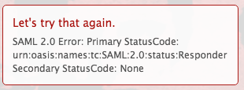

# 错误消息： SAML 2.0错误：主要状态代码

## 问题

无法成功建立与ADFS的连接。

>[!NOTE]
>
>如果成功建立了测试连接，但仍遇到问题，则属性映射可能不正确，或者联合ID出现问题。 如有疑问，请联系客户支持。

## 访问要求

您必须具有以下权限才能执行本文中的步骤：

<table style="table-layout:auto"> 
 <col> 
 <col> 
 <tbody> 
  <tr> 
   <td role="rowheader">[!DNL Adobe Workfront] 计划</td> 
   <td>任何</td> 
  </tr> 
  <tr> 
   <td role="rowheader">[!DNL Adobe Workfront] 许可证</td> 
   <td>计划</td> 
  </tr> 
  <tr> 
   <td role="rowheader">访问级别配置</td> 
   <td> 
您必须是[!DNL Workfront]管理员。 有关详细信息，请参阅<a href="../../administration-and-setup/add-users/configure-and-grant-access/grant-a-user-full-administrative-access.md" class="MCXref xref">授予用户完全管理访问权限</a>。
 
<b>注意</b>：如果您仍然没有访问权限，请询问您的[!DNL Workfront]管理员是否对您的访问级别设置了其他限制。 有关[!DNL Workfront]管理员如何修改访问级别的信息，请参阅<a href="../../administration-and-setup/add-users/configure-and-grant-access/create-modify-access-levels.md" class="MCXref xref">创建或修改自定义访问级别</a>。
 </td> 
  </tr> 
 </tbody> 
</table>

## 原因1：安全哈希算法设置为SHA-256

### 解决方案

1. 在Windows中，单击&#x200B;**[!UICONTROL 开始]** > **[!UICONTROL 管理]** > **[!UICONTROL ADFS 2.0管理]**。\
   将显示“ADFS 2.0管理”对话框。

1. 在左侧窗格中选择&#x200B;**[!UICONTROL 信任关系]** > **[!UICONTROL 信赖方信任]**。

1. 右键单击与[!DNL Adobe Workfront]相关的信赖方信任，然后选择&#x200B;**[!UICONTROL 属性]**。
1. 单击&#x200B;**[!UICONTROL 高级]**&#x200B;选项卡，然后从&#x200B;**[!UICONTROL 安全哈希算法]**&#x200B;下拉菜单中选择&#x200B;**[!UICONTROL SHA-1]**。\
   

## 原因2： ADFS签名证书即将过期，已被日期重叠的新证书替换

### 解决方案

[!DNL Workfront] SSO设置页列出了证书到期日期。 如果证书即将过期，则需要从ADFS服务器中手动提取新签名证书：

1. 在Windows中，单击&#x200B;**[!UICONTROL 开始]** > **[!UICONTROL 管理]** > **[!UICONTROL ADFS 2.0管理]**。\
   将显示“ADFS 2.0管理”对话框。

1. 在左侧窗格中选择&#x200B;**[!UICONTROL 信任关系]** > **[!UICONTROL 信赖方信任]**。

1. 右键单击与[!DNL Workfront]相关的信赖方信任，然后选择&#x200B;**[!UICONTROL 属性]**。
1. 单击&#x200B;**[!UICONTROL 签名]**&#x200B;选项卡。
1. 单击签名证书的名称，然后单击&#x200B;**[!UICONTROL 查看]**。
1. 单击“复制到&#x200B;**[!UICONTROL 文件]**...”，然后选择&#x200B;**[!UICONTROL 下一步]**。

1. 选择&#x200B;**[!UICONTROL Base-64编码的x.509 (CER)]**，然后单击&#x200B;**[!UICONTROL 下一步]**。

1. 指定文件名，然后单击&#x200B;**[!UICONTROL 下一步]**。
1. 单击&#x200B;**[!UICONTROL 完成]**。
1. 在[!DNL Workfront]中，导航到&#x200B;**[!UICONTROL 设置]** > **[!UICONTROL 系统]** > **[!UICONTROL 单点登录(SSO)]**&#x200B;并手动上传签名证书。

## 原因3：证书吊销检查失败

此问题的解决方案取决于您所使用的[!DNL Microsoft] ADFS的版本。 请参考[!DNL Microsoft]的文档以获取适用于您的版本的命令。
