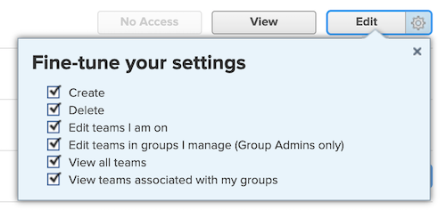

# 组管理员必须具有比其管理的组管理员更高的访问权限

如果群组管理员的访问级别权限低于他们管理的权限级别，则他们将无法查看、修改或分配较低的访问级别。

## 问题

如果为群组管理员分配了具有“团队”查看权限的已修改计划员访问级别，但为某些用户分配了具有“团队”编辑权限的“员工”访问级别，则群组管理员将无法与已修改的“员工”访问级别进行交互。

>[!NOTE]
>
>此逻辑还适用于“微调设置”下拉菜单。 两个访问级别都可以具有“编辑”访问权限，但“微调设置”下拉菜单中的设置对于组管理员必须更高。
> 

## 解决方案

组管理员必须在访问级别的所有区域中拥有比他们管理的区域更大的权限。