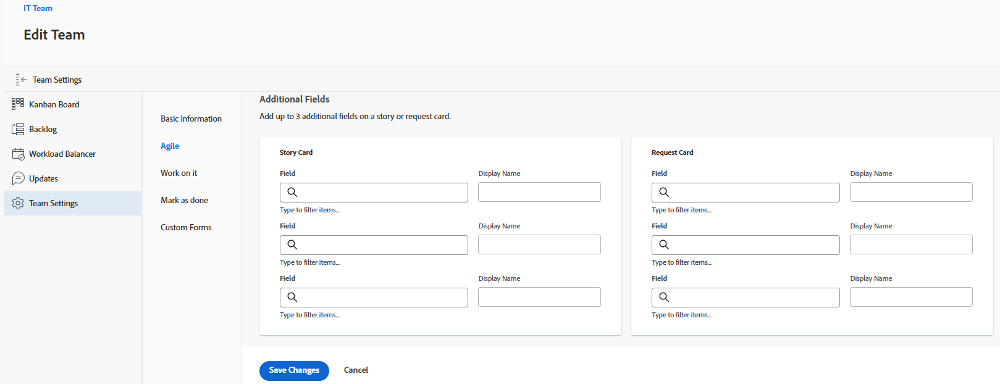

# 配置[!UICONTROL Kanban]

<!--Audited: 12/2023-->

您可以在[!DNL Adobe Workfront]中创建Agile团队，如[创建Agile团队](../../agile/get-started-with-agile-in-workfront/create-an-agile-team.md)中所述。 在创建Agile团队时，您可以选择团队用于完成其工作的方法。 您可以从以下选项中进行选择：

* Scrum
* Kanban

本文介绍了如何配置Kanban团队的设置。 在创建敏捷团队并选择Kanban方法之后，您可以参考本文以更新以下设置：

* 故事的估计单位是点还是小时
* 敏捷故事板上的状态列
* 要在敏捷故事板上的故事卡上显示的其他字段
* 正在进行的工作(WIP)限制
* 如何自动添加积压中的故事
* 卡片在Kanban展示板上停留多长时间

有关配置Scrum团队的信息，请参阅[配置Scrum](../get-started-with-agile-in-workfront/configure-scrum.md)。

## 访问要求

+++ 展开以查看本文中各项功能的访问要求。

<table style="table-layout:auto"> 
 <col> 
 </col> 
 <col> 
 </col> 
 <tbody> 
  <tr> 
   <td role="rowheader">Adobe Workfront包</td> 
   <td> 
任何
 </td> 
  </tr>

<tr> 
   <td role="rowheader">Adobe Workfront许可证</td> 
   <td> 
标准
 
   
工作或更高
 </td> 
  </tr>

<tr> 
   <td role="rowheader">访问级别配置</td> 
   <td> 
编辑团队的访问权限
  </td> 
  </tr>

</tbody> 
</table>

有关此表中信息的更多详细信息，请参阅Workfront文档中的[访问要求](/help/quicksilver/administration-and-setup/add-users/access-levels-and-object-permissions/access-level-requirements-in-documentation.md)。

+++

## 配置故事的估计单位为点还是小时

您可以将故事配置为使用点数或小时进行估计。

要配置如何为您的Agile团队估计故事：

{{step1-to-team}}

1. 单击&#x200B;**[!UICONTROL 切换团队]**&#x200B;图标，然后从下拉菜单中选择新团队或在搜索框中搜索团队。
1. 选择要管理的Agile团队。
1. 单击&#x200B;**[!UICONTROL 更多]**&#x200B;菜单，然后选择&#x200B;**[!UICONTROL 编辑]**。

   

1. 在&#x200B;**[!UICONTROL Agile]**&#x200B;部分的&#x200B;**[!UICONTROL 估算]**&#x200B;中的故事区域，选择您是要使用点还是小时来估算故事的大小（工作负载）。 如果选择“点”，请指定多少小时等于1点。 （默认值为1点= 8小时。） 这是添加到故事的计划小时数。

   **示例：**&#x200B;如果您已选择估计故事的点数，1点等于8小时，并且估计故事的点数为3，则系统会将24个已计划小时数添加到故事中。

1. 单击&#x200B;**[!UICONTROL 保存更改]**。

## 在敏捷故事板上配置状态列

您可以为Agile团队定义故事板上的状态。 这些是在故事板上显示的唯一状态。

要定义可用于与Agile团队关联的故事板的状态，请执行以下操作：

{{step1-to-team}}

1. 单击&#x200B;**[!UICONTROL 切换团队]**&#x200B;图标，然后从下拉菜单中选择新团队或在搜索栏中搜索团队。

1. 选择要管理的Agile团队。
1. 单击&#x200B;**[!UICONTROL 更多]**&#x200B;菜单，然后选择&#x200B;**[!UICONTROL 编辑]**。

   

1. 在&#x200B;**[!UICONTROL Agile]**&#x200B;部分中，找到&#x200B;**[!UICONTROL 故事板]**&#x200B;区域。

1. （可选）单击&#x200B;**[!UICONTROL 添加列]**&#x200B;以向故事板添加其他状态列。
1. （可选）使用拖放指示器拖动任意状态列，以重新排列故事板上的状态列。 无法移动第一列，也不能将另一列拖到第一列的前面。

   

1. 选择任务状态。

   >[!IMPORTANT]
   >
   >只有锁定的系统范围状态可供选择。 您不能选择特定于组的状态。 第一列的状态始终对应于&#x200B;**[!UICONTROL New]**。

   如果[!DNL Workfront]管理员已配置自定义状态，则可以添加这些状态。 有关详细信息，请参阅[创建或编辑状态](../../administration-and-setup/customize-workfront/creating-custom-status-and-priority-labels/create-or-edit-a-status.md)。

1. 单击&#x200B;**[!UICONTROL 保存更改]**。

## 配置要在敏捷故事板上的故事卡上显示的其他字段

将字段添加到故事卡时，字段为仅查看字段，并且仅在填充字段时才显示。

默认情况下，以下类型的数据会显示在任务和问题的故事卡上：

* 带有直接指向任务或问题的链接的新闻稿名称
* 带有直接项目链接的项目名称
* 此链接仅针对故事显示，不针对子任务显示
* 任务或问题描述
* 当前承诺
* 通过调整完成百分比本身或通过调整完成点数或小时数，查看和编辑完成百分比
* 已分配用户

您可以在故事卡上显示其他数据（包括自定义数据）。 出于各种原因，您可能希望在故事卡上显示其他字段。 例如，如果您正在开发周期内为多个客户处理故事，则可能需要显示客户ID，或者您可能需要显示项目开始日期或项目完成日期。

>[!NOTE]
>
>如果您在故事卡上使用自定义字段，则名称中不能包含句点（或点）。

配置分配给敏捷团队的故事卡以显示其他字段：

{{step1-to-team}}

1. 单击&#x200B;**[!UICONTROL 切换团队]**&#x200B;图标，然后从下拉菜单中选择新团队或在搜索栏中搜索团队。

1. 选择要管理的Agile团队。
1. 单击&#x200B;**[!UICONTROL 更多]**&#x200B;菜单，然后选择&#x200B;**[!UICONTROL 编辑]**。

   

1. 在&#x200B;**[!UICONTROL Agile]**&#x200B;部分中，键入字段名称以找到它。

   

1. 选择要添加的字段的名称。
1. 为要显示在文章或问题卡上的字段键入&#x200B;**[!UICONTROL 显示名称]**。
1. 单击&#x200B;**[!UICONTROL 保存更改]**。

## 配置正在进行的工作(WIP)限制

定义Kanban团队的WIP限制时，可以通过限制可在[!UICONTROL Kanban]展示板上的[!UICONTROL New]或[!UICONTROL In Progress]列中出现的任务数来控制团队当前正在处理的项目数。

配置Kanban团队的WIP限制后，您可以查看WIP限制并从[!UICONTROL Kanban]敏捷故事板更新它，如[Kanban[!UICONTROL 展示板]上的](../../agile/use-kanban-in-an-agile-team/work-in-progress-limit-on-the-kanban-board.md)管理正在进行的工作(WIP)限制中所述。

要限制Kanban团队的WIP，请执行以下操作：

{{step1-to-team}}

1. 单击&#x200B;**[!UICONTROL 切换团队]**&#x200B;图标，然后从下拉菜单中选择新团队或在搜索栏中搜索团队。

1. 选择要管理的Kanban团队。
1. 单击&#x200B;**[!UICONTROL 更多]**&#x200B;菜单，然后选择&#x200B;**[!UICONTROL 编辑]**。

   

1. 在&#x200B;**[!UICONTROL Agile]**&#x200B;部分的&#x200B;**[!UICONTROL 方法]**&#x200B;部分中，确保已选择Kanban。

1. 在&#x200B;**[!UICONTROL 故事板]**&#x200B;部分的&#x200B;**[!UICONTROL WIP限制]**&#x200B;字段中，指定[!UICONTROL Kanban]敏捷故事板每列允许的最大项目数。 您可以为每个列设置不同的限制。 您可以为每个列设置的最大限制为100。
设置后，每当超过故事板上任何列的限制，WIP限制会在[!UICONTROL Kanban]敏捷故事板上显示警告消息。 此警告消息仅在第一次超出WIP限制时显示。 此警告消息不显示在任何状态等于[!UICONTROL Complete]的列上。
WIP限制只是一个视觉上的警告，不会限制您的团队在一列中拥有超过您设置的限制数量的项目。

   

1. 单击&#x200B;**保存更改**。

## 配置从积压自动添加故事

<!-- this functionality needs to be verified-->

您可以将积压中的故事配置为在项目从列移动后立即自动添加到[!UICONTROL Kanban]展示板上的第一列。

{{step1-to-team}}

1. 单击&#x200B;**[!UICONTROL 切换团队]**&#x200B;图标，然后从下拉菜单中选择新团队或在搜索栏中搜索团队。

1. 选择要管理的Kanban团队。
1. 单击&#x200B;**[!UICONTROL 更多]**&#x200B;菜单，然后选择&#x200B;**[!UICONTROL 编辑]**。

   

1. 选择&#x200B;**[!UICONTROL 自动从积压工作]**&#x200B;添加下一个故事，以配置在项目移出&#x200B;**[!UICONTROL 进行中]**&#x200B;列时，积压工作中的下一个项目自动添加到&#x200B;**[!UICONTROL 新建]**&#x200B;列。

   用户必须在&#x200B;**Kanban**&#x200B;展示板上启用[!UICONTROL 显示积压]设置，此功能才能生效。 当用户启用[!UICONTROL Kanban展示板]上的[!UICONTROL 显示积压]设置时，将执行以下功能：

   每当故事从[!UICONTROL 进行中]列移动到故事板上代表[!UICONTROL 完成]状态（或相当于[!UICONTROL 完成]状态）的列时，积压列中的故事就会自动移动到[!UICONTROL Kanban展示板]的[!UICONTROL 新建]列。
从积压中添加时，具有最高优先级的故事会添加到故事板。

1. 单击&#x200B;**[!UICONTROL 保存更改]**。

## 配置信息卡在[!UICONTROL Kanban]展示板上停留的时长

您可以选择已完成信息卡在[!UICONTROL Kanban]展示板上停留的时间。 从[!UICONTROL Kanban]展示板掉落的任务仍可在原始项目中访问。

{{step1-to-team}}

1. （可选）单击&#x200B;**[!UICONTROL 切换团队]**&#x200B;图标，然后从下拉菜单中选择新的Kanban团队或在搜索栏中搜索团队。
1. 选择Kanban团队。
1. 单击&#x200B;**[!UICONTROL 更多]**&#x200B;菜单，然后选择&#x200B;**[!UICONTROL 编辑]**。

   

1. 在&#x200B;**[!UICONTROL 已完成天数信息卡停留在Kanban展示板]**&#x200B;下拉菜单中，选择一个值。

   您可以选择1到30天之间的数字。
1. 单击&#x200B;**[!UICONTROL 保存更改]**。
