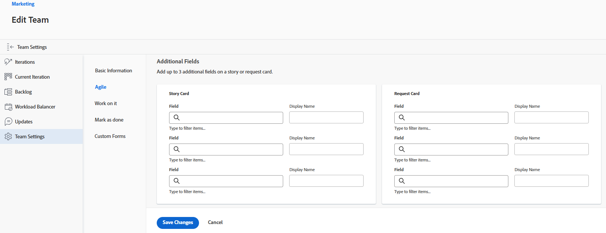

# 配置 [!UICONTROL Scrum]

在创建团队期间或创建团队之后，您可以为敏捷团队配置以下选项。 在 [!DNL Adobe Workfront] 如 [创建敏捷的团队](../../agile/get-started-with-agile-in-workfront/create-an-agile-team.md).

## 访问要求

您必须具有以下访问权限才能执行本文中的步骤：

<table style="table-layout:auto"> 
 <col> 
 </col> 
 <col> 
 </col> 
 <tbody> 
  <tr> 
   <td role="rowheader"><strong>[!DNL Adobe Workfront] 计划*</strong></td> 
   <td> 
任意
 </td> 
  </tr> 
  <tr> 
   <td role="rowheader"><strong>[!DNL Adobe Workfront] 许可证*</strong></td> 
   <td> 
[!UICONTROL Work]或更高版本
 </td> 
  </tr> 
 </tbody> 
</table>

&#42;要了解您拥有的计划或许可证类型，请联系 [!DNL Workfront] 管理员。

## 配置文章是以点还是以小时为单位进行估计

>[!NOTE]
>
>如果团队有任何当前正在进行的小版本，则无法更改此设置。

您可以配置文章以使用点或小时进行估计。

要配置如何为您的敏捷团队评估故事，请执行以下操作：

1. 单击 **[!UICONTROL 主菜单]** 图标  的右上角 [!UICONTROL Workfront]，然后单击 **[!UICONTROL 团队]**.

1. 单击 **[!UICONTROL 切换组]** 图标，然后从下拉菜单中选择新团队，或在搜索栏中搜索团队。
1. 选择要管理的敏捷团队。
1. 单击 **[!UICONTROL 更多]** 菜单，然后选择 **[!UICONTROL 编辑]**.

   仅具有 [!UICONTROL 计划] 或 [!UICONTROL 工作] 许可证请参阅此选项。\
   

1. 在 **[!UICONTROL 敏捷]** 部分，在 **[!UICONTROL 在中估算文章]** 区域，选择是使用点还是小时来估算文章的大小（工作量）。 如果选择“点”，请指定小时数等于1点。 （默认值为1点= 8小时。） 这是添加到文章的计划小时数。

   **示例：** 如果您选择以分来估计文章，而1分等于8小时，而文章估计为3分，则会在文章中添加24个计划小时。

1. 单击 **[!UICONTROL 保存更改]**.

## 在敏捷文章展示板上配置状态列

您可以为分配给团队的所有小版本或给定项目配置在敏捷文章展示板上显示的列。

* [为迭代配置状态列](#configure-status-columns-for-iterations)
* [为项目配置状态列](#configure-status-columns-for-projects)

### 为迭代配置状态列 {#configure-status-columns-for-iterations}

您可以为敏捷团队定义文章展示板上存在的状态。 这些状态是文章展示板上唯一显示的状态。

要定义可用于与敏捷团队关联的文章展示板的状态，请执行以下操作：

1. 单击 **[!UICONTROL 主菜单]** 图标  的右上角 [!DNL Workfront]，然后单击 **[!UICONTROL 团队]**.

1. 单击 **[!UICONTROL 切换组]** 图标 ，然后从下拉菜单中选择新团队，或在搜索栏中搜索团队。

1. 选择要管理的敏捷团队。
1. 单击 **[!UICONTROL 更多]** 菜单，然后选择 **[!UICONTROL 编辑]**.

   仅具有 [!UICONTROL 计划] 或 [!UICONTROL 工作] 许可证请参阅此选项。

   

1. 在 **[!UICONTROL 敏捷]** ，找到 **[!UICONTROL 文章展示板]** 的上界。

1. （可选）单击 **[!UICONTROL 添加列]** 向文章板添加其他状态列。
1. （可选）使用拖放指示器拖动任何状态列，以重新排序文章展示板上的状态列。 无法移动第一列，并且不能将另一列拖动到第一列前面。

   

1. 选择任务和问题状态。 任务状态显示为文章板上每列的列标题。 您选择的问题状态映射到任务状态。 这意味着，将问题移动到文章板的另一列时，问题状态将更改为此处显示的问题状态，而不是更改文章板中列的名称（反映任务状态）。

   >[!IMPORTANT]
   >
   >只能选择系统范围的锁定状态；您无法选择特定于群组的状态。 此外，第一列的状态始终对应 **[!UICONTROL 新建]**.

   您可以添加自定义状态(如果 [!DNL Workfront] 管理员已配置了这些配置；可以按照 [创建或编辑状态](../../administration-and-setup/customize-workfront/creating-custom-status-and-priority-labels/create-or-edit-a-status.md).

   >[!NOTE]
   >
   >选择问题状态时，第三列始终默认为 [!UICONTROL 已关闭]. 如果您有三列以上，请确保手动更新列以反映正确的状态。

1. 单击 **[!UICONTROL 保存更改]**.

### 为项目配置状态列 {#configure-status-columns-for-projects}

有关如何为项目配置状态列的信息，请参阅部分 [创建或自定义 [!UICONTROL 敏捷] 视图](../../reports-and-dashboards/reports/reporting-elements/create-edit-views.md#customizing-an-agile-view) 在文章中 [在中创建或编辑视图 [!DNL Adobe Workfront]](../../reports-and-dashboards/reports/reporting-elements/create-edit-views.md).

## 配置要在敏捷文章展示板上的文章卡片上显示的其他字段

在向文章卡片中添加字段时，在填充字段时，字段为仅查看字段和仅显示字段。

默认情况下，文章卡片中会显示以下类型的任务和问题数据：

* 带有直接指向任务或问题的链接的文章名称
* 带有直接指向项目的链接的项目名称
* 此链接仅用于文章，而不用于子任务
* 任务或问题说明
* 当前承诺
* 通过调整完成百分比本身或通过调整完成的点数或小时数，查看和编辑完成百分比
* 已分配的用户

您可以在文章卡片上显示其他数据（包括自定义数据）。 出于任何原因，您可能希望在文章卡片上显示其他字段。 例如，如果您在小版本中为多个客户处理文章，或者您可能希望显示项目开始日期或项目完成日期，则可能需要显示客户ID。

>[!NOTE]
>
>如果在文章卡片上使用自定义字段，则该字段的名称中不能包含句点/圆点。

要配置分配给敏捷团队的文章卡片以显示其他字段，请执行以下操作：

1. 单击 **[!UICONTROL 主菜单]** 图标  的右上角 [!UICONTROL Workfront]，然后单击 **[!UICONTROL 团队]**.

1. 单击 **[!UICONTROL 切换组]** 图标 ，然后从下拉菜单中选择新团队，或在搜索栏中搜索团队。

1. 选择要管理的敏捷团队。
1. 单击 **[!UICONTROL 更多]** 菜单，然后选择 **[!UICONTROL 编辑]**.\
   仅具有 [!UICONTROL 计划] 或 [!UICONTROL 工作] 许可证请参阅此选项。

   

1. 在 **[!UICONTROL 敏捷]** 字段名称，以将其找到。

   

1. 选择要添加的字段的名称。
1. 键入 **[!UICONTROL 显示名称]** ，以便在文章或发行卡上显示字段。
1. 单击 **[!UICONTROL 保存更改]**.

## 配置如何在敏捷文章展示板上将颜色指示器用于文章

默认情况下，敏捷小版本中的文章板拼贴会根据与文章关联的项目进行颜色编码。 每个项目在文章板上被任意指定一种颜色。 您可以为每个敏捷团队更改此默认行为。 敏捷文章的颜色可以与文章优先级、所有者等绑定。

要更改为敏捷团队的文章分配颜色的行为，请执行以下操作：

1. 单击 **[!UICONTROL 主菜单]** 图标  的右上角 [!DNL Workfront]，然后单击 **[!UICONTROL 团队]**.

1. 单击 **[!UICONTROL 切换组]** 图标 ，然后从下拉菜单中选择新团队，或在搜索栏中搜索团队。

1. 选择要管理的敏捷团队。
1. 单击 **[!UICONTROL 更多]** 菜单，然后选择 **[!UICONTROL 编辑]**.

   仅具有 [!UICONTROL 计划] 或 [!UICONTROL 工作] 许可证请参阅此选项。

   

1. 在 [!UICONTROL 敏捷] 部分，在 [!UICONTROL 将卡片颜色与] ，请从以下选项中选择：

   * **[!UICONTROL 项目]**:颜色与文章所绑定的项目相关联。 (创建文章时，必须将其与项目关联，如 [创建敏捷故事](/help/quicksilver/agile/work-in-an-agile-environment/create-an-agile-story.md). 同一项目中的所有任务均以相同的颜色显示。
   * **[!UICONTROL 自由格式]**:默认情况下，所有卡片都显示为蓝色，直到用户手动更改颜色为止，如 [[!UICONTROL 按颜色对文章进行分类] 在Scrum板上](/help/quicksilver/agile/use-scrum-in-an-agile-team//scrum-board/categorize-stories-by-color.md).
   * **[!UICONTROL 优先级]**:颜色与文章优先级相关联，如下所示：

      * 高=红色
      * 中=黄色
      * 低=绿色\

         如果系统管理员为您的 [!DNL Workfront] 系统中，最高优先级为红色，第二高优先级为黄色，第三高优先级为绿色。
   * **[!UICONTROL 任务所有者]**:具有相同主要代理人的所有文章颜色相同。 主被分派人是最先分配给任务的用户。

1. 单击 **[!UICONTROL 保存更改]**.

## 配置在向小版本添加工作项时如何应用日期

默认情况下，在将工作项添加到Scrum小版本时，将修改工作项上的计划起始日期和计划完成日期，以匹配小版本的开始和结束日期。 您可以选择保留该团队所有工作项的原始日期。

1. 单击 **[!UICONTROL 主菜单]** 图标  的右上角 [!DNL Adobe] Workfront，然后单击 **[!UICONTROL 团队]**.
1. （可选）单击 **[!UICONTROL 切换组]** 图标 ，然后从下拉菜单中选择新的Scrum团队，或在搜索栏中搜索团队。
1. 单击 **[!UICONTROL 更多]** 菜单，然后选择 **[!UICONTROL 编辑]**.\
   仅具有 [!UICONTROL 计划] 或 [!UICONTROL 工作] 许可证请参阅此选项。
1. 在 [!UICONTROL 敏捷] 部分，在 [!UICONTROL 将工作项添加到小版本时] ，请从以下选项中选择：

   * **[!UICONTROL 修改计划起始日期和计划完成日期以匹配小版本的起始日期和终止日期]**:将工作项添加到小版本后，工作项日期将更改为小版本日期。\

      有关如何修改日期的更多信息，请参阅部分 [了解添加文章如何影响任务日期](../../agile/use-scrum-in-an-agile-team/iterations/add-stories-to-existing-iteration.md#understa) 在文章中 [将文章添加到现有小版本](../../agile/use-scrum-in-an-agile-team/iterations/add-stories-to-existing-iteration.md).
   * **[!UICONTROL 请勿修改计划起始日期和计划完成日期以匹配小版本的起始日期和终止日期]**:将工作项添加到小版本后，工作项会保留其原始日期。

   如果更改日期选项，则不会调整小版本中已有工作项的日期。

   这些选项会影响团队将工作项分配给彼此迭代的日期。 例如，团队A将工作项日期修改为小版本日期，而团队B不修改工作项日期。 如果B组将工作项分配给A组的小版本，则工作项日期将发生更改。 但是，如果A组将工作项分配给B组的小版本，则日期不会更改。

1. 单击 **[!UICONTROL 保存更改]**.
