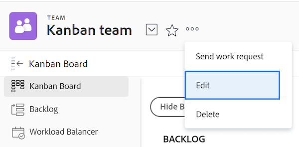

# 创建敏捷的团队

[!DNL Adobe Workfront] 使敏捷的团队能够以增量式、有组织的方式完成工作。

组织中的任何用户都可以查看敏捷团队并查看团队的所有敏捷组件，包括积压工作、迭代、文章展示板和单个文章。 但是，只有具有 [!UICONTROL 编辑] 访问工作可以对分配给团队的工作进行更改。

[!DNL Workfront] 支持以下灵活方法：

* **[!UICONTROL Scrum]**:各小组的工作积压，需要完成。 当团队准备好处理特定的工作块时，工作将从积压工作移到小版本。 有关管理Scrum团队的更多详细信息，请参阅 [在敏捷的团队中磨蹭](../../agile/use-scrum-in-an-agile-team/scrum-in-an-agile-team.md).

* **[!UICONTROL 看板]:** 团队在“看板”视图中跨预定状态移动工作。 默认状态为：积压、正在处理并完成。 有关管理看板团队的详细信息，请参阅 [敏捷团队中的看板](../../agile/use-kanban-in-an-agile-team/using-kanban-in-an-agile-team.md).

## 访问要求

您必须具有以下访问权限才能执行本文中的步骤：

<table style="table-layout:auto"> 
 <col> 
 </col> 
 <col> 
 </col> 
 <tbody> 
  <tr> 
   <td role="rowheader"><strong>[!DNL Adobe Workfront] 计划*</strong></td> 
   <td> 
任意
 </td> 
  </tr> 
  <tr> 
   <td role="rowheader"><strong>[!DNL Adobe Workfront] 许可证*</strong></td> 
   <td> 
[!UICONTROL计划]，创建新的敏捷团队；[!UICONTROL Work]或更高版本，将团队转换为灵活的团队
 </td> 
  </tr> 
 </tbody> 
</table>

&#42;要了解您拥有的计划或许可证类型，请联系 [!DNL Workfront] 管理员。

## 确定灵活方法

您可以为敏捷团队使用“看板”或“看板”敏捷方法。 每种方法都有各种好处。 敏捷团队的工作方式决定了您选择使用的敏捷方法。

中的Scrum和Kanban敏捷方法 [!DNL Workfront] 允许您在文章展示板中移动文章，以指示文章的状态更改和进度。

中的Scrum和Kanban灵活方法 [!DNL Workfront] 不同之处如下：

### 在中使用看板的好处 [!DNL Workfront]

的 [!DNL Kanban] 敏捷方法 [!DNL Workfront] 使您能够更轻松地在敏捷的文章展示板中移动文章，同时限制正在进行的工作量。 使用 [!DNL Kanban] 敏捷方法。

以下功能支持此方法：

* 在 [!DNL Kanban] 敏捷故事板。\
   有关更多信息，请参阅 [将积压工作添加到 [!UICONTROL 看板] 展示板](../../agile/use-kanban-in-an-agile-team/view-the-backlog-on-the-kanban-board.md).

* 配置待处理项目以自动添加到 [!UICONTROL 看板] 将其他项目移动到等于“完成”的状态时，可灵活显示文章展示板。\
   有关更多信息，请参阅 [配置要自动从积压工作中添加的文章](../../agile/get-started-with-agile-in-workfront/configure-kanban.md#configur5) 在文章中 [配置看板](../../agile/get-started-with-agile-in-workfront/configure-kanban.md).

* 配置要在 [!UICONTROL 看板] 敏捷故事板。\
   有关更多信息，请参阅 [在看板板上管理在制品(WIP)限制](../../agile/use-kanban-in-an-agile-team/work-in-progress-limit-on-the-kanban-board.md).

### 在中使用Scrum的好处 [!DNL Workfront]

Scrum敏捷方法 [!DNL Workfront] 允许您向灵活迭代中添加一组文章，并为该迭代创建一个文章展示板。 迭代基于您定义的开始和结束日期。

以下功能支持此方法：

* 包括 [!UICONTROL Scrum] 故事展示板
* 包括敏捷团队积压问题
* 子任务可显示在 [!UICONTROL Scrum] 故事展示板
* 查看燃耗图以查看迭代期间文章的进度\
   有关更多信息，请参阅 [敏捷燃耗图概述](../../agile/use-scrum-in-an-agile-team/burndown/burndown-chart-overview.md).

## 创建新的敏捷团队

1. 单击 **[!UICONTROL 主菜单]** 图标  的右上角 [!DNL Adobe Workfront]，然后单击 **[!UICONTROL 团队]**.
1. 单击 **[!UICONTROL 切换团队]** 图标 ，然后单击 **[!UICONTROL 新建团队]**.

   

1. 在 [!UICONTROL 新建团队] 对话框：

   <table style="table-layout:auto"> 
    <col> 
    <col> 
    <tbody> 
     <tr> 
      <td role="rowheader"><strong>[!UICONTROL团队名称]</strong> </td> 
      <td>键入新敏捷团队的名称。</td> 
     </tr> 
     <tr> 
      <td role="rowheader"><strong>[!UICONTROL这是一支敏捷的团队]</strong> </td> 
      <td>选择此选项可将此新团队配置为敏捷团队。</td> 
     </tr> 
     <tr data-mc-conditions="QuicksilverOrClassic.Quicksilver"> 
      <td role="rowheader"><strong>[!UICONTROL组]</strong> </td> 
      <td> 
开始键入要添加到团队的群组名称，然后在下拉列表中显示该名称时选择该名称。
 
注意：将团队分配到组或子组后，该组或子组的任何组管理员都可以管理团队，而不是其成员。 组管理员可以从[!UICONTROL主菜单]转到[!UICONTROL Teams]区域，然后单击[!UICONTROL Switch Teams]箭头  列出分配给其管理的组的所有团队。
 </td> 
     </tr> 
     <tr> 
      <td role="rowheader"><strong>[!UICONTROL团队成员]</strong> </td> 
      <td>开始键入要加入团队的用户名称，然后在下拉列表中显示该名称时选择该名称。 重复此过程以向团队添加多个用户。 由于用户可以位于多个团队中，因此他们可以同时位于敏捷团队和非敏捷团队中。</td> 
     </tr> 
     <tr> 
      <td role="rowheader"><strong>[!UICONTROL描述]</strong> </td> 
      <td>
键入团队的描述。
 
选择团队后，描述将显示在[!UICONTROL团队]区域的右上角。

      
如果描述较长，您可以单击该描述以在弹出窗口中显示完整描述。 如果您有权编辑[!UICONTROL团队设置]，则还可以直接在弹出窗口中编辑描述。
</td>
     </tr> 
    </tbody> 
   </table>

1. 单击&#x200B;**[!UICONTROL 创建]**。

   有关配置Agile团队的信息，请参阅以下文章：

   * [配置 [!UICONTROL 看板]](../../agile/get-started-with-agile-in-workfront/configure-kanban.md)
   * [配置 [!UICONTROL Scrum]](../../agile/get-started-with-agile-in-workfront/configure-scrum.md)

## 将现有团队转换为敏捷团队

您可以将现有团队转换为敏捷团队：

1. 单击 **[!UICONTROL 主菜单]** 图标  的右上角 [!DNL Adobe Workfront]，然后单击 **[!UICONTROL 团队]**.
1. 单击 **[!UICONTROL 切换组]** 图标 ，然后从下拉菜单中选择新团队，或在搜索栏中搜索团队。

1. 选择要转换为敏捷团队的团队。
1. 单击 **[!UICONTROL 更多]** 菜单，然后选择 **[!UICONTROL 编辑]**.\
   仅具有 [!UICONTROL 计划] 或 [!UICONTROL 工作] 许可证请参阅此选项。\
   

1. 在 **[!UICONTROL 敏捷]** 选择 **[!UICONTROL 这是一个敏捷的团队]**.

1. 在 **[!UICONTROL 方法]** ，选择团队是否将使用 **[!UICONTROL Scrum]** 或 **[!UICONTROL 看板]** 敏捷方法。

1. 单击 **保存更改。**

   有关配置Agile团队的信息，请参阅以下文章：

   * [配置 [!UICONTROL 看板]](../../agile/get-started-with-agile-in-workfront/configure-kanban.md)
   * [配置 [!UICONTROL Scrum]](../../agile/get-started-with-agile-in-workfront/configure-scrum.md)
