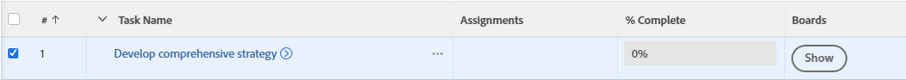

# 将现有任务或问题添加到[!DNL Workfront]展示板

>[!IMPORTANT]
>
>工作流仅适用于特定的客户组。

您可以从列表、报表视图或对象详细信息将任何任务或问题添加到[!DNL Adobe Workfront]中的展示板或工作流中。

## 访问权限要求

+++ 展开可查看本文所述功能的访问权限要求。

<table style="table-layout:auto">
 <col>
 <col>
 <tbody>
  <tr>
   <td role="rowheader">Adobe Workfront 包</td>
   <td> 
“任一”
 </td>
  </tr>
  <tr>
   <td role="rowheader">Adobe Workfront许可证</td>
   <td>
   
标准
 
   
工作版或更高版本

   </td>
  </tr>
  <tr>
   <td role="rowheader">对象权限</td>
   <td>查看任务或问题的更高权限 </td>
  </tr>
 </tbody>
</table>

有关此表中信息的详细信息，请参阅[Workfront文档中的访问要求](/help/quicksilver/administration-and-setup/add-users/access-levels-and-object-permissions/access-level-requirements-in-documentation.md)。

+++

## 从列表向展示板或工作流添加现有任务或问题

{{step1-click-main-menu}}

1. 选择以下选项之一： **[!UICONTROL 项目]**、**[!UICONTROL 报告]**&#x200B;或&#x200B;**[!UICONTROL 仪表板]**。
1. 转到项目、报告或仪表板，其中包含要添加到展示板或工作流的任务或问题。
1. 选择一个或多个任务或问题。

   如果选择子任务，它也会作为信息卡添加到展示板上。

1. 单击&#x200B;[!UICONTROL **更多**] > [!UICONTROL **添加到讨论区**]&#x200B;或&#x200B;[!UICONTROL **添加到工作流**]。
1. 在[!UICONTROL 添加到]对话框中，选择要将项目添加到的展示板或工作流。

   对于展示板，仅提供独立展示板，而不能提供属于工作流的展示板。

1. 单击&#x200B;[!UICONTROL **添加**]。

   对于展示板：任务或问题将作为信息卡添加到展示板。 如果主板应用了列策略来获取状态，则卡会添加到与其状态对应的列中。 否则，它将出现在左边的第一列中，但不包括进气列。

   有关列策略的信息，请参阅[管理展示板列](/help/quicksilver/agile/get-started-with-boards/manage-board-columns.md)。

   对于工作流：任务或问题将作为计划外信息卡添加到工作流的信息卡列表。

## 从对象详细信息将现有任务或问题添加到展示板或工作流

{{step1-click-main-menu}}

1. 单击&#x200B;[!UICONTROL **项目**]，然后单击项目名称以将其打开。
1. 单击左侧面板中的&#x200B;[!UICONTROL **任务**]&#x200B;或&#x200B;[!UICONTROL **问题**]。
1. 单击要添加到展示板或工作流的任务、子任务或问题。
1. 单击对象名称旁边的&#x200B;**[!UICONTROL 更多]**&#x200B;菜单，然后选择&#x200B;[!UICONTROL **添加到展示板**]&#x200B;或&#x200B;[!UICONTROL **添加到工作流**]。
1. 在[!UICONTROL 添加到]对话框中，选择要将项目添加到的展示板或工作流。

   对于展示板，只能使用独立展示板，不能使用属于工作流的主板。

1. 单击&#x200B;[!UICONTROL **添加**]。

   对于展示板：任务或问题将作为信息卡添加到展示板。 如果主板应用了列策略来获取状态，则卡会添加到与其状态对应的列中。 否则，它将出现在左边的第一列中，但不包括进气列。

   有关列策略的信息，请参阅[管理展示板列](/help/quicksilver/agile/get-started-with-boards/manage-board-columns.md)。

   对于工作流：任务或问题将作为计划外信息卡添加到工作流的信息卡列表。

## 从列表显示与任务或问题关联的讨论区

1. 转到项目、报表或功能板，其中包含要查看其讨论区信息的任务或问题。
1. 选择包含“展示板”列的视图，或使用“展示板”列创建新视图。
有关视图的信息，请参阅[在Adobe Workfront中创建或编辑视图](/help/quicksilver/reports-and-dashboards/reports/reporting-elements/create-edit-views.md)。
1. 单击列中的&#x200B;[!UICONTROL **显示**]&#x200B;以显示任务或问题所在讨论区列表。

   

1. 单击展示板名称以打开展示板上的已连接任务或问题。

   
