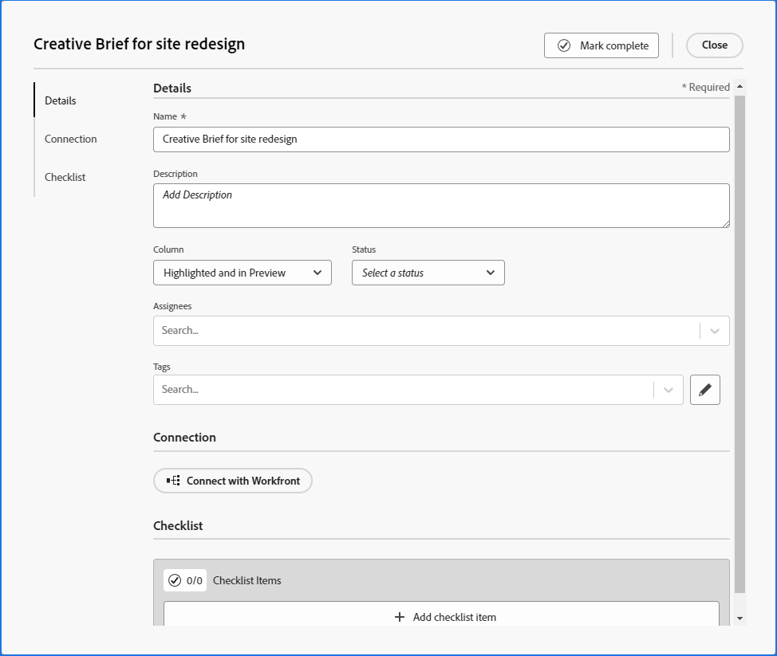

# 向展示板添加临时信息卡

{{highlighted-preview}}

您可以快速将信息卡添加到展示板，并将其分配给展示板上的成员。 该卡可以表示任务、问题、人员、组，或要包含在展示板中的任何类型的项目。

>[!NOTE]
>
>展示板上的临时卡片未连接到 [!DNL Adobe Workfront]. 有关已连接卡的详细信息，请参阅 [在主板上使用连接的卡](/help/quicksilver/agile/get-started-with-boards/connected-cards.md).

## 访问要求

您必须具有以下访问权限才能执行本文中的步骤：

<table style="table-layout:auto"> 
 <col> 
 </col> 
 <col> 
 </col> 
 <tbody> 
  <tr> 
   <td role="rowheader"><strong>[!DNL Adobe Workfront] 计划*</strong></td> 
   <td> 
任意
 </td> 
  </tr> 
  <tr> 
   <td role="rowheader"><strong>[!DNL Adobe Workfront] 许可证*</strong></td> 
   <td> 
[!UICONTROL请求]或更高版本
 </td> 
  </tr> 
 </tbody> 
</table>

&#42;要了解您拥有的计划、许可类型或访问权限，请联系您的 [!DNL Workfront] 管理员。

## 添加具有完整详细信息的临时卡片

临时卡未连接到 [!DNL Adobe Workfront].

1. 单击 **[!UICONTROL 主菜单]** 图标  的右上角 [!DNL Adobe] Workfront，然后单击 **[!UICONTROL 展示板]**.
1. 访问展示板。 有关信息，请参阅 [创建或编辑展示板](../../agile/get-started-with-boards/create-edit-board.md).
1. 单击 **[!UICONTROL 添加卡片] > [!UICONTROL 新卡片]**.
1. 在 **[!UICONTROL 卡片详细信息]** 框中，添加以下信息：

   <table style="table-layout:auto"> 
    <col> 
    <col> 
    <tbody> 
     <tr> 
      <td role="rowheader"><strong>[!UICONTROL名称]</strong> </td> 
      <td>卡片的名称。</td> 
     </tr> 
     <tr> 
      <td role="rowheader"><strong>[!UICONTROL描述]</strong> </td> 
      <td>卡的描述。 您可以在描述中添加URL，在保存卡片后，这些URL将变为可单击的链接。</td>
     </tr> 
     <tr> 
      <td role="rowheader"><strong>[!UICONTROL任务负责人]</strong> </td> 
      <td> 
要分配信息卡，请开始在搜索字段中键入名称，然后在信息卡显示在列表中时将其选中。 您可以添加个人和团队，并且可以为信息卡分配多个人员或团队。
 
受分配者必须是董事会成员，否则他们不会出现在选择列表中。 当团队是展示板上的成员时，可以将各个团队成员分配到卡片中。
</td>
     </tr> 
     <tr> 
      <td role="rowheader"><strong>[!UICONTROL Column]</strong> </td> 
      <td>选择卡的列。 如果您离开 <strong>[!UICONTROL Column]</strong> 字段，则卡片会放置在展示板左侧的第一列中。</td>
     </tr>
     <tr> 
      <td role="rowheader"><strong>[!UICONTROL状态]</strong> </td> 
      <td>选择卡的状态。 如果单击 <strong>[!UICONTROL标记结束]</strong> 在卡的顶部，状态会自动更改为[!UICONTROL Complete]。</td> 
     </tr>
     <tr> 
      <td role="rowheader"><strong>[!UICONTROL估计]</strong></td> 
      <td>键入卡片预计完成的小时数。 这只是手动输入。</td>
     </tr>
     <tr> 
      <td role="rowheader"><strong>[!UICONTROL到期日期]</strong></td> 
      <td>为卡选择到期日期。 </td>
     </tr>
     <tr> 
      <td role="rowheader"><strong>[!UICONTROL标记]</strong></td> 
      <td>搜索并选择卡的标记。 有关创建新标记的信息，请参阅 <a href="../../agile/get-started-with-boards/add-tags.md" class="MCXref xref">添加标记</a>.</td> 
     </tr>  
     <tr> 
      <td role="rowheader"><strong>[!UICONTROL核对清单项]</strong> </td> 
      <td> 
单击 <strong>[!UICONTROL添加核对清单项]</strong>. 然后，键入项目的标题并按Enter。 另一个项目会自动添加。 继续输入标题以添加更多项目。
 
清单顶部的计数器显示已完成项目的数量和项目总数。
 
有关核对清单项目的更多信息，请参阅 <a href="/help/quicksilver/agile/get-started-with-boards/manage-checklist-items.md">管理信息卡上的核对清单项目</a>.
 </td> 
     </tr> 
    </tbody> 
   </table>

   生产环境中的卡片详细信息图像示例：
   

   预览环境中的卡片详细信息图像示例：
   

   使用左侧的导航面板可在卡片详细信息的字段组之间移动。

   >[!NOTE]
   >
   >左侧导航面板和在“描述”字段中添加可单击链接的功能，只有通过为Workfront展示板提供早期功能选择加入才可用。

1. 单击 **[!UICONTROL 关闭]** 将信息卡添加到展示板。

   卡片上会显示受让人、标记、到期日期、核对清单计数器、预计小时数和状态。

## 快速添加临时卡片

您可以添加仅具有标题的临时信息卡，以快速填充展示板。

1. 访问要向其添加信息卡的展示板。
1. 单击 **[!UICONTROL 添加]** 图标  在要添加卡的列中。
1. 键入卡名称并按Enter。

   新卡片的下方会自动添加另一张卡。

1. 继续输入卡片名称以添加更多卡片。
1. 要停止添加信息卡，请单击列外部。
1. 要添加更多详细信息，您必须编辑信息卡。 有关信息，请参阅 [编辑现有信息卡](#edit-an-existing-card) 在本文中。

## 编辑现有信息卡 {#edit-an-existing-card}

1. 访问展示板。
1. 单击卡片名称可编辑该名称。
1. 要编辑卡片详细信息，请单击卡片（不在卡片名称中）。

   或

   单击 **[!UICONTROL 更多]** 菜单 ![[!UICONTROL “更多”菜单]](assets/more-icon-spectrum.png) ，然后选择 **[!UICONTROL 编辑]**.

1. 在 [!UICONTROL 卡片详细信息] 框中，根据需要更新信息，然后单击 **[!UICONTROL 关闭]** 回到董事会。

   如果启用了列策略来更新字段值，则更改信息卡上的状态会自动将信息卡移至相应的列。 有关更多信息，请参阅文章中的“定义列设置和策略” [管理展示板列](/help/quicksilver/agile/get-started-with-boards/manage-board-columns.md).
