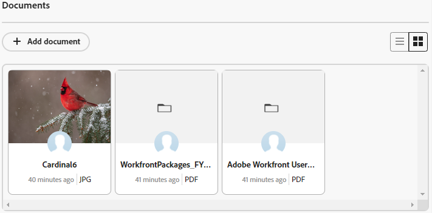

# 在信息卡上添加文档

您可以将文档添加到Adobe Workfront展示板上连接的信息卡。 您在信息卡中添加的任何文档都将在已连接任务或问题的文档选项卡上可用，并且您在任务或问题中添加的文档将显示在信息卡上。 这两个区域都支持相同的文件类型。 有关Workfront中文档的更多信息，请参阅[将文档从您的文件系统添加到Adobe Workfront](/help/quicksilver/documents/adding-documents-to-workfront/add-documents-from-file-system.md)。

>[!NOTE]
>
>文档仅在连接的信息卡上可用。 有关详细信息，请参阅[在展示板上使用连接的卡片](/help/quicksilver/agile/get-started-with-boards/connected-cards.md)。

## 访问要求

+++ 展开以查看本文中各项功能的访问要求。

<table style="table-layout:auto"> 
 <col> 
 <col> 
 <tbody> 
  <tr> 
   <td role="rowheader">Adobe Workfront包</td> 
   <td> 
任何
 </td> 
  </tr> 
  <tr> 
   <td role="rowheader">Adobe Workfront许可证</td> 
   <td> 
   
参与者或更高版本
 
   
请求或更高版本

   </td> 
  </tr> 
   <tr>
   <td role="rowheader">访问级别配置</td>
   <td>编辑对文档的访问权限</td>
  </tr>
 </tbody> 
</table>

有关此表中信息的更多详细信息，请参阅Workfront文档中的[访问要求](/help/quicksilver/administration-and-setup/add-users/access-levels-and-object-permissions/access-level-requirements-in-documentation.md)。

+++

## 将文档添加到信息卡

{{step1-to-boards}}

1. 打开要向其添加文档的已连接信息卡。
1. 将文件拖放到[!UICONTROL 文档]区域，或单击&#x200B;[!UICONTROL **添加文档**]&#x200B;以选择文件。

   文件出现在[!UICONTROL 文档]区域。

   

## 从信息卡查看现有文档

1. 在信息卡上，找到[!UICONTROL 文档]区域。 单击查看列表中的所有文档，或单击查看图库中的文档。
1. 将鼠标悬停在文档缩略图上，然后单击&#x200B;[!UICONTROL **预览**]&#x200B;以在浏览器中查看文件，或者单击&#x200B;[!UICONTROL **下载**]&#x200B;将文件下载到您的计算机。

   >[!NOTE]
   >
   >PDF不显示缩略图图像。
