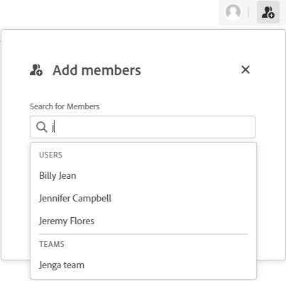

# 在讨论区中添加或删除成员

必须将人员和团队作为成员添加到讨论区，然后才能查看讨论区。

默认情况下，展示板的创建者是所有者。 留言板所有者是唯一可以在“配置”面板中删除该留言板或更新其过滤器的人。 只有系统管理员或当前的主板所有者才能更改主板所有者。

## 访问权限要求

+++ 展开可查看本文所述功能的访问权限要求。

<table style="table-layout:auto"> 
 <col> 
 <col> 
 <tbody> 
  <tr> 
   <td role="rowheader">Adobe Workfront 包</td> 
   <td> 
“任一”
 </td> 
  </tr> 
  <tr> 
   <td role="rowheader">Adobe Workfront许可证</td> 
   <td> 
   
参与者或更高
 
   
请求或更高版本

   </td> 
  </tr> 
 </tbody> 
</table>

有关此表中信息的更多详细信息，请参阅Workfront文档中的[访问要求](/help/quicksilver/administration-and-setup/add-users/access-levels-and-object-permissions/access-level-requirements-in-documentation.md)。

+++

## 将成员添加到讨论区

{{step1-to-boards}}

1. 创建新展示板或编辑现有展示板。 有关信息，请参阅[创建或编辑展示板](../../agile/get-started-with-boards/create-edit-board.md)。
1. 单击&#x200B;**[!UICONTROL 添加成员]**&#x200B;图标。
1. 在&#x200B;**[!UICONTROL 添加成员]**&#x200B;框中，开始键入名称，然后在列表中显示名称时选择该名称。

   您可以选择单个成员或团队。 如果您选择某个团队，则该团队本身会添加到展示板中。

   >[!NOTE]
   >
   >个人用户必须为团队在其访问级别中设置&#x200B;**[!UICONTROL 查看]**&#x200B;或&#x200B;**[!UICONTROL 编辑]**&#x200B;选项，否则他们将无法查看展示板。

   

## 从展示板中移除成员

{{step1-to-boards}}

1. 创建新展示板或编辑现有展示板。 有关信息，请参阅[创建或编辑展示板](../../agile/get-started-with-boards/create-edit-board.md)。
1. 单击&#x200B;**[!UICONTROL 添加成员]**&#x200B;图标。
1. 在&#x200B;**[!UICONTROL 添加成员]**&#x200B;框中，单击人员或团队名称旁边的X以将其从展示板中删除。

   

   从展示板移除成员时，不会从分配给成员的任何信息卡中移除成员。 对于已连接的信息卡，分配也会在[!DNL Workfront]任务或问题中更新。

   仅从该展示板移除成员。 它们不会从其所属的其他主板上移除。

   >[!NOTE]
   >
   >您不能删除展示板所有者。

## 更改展示板所有者

>[!NOTE]
>
>只有系统管理员或当前的主板所有者才能更改主板所有者。 一个展示板只能有一个所有者。
>
>可以在基本、追溯和Kanban展示板上更改展示板所有者，但不能更改动态展示板。

1. 访问展示板。
1. 单击讨论区名称旁边的&#x200B;**[!UICONTROL 更多]**&#x200B;菜单，然后选择&#x200B;**[!UICONTROL 更改讨论区所有者]**。
1. 在“更改展示板所有者”对话框中，搜索并选择想要成为该所有者的用户。

   无法搜索已成为展示板成员的用户。 要使现有成员成为所有者，必须先将它们从展示板中删除。 将用户设置为主板所有者会将用户添加到主板。

   只有用户才能成为展示板所有者。 团队不能是所有者。

1. 单击&#x200B;[!UICONTROL **更新**]。
