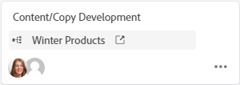
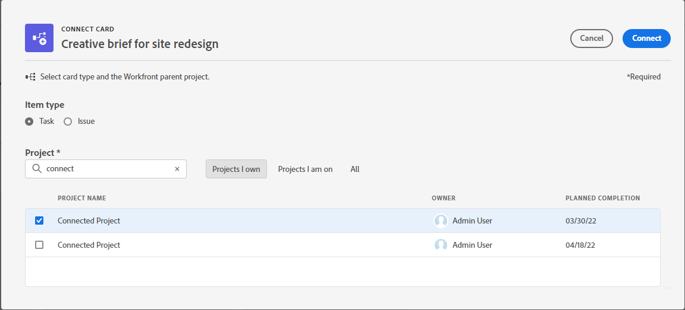
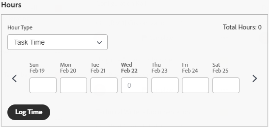

# 在主板上使用已连接的卡

<!-- Audited: 2/2024 -->

您可以在展示板上添加一个连接到[!DNL Workfront]中现有任务和问题的信息卡。

当在一个位置更新信息卡的以下任何详细信息时，都会在另一个位置自动更新该信息卡：

* [!UICONTROL 名称]
* [!UICONTROL 描述]
* [!UICONTROL 受分配人]
* [!UICONTROL 状态]
* [!UICONTROL 计划完成日期]
* [!UICONTROL 估计] / [!UICONTROL 故事点]
* [!UICONTROL 子任务]
* [!UICONTROL 文档]

若要将连接的卡与Workfront同步，请单击展示板名称旁边的&#x200B;**[!UICONTROL 更多]**&#x200B;菜单![[!UICONTROL 更多]](assets/more-icon-spectrum.png)，然后选择&#x200B;**[!UICONTROL 同步连接的项目]**。 已存档的信息卡不会同步到Workfront任务和问题。 如果您还原一张卡，它将再次同步。

>[!NOTE]
>
>每个展示板只能添加一次单个连接的任务或问题。 同一任务或问题可以连接到多个讨论区。

## 访问权限要求

+++ 展开可查看本文所述功能的访问权限要求。

<table style="table-layout:auto"> 
 <tbody> 
  <tr> 
   <td role="rowheader">Adobe Workfront 包</td> 
   <td> 
“任一”
 </td> 
  </tr> 
  <tr> 
   <td role="rowheader">Adobe Workfront许可证</td> 
   <td> 
   
参与者或更高
 
   
请求或更高版本

   </td> 
  </tr> 
  <tr>
   <td role="rowheader">访问级别配置</td>
   <td>
查看或更高权限的任务和问题
</td>
  </tr>
  <tr>
   <td role="rowheader">对象权限</td>
   <td>
查看或更高权限的Workfront任务或问题

</td>
  </tr>
 </tbody> 
</table>

有关此表中信息的详细信息，请参阅[Workfront文档中的访问要求](/help/quicksilver/administration-and-setup/add-users/access-levels-and-object-permissions/access-level-requirements-in-documentation.md)。

+++

## 添加连接的卡片

{{step1-to-boards}}

1. 访问展示板。 有关信息，请参阅[创建或编辑展示板](../../agile/get-started-with-boards/create-edit-board.md)。
1. 单击&#x200B;**[!UICONTROL 添加卡片] > [!UICONTROL 连接的卡片]**。
1. 选择一个项目，然后选择一个任务或问题，将其添加为讨论区中的信息卡。

   您可以选择多个对象，它们都将作为单独的卡添加。

   >[!NOTE]
   >
   >* 搜索结果中只有您具有权限的对象可用。 如果项目变暗，则表示该项目已添加到讨论区。
   >* 当您按&#x200B;**[!UICONTROL 我拥有的项目]**&#x200B;或&#x200B;**[!UICONTROL 我所在的项目]**&#x200B;进行筛选时，等于完成、失效或拒绝状态的项目不包括在内。 您仍可以使用&#x200B;**[!UICONTROL 全部]**&#x200B;筛选器搜索这些项目。

1. 单击&#x200B;**[!UICONTROL 添加]**。

   

   该卡将添加到最左列的底部。 卡片上将显示连接的[!DNL Workfront]对象及其分配人。

   

1. 单击以在新浏览器选项卡中打开[!DNL Workfront]任务或问题。
1. 要编辑卡片的详细信息，请单击卡片（而不是卡片名称）。

   或

   单击卡片上的&#x200B;**[!UICONTROL 更多]**&#x200B;菜单，然后选择&#x200B;**[!UICONTROL 编辑]**。

1. 在&#x200B;**[!UICONTROL 卡片详细信息]**&#x200B;框中，添加或更新以下信息：

   <table style="table-layout:auto"> 
    <tbody> 
     <tr> 
      <td role="rowheader"><strong>[!UICONTROL 名称]</strong></td> 
      <td>更改名称也会更改连接的[!DNL Workfront]对象上的名称。</td> 
     </tr> 
     <tr> 
      <td role="rowheader"><strong>[!UICONTROL 描述]</strong></td> 
      <td>更改描述也会更改连接的[!DNL Workfront]对象上的描述。 您可以在描述中添加URL，当保存信息卡时，这些URL将成为可点击的链接。</td> 
     </tr>
     <tr>
      <td role="rowheader"><strong>[!UICONTROL 列]</strong></td>
      <td>选择卡所在的列。</td>
     </tr>
     <tr>
      <td role="rowheader"><strong>[!UICONTROL Status]</strong></td>
      <td>
选择卡的状态。 默认值为[!UICONTROL New]、[!UICONTROL In Progress]和[!UICONTROL Complete]，但也可以使用为[!DNL Workfront]中的项目定义的任何自定义状态。

      
如果您启用了列策略来更新字段值，则更改信息卡上的状态会自动将信息卡移动到相应的列。 有关详细信息，请参阅文章<a href="/help/quicksilver/agile/get-started-with-boards/manage-board-columns.md" class="MCXref xref">管理展示板列</a>中的“定义列设置和策略”。

      
如果单击信息卡顶部的<strong>[!UICONTROL 标记完成]</strong>，状态将自动变为“完成”。
</td>
     </tr>
     <tr>
      <td role="rowheader"><strong>[!UICONTROL 计划完成]</strong></td>
      <td>更改此日期还会更改连接的[!DNL Workfront]对象的计划完成日期。</td>
     </tr>
      <tr>
      <td role="rowheader"><strong>[!UICONTROL Estimation]</strong></td>
      <td>
完成信息卡的小时数。

更改估计还会更改连接的[!DNL Workfront]对象上的文章点值。
</td>
     </tr>
     <tr>
      <td role="rowheader"><strong>[!UICONTROL Assignments]</strong></td>
      <td>
要为该信息卡分配更多人员或团队，请单击<strong>[!UICONTROL 添加分配]</strong>，然后在搜索字段中开始键入名称。 然后，当它显示在结果列表中时将其选中。 您可以同时添加个人和团队。 一个连接的卡只允许分配一个团队。

      
您选择的所有任务接受者也会被分配到[!DNL Workfront]中的任务或问题。
</td>
     </tr>
     <tr>
      <td role="rowheader"><strong>[!UICONTROL 标记]</strong></td>
      <td>
搜索并选择卡的标签。

      
有关创建新标签的信息，请参阅<a href="../../agile/get-started-with-boards/add-tags.md" class="MCXref xref">添加标签</a>。
</td>
     </tr>
     <tr>
      <td role="rowheader"><strong>[!UICONTROL 自定义字段]</strong></td>
      <td>
您添加的任何自定义字段都会显示在此区域中。

      
有关详细信息，请参阅<a href="/help/quicksilver/agile/get-started-with-boards/customize-fields-on-card.md">自定义卡片上显示的字段</a>。
</td>
     </tr>
     <tr>
     <tr>
      <td role="rowheader"><strong>[!UICONTROL Subtask]</strong></td>
      <td>
此部分将显示任务的任何现有子任务。 单击<strong>[!UICONTROL 添加子任务]</strong>以添加新子任务。

      
部分顶部的计数器显示已完成的子任务数和子任务总数。

      
有关子任务的详细信息，请参阅<a href="/help/quicksilver/agile/get-started-with-boards/manage-subtasks-on-boards.md">管理展示板上的子任务</a>。
</td>
     </tr>
     <tr> 
      <td role="rowheader"><strong>[!UICONTROL 核对清单]</strong></td>
      <td>
单击<strong>[!UICONTROL 添加清单项目]</strong>。 然后，键入项目的标题并按Enter。 系统会自动添加另一个项目。 继续输入标题以添加更多项目。

      
清单顶部的计数器显示已完成项目的数量和项目总数。
 
有关清单项目的详细信息，请参阅<a href="/help/quicksilver/agile/get-started-with-boards/manage-checklist-items.md">管理卡片上的清单项目</a>。
</td>
     </tr>
     <tr>
      <td role="rowheader"><strong>[!UICONTROL 文档]</strong></td>
      <td>对于现有文档，将鼠标悬停在文档缩略图上，然后单击<strong>预览</strong>以在浏览器中查看文件，或者单击<strong>下载</strong>将文件下载到您的计算机。 有关新文档，请参阅<a href="/help/quicksilver/agile/get-started-with-boards/add-documents-on-cards.md">添加信息卡上的文档</a>。</td>
     </tr>
     <tr>
      <td role="rowheader"><strong>[!UICONTROL 小时]</strong></td>
      <td>请参阅下面的“在连接的卡上记录小时数”。</td>
     </tr>
     <tr>
      <td role="rowheader"><strong>[!UICONTROL Comments]</strong></td>
      <td>
单击<strong>[!UICONTROL 新建评论]</strong>字段并键入您的评论。 使用格式设置工具设置文本的格式。 要标记人员或团队，请使用评论区域底部的搜索框。 用户不必是讨论区的成员。 已连接信息卡上已标记的用户将收到电子邮件通知。

单击<strong>[!UICONTROL Submit]</strong>以将评论添加到卡片。

      
有关注释的详细信息，请参阅<a href="/help/quicksilver/workfront-basics/updating-work-items-and-viewing-updates/update-work.md">更新工作</a>。
</td>
     </tr>
     <tr> 
      <td role="rowheader"><strong>[!UICONTROL System activity]</strong></td> 
      <td>
如果您已将<strong>系统活动</strong>启用为卡分区，则该活动将显示在此区域中。
 
有关详细信息，请参阅<a href="/help/quicksilver/agile/get-started-with-boards/customize-fields-on-card.md">自定义哪些字段显示在卡上</a>和<a href="/help/quicksilver/administration-and-setup/set-up-workfront/system-tracked-update-feeds/system-tracked-update-feeds.md">系统跟踪更新</a>。
</td>
     </tr>     
    </tbody> 
   </table>

   使用左侧导航面板在卡详细信息上的字段部分之间移动。

1. 单击&#x200B;**[!UICONTROL 关闭]**&#x200B;返回讨论区。
卡片上将显示连接的对象、任务接受者、标记、截止日期、清单计数器、估计小时数和状态。

   

## 断开连接的卡

您可以断开已连接信息卡与其Workfront对象的连接，并且该信息卡会作为可编辑的临时信息卡保留在展示板上。

>[!NOTE]
>
>如果断开动态展示板上已连接卡的连接，则在刷新展示板时，该卡会重新出现，因为此展示板类型从特定项目提取所有任务和问题。
>
>如果断开已连接信息卡与任何其他具有引入列的展示板类型的连接，则在刷新展示板时，如果尚未将已连接任务或问题标记为完成，该信息卡将重新出现在引入列中。
>
>在这两种情况下，在刷新之后，您将拥有两个用于同一任务或问题的信息卡：临时信息卡和连接的信息卡。

要在主板级别断开卡，请执行以下操作：

1. 访问展示板。
1. 单击所连接卡上的&#x200B;**[!UICONTROL 更多]**&#x200B;菜单，然后选择&#x200B;**[!UICONTROL 断开连接]**。
1. 单击确认消息上的&#x200B;**[!UICONTROL 断开连接]**。

要在卡级别断开卡的连接，请执行以下操作：

1. 访问主板并打开已连接的卡。
1. 在卡详细信息的“连接”区域中单击&#x200B;**[!UICONTROL 更多]**&#x200B;菜单，然后选择&#x200B;**[!UICONTROL 断开连接]**。
1. 在确认消息上单击&#x200B;**[!UICONTROL 断开连接]**。

## 将Ad Hoc卡转换为连接的卡

创建临时信息卡后，可将其转换为已连接的信息卡。 有关临时信息卡的详细信息，请参阅[将临时信息卡添加到展示板](/help/quicksilver/agile/get-started-with-boards/add-card-to-board.md)。

1. 访问展示板并打开Ad Hoc卡。
1. 验证卡上的名称和描述。 它们将被添加到您在[!DNL Workfront]中创建的任务或问题中。
1. 在卡片详细信息的[!UICONTROL 连接]区域中，单击&#x200B;**[!UICONTROL 与Workfront连接]**。
1. 在[!UICONTROL 连接卡]窗口中，选择您是在创建任务还是在创建问题。
1. 搜索并选择要将任务或问题添加到的项目。

   >[!NOTE]
   >
   >* 搜索结果中只有您具有权限的对象可用。
   >* 当您按&#x200B;**[!UICONTROL 我拥有的项目]**&#x200B;或&#x200B;**[!UICONTROL 我所在的项目]**&#x200B;进行筛选时，不包括[!UICONTROL 完成]、[!UICONTROL 死亡]或[!UICONTROL 已拒绝]状态的项目。 您仍然可以使用&#x200B;**[!UICONTROL 所有]**&#x200B;筛选器搜索这些项目。

1. 单击&#x200B;**[!UICONTROL 连接]**。

   

   项目名称将显示在卡详细信息上的“连接”区域中。

1. 单击&#x200B;**[!UICONTROL 关闭]**&#x200B;返回讨论区。

## 在已连接的卡上记录小时数

您必须具有正确的权限，才能在连接的任务或问题上记录工时。

默认情况下，已连接的卡上不显示时间记录字段。 必须在&#x200B;[!UICONTROL **卡**]&#x200B;下的[!UICONTROL 配置]区域中启用[!UICONTROL 小时]。 有关详细信息，请参阅[自定义卡片上显示的字段](/help/quicksilver/agile/get-started-with-boards/customize-fields-on-card.md)。

1. 输入任务或问题的小时数。
1. 从下拉菜单中选择[!UICONTROL 小时类型]（如果它与默认值不同）。
1. 单击&#x200B;[!UICONTROL **记录时间**]。

   

   信息卡上的登录时间也会保存在连接的任务或问题上。

信息卡上的记录时间与任务或问题的记录时间相同。 有关详细信息，请参阅[记录时间](/help/quicksilver/timesheets/create-and-manage-timesheets/log-time.md)一文中的“记录项目、任务或问题的时间”。

