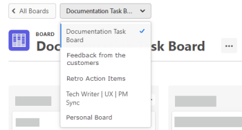

# 创建或编辑展示板

从 [!UICONTROL 讨论区] 图标板中，您可以创建新展示板或编辑现有展示板。

要将展示板添加到收藏集，请参阅 [管理收藏集](/help/quicksilver/agile/use-boards-agile-planning-tools/manage-collections.md).

## 访问要求

您必须具有以下权限才能执行本文中的步骤：

<table style="table-layout:auto"> 
 <col> 
 <col> 
 <tbody> 
  <tr> 
   <td role="rowheader"><strong>[!DNL Adobe Workfront] 计划*</strong></td> 
   <td> 
任意
 </td> 
  </tr> 
  <tr> 
   <td role="rowheader"><strong>[!DNL Adobe Workfront] 许可证*</strong></td> 
   <td> 
[！UICONTROL Request]或更高版本
 </td> 
  </tr> 
 </tbody> 
</table>

&#42;要了解您拥有什么计划、许可证类型或访问权限，请联系贵机构的 [!DNL Workfront] 管理员。

## 创建新展示板

1. 单击 **[!UICONTROL 主菜单]** 图标  （位于的右上角） [!DNL Adobe Workfront]，然后单击 **[!UICONTROL 讨论区]**.
1. 要创建独立展示板，请单击 **[!UICONTROL 添加展示板]** 在 [!UICONTROL 讨论区] 区域。 要将展示板添加到收藏集，请参阅 [管理收藏集](/help/quicksilver/agile/use-boards-agile-planning-tools/manage-collections.md).

   >[!NOTE]
   >
   > 收藏集只能通过的早期功能选择加入获得 [!DNL Workfront] [!UICONTROL 讨论区].

1. 为展示板选择模板。

   | 模板 | 描述 |
   |---------|----------|
   | 基本展示板 | 展示板上提供了三个默认列。 可以添加新列，也可以重命名或删除缺省列。 
展示板上提供了三个默认列。 可以添加新列，也可以重命名或删除缺省列。 |
   | Kanban 展示板 | 展示板上提供了以下列：“积压”、“新建”、“进行中”、“完成”和“暂停”。 可以添加新列，也可以重命名或删除缺省列。
要使用积压，必须为引入列设置过滤器。 有关信息，请参阅 [向展示板添加引入列](/help/quicksilver/agile/use-boards-agile-planning-tools/add-intake-column-to-board.md). 
要查看每列的默认策略，请单击 [!UICONTROL **更多** 菜单] 在列上并选择 [!UICONTROL **编辑**]. 您可以更改这些预设策略中的任何一个。 有关信息，请参阅 [管理展示板列](/help/quicksilver/agile/get-started-with-boards/manage-board-columns.md). |
   | 回顾展示板 | 展示板上提供了以下列：哪些方面进展顺利？ 有什么可以改进的? 我们应该为谁庆祝? 我们可以做些什么来加快步伐？? 可以添加新列，也可以重命名或删除缺省列。 
未应用任何列策略。 |

   >[!NOTE]
   >
   > 仅可通过提前选择加入功能获得讨论区模板 [!DNL Workfront] [!UICONTROL 讨论区].

1. 在中键入讨论区的名称 **[!UICONTROL 讨论区]** 字段，然后按Enter。
1. 根据需要配置主板。

   有关信息，请参阅 [在讨论区中添加或移除成员](../../agile/get-started-with-boards/add-members-to-board.md)， [管理展示板列](../../agile/get-started-with-boards/manage-board-columns.md)， [向展示板添加临时信息卡](../../agile/get-started-with-boards/add-card-to-board.md)、和 [在展示板上使用连接的信息卡](/help/quicksilver/agile/get-started-with-boards/connected-cards.md).

1. 单击 **[!UICONTROL 所有讨论区]** 以返回到展示板功能板。

   您还可以找到标有当前主板名称的下拉菜单，然后单击该菜单切换到另一个主板。

   

## 编辑现有展示板

1. 单击 **[!UICONTROL 主菜单]** 图标  （位于的右上角） [!DNL Adobe Workfront]，然后单击 **[!UICONTROL 讨论区]**.
1. 在操控板上，选择要打开的面板。
1. 根据需要编辑展示板。 您可以单击电路板名称来重命名它。

   有关信息，请参阅 [在讨论区中添加或移除成员](../../agile/get-started-with-boards/add-members-to-board.md)， [管理展示板列](../../agile/get-started-with-boards/manage-board-columns.md)、和 [向展示板添加信息卡](../../agile/get-started-with-boards/add-card-to-board.md).

1. 单击 **[!UICONTROL 所有讨论区]** 以返回到展示板功能板。

   您还可以找到标有当前主板名称的下拉菜单，然后单击该菜单切换到另一个主板。
