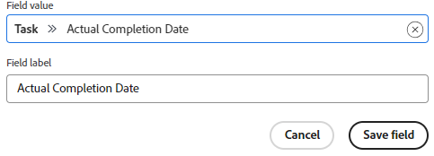

# 自定义在卡片上显示的字段

默认情况下，所有可用字段都将显示在卡上，既可以显示在卡打开时的完整视图中，也可以显示在主板上的紧缩卡视图中。 您可以通过以下方式自定义显示哪些字段：

* 禁用字段，使其不显示在任一视图中
* 在紧缩卡视图中隐藏字段

如果某个字段包含值，而您禁用了该字段，那么如果您稍后再次启用该字段，该值将保留。

部分（在卡详细信息上显示为左侧导航选项）也可用于显示和隐藏。

您还可以显示以前创建的自定义字段。 不能在讨论区中设计和创建新的自定义字段。

>[!NOTE]
>
>您所做的任何字段自定义都仅适用于您正在使用的展示板。

## 访问权限要求

+++ 展开可查看本文所述功能的访问权限要求。

<table style="table-layout:auto"> 
 <col> 
 <col> 
 <tbody> 
  <tr> 
   <td role="rowheader">Adobe Workfront 包</td> 
   <td> 
“任一”
 </td> 
  </tr> 
  <tr> 
   <td role="rowheader">Adobe Workfront许可证</td> 
   <td> 
   
参与者或更高版本
 
   
请求或更高版本

   </td> 
  </tr> 
 </tbody> 
</table>

有关此表中信息的更多详细信息，请参阅Workfront文档中的[访问要求](/help/quicksilver/administration-and-setup/add-users/access-levels-and-object-permissions/access-level-requirements-in-documentation.md)。

+++

## 配置信息卡 {#configure-cards}

{{step1-to-boards}}

1. 访问展示板。 有关信息，请参阅[创建或编辑展示板](../../agile/get-started-with-boards/create-edit-board.md)。
1. 单击讨论区右侧的&#x200B;[!UICONTROL **“配置”**]&#x200B;以打开“配置”面板。
1. 展开&#x200B;[!UICONTROL **卡**]。

   默认情况下，大多数字段和节处于启用状态。

1. 关闭字段或部分以在这两个卡片视图中禁用它。
1. 单击字段或区域旁边的“隐藏”图标以在压缩视图上隐藏它。
1. 要显示两个视图中的所有字段和节，请单击&#x200B;[!UICONTROL **将所有字段还原为默认值**]。
1. 单击&#x200B;[!UICONTROL **隐藏配置**]&#x200B;以关闭“配置”面板。

## 将自定义字段添加到卡片

已连接的卡上提供了自定义字段。 它们仅在全卡视图中可见，在主板上的紧缩视图中不可见。

自定义字段上的数据可以在卡上编辑，但某些自定义元素可能只能在原始字段上编辑，不能在卡上编辑。

1. 访问展示板并单击&#x200B;[!UICONTROL **配置**]&#x200B;以打开“配置”面板。
1. 展开&#x200B;[!UICONTROL **卡片**]。
1. 在[!UICONTROL 卡片字段]下，单击&#x200B;[!UICONTROL **添加自定义字段**]。
1. 选择&#x200B;[!UICONTROL **任务**]&#x200B;或&#x200B;[!UICONTROL **问题**]。

   出现任务或问题的可用字段类别。 展开类别以查看所有字段。 您还可以搜索字段。

   

   >[!NOTE]
   >
   >以下字段类型无法添加到信息卡：Adobe XD、图像、PDF、视频。

1. 选择字段名称。
1. （可选）单击&#x200B;**[!UICONTROL 字段值]**&#x200B;字段以将此自定义字段更改为其他字段。
1. （可选）将&#x200B;**[!UICONTROL 字段标签]**&#x200B;更改为要显示在卡片上的字段名称。
1. 完成更改后，单击&#x200B;[!UICONTROL **保存字段**]。

   

   该自定义字段将添加到可用字段列表中，并默认处于启用状态。 您可以按照上述[配置信息卡](customize-fields-on-card.md#configure-cards)部分中的步骤禁用自定义字段、编辑该字段或从所有信息卡中删除该字段。

>[!NOTE]
>
>如果您稍后在Workfront中重命名自定义字段，则必须编辑“配置”面板上的字段标签以使其匹配，否则该字段将不会显示在卡片上。

## 显示或隐藏已存档的信息卡

必须启用配置设置才能在讨论区中显示存档的卡。

1. 访问展示板并单击&#x200B;[!UICONTROL **配置**]&#x200B;以打开“配置”面板。
1. 展开&#x200B;[!UICONTROL **卡片**]。
1. 打开&#x200B;[!UICONTROL **在展示板上显示已存档的卡片**]。

   现在，您可以筛选展示板以显示已存档的任何信息卡。 有关详细信息，请参阅[在讨论区中筛选和搜索](/help/quicksilver/agile/get-started-with-boards/filter-search-in-board.md)。

1. 单击&#x200B;[!UICONTROL **隐藏配置**]&#x200B;以关闭配置面板。

## 配置信息卡减少

要在一段时间后自动从展示板中删除信息卡，请参阅[配置信息卡减少](/help/quicksilver/agile/use-boards-agile-planning-tools/configure-card-falloff.md)。
