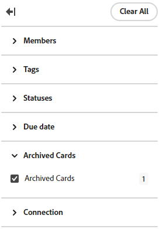

# 从讨论区中删除或存档卡

当您从讨论区中删除某个临时卡时，该卡将被永久删除，且无法恢复。 删除已连接的卡后，可以手动将其添加回讨论区。

如果从动态讨论区中删除已连接的卡，则在刷新讨论区时将重新显示该卡，因为此讨论区类型会提取特定项目的所有任务和问题。 要删除信息卡，必须从Workfront项目中删除已连接的任务或问题。

从任何其它具有引入列的电路板类型中删除已连接卡时，如果尚未将已连接任务或问题标记为完成，则当您刷新电路板时，该卡将重新出现在引入列中。 有关导入列的详细信息，请参阅[向讨论区添加导入列](/help/quicksilver/agile/use-boards-agile-planning-tools/add-intake-column-to-board.md)。

对卡进行存档会将卡发送到存档中，以后您就可以将其恢复到主板上。

存档的卡不会同步到Workfront任务和问题。 如果您还原一张卡，它将再次同步。

## 访问权限要求

+++ 展开可查看本文所述功能的访问权限要求。

<table style="table-layout:auto"> 
 <col> 
 <col> 
 <tbody> 
  <tr> 
   <td role="rowheader">Adobe Workfront 包</td> 
   <td> 
“任一”
 </td> 
  </tr> 
  <tr> 
   <td role="rowheader">Adobe Workfront许可证</td> 
   <td> 
   
投稿人或更高版本
 
   
请求或更高版本

   </td> 
  </tr> 
 </tbody> 
</table>

有关此表中的信息的更多详细信息，请参阅Workfront文档中的[访问要求](/help/quicksilver/administration-and-setup/add-users/access-levels-and-object-permissions/access-level-requirements-in-documentation.md)。

+++

## 从讨论区中删除卡

{{step1-to-boards}}

1. 访问讨论区。 有关信息，请参阅[创建或编辑讨论区](../../agile/get-started-with-boards/create-edit-board.md)。
1. 单击卡上的&#x200B;**[!UICONTROL 更多]**&#x200B;菜单，然后选择&#x200B;**[!UICONTROL 删除]**。
1. 单击确认消息上的&#x200B;**[!UICONTROL “删除”]**。

## 从讨论区存档卡

1. 访问讨论区。
1. 单击卡片上的&#x200B;**[!UICONTROL 更多]**&#x200B;菜单，然后选择&#x200B;**[!UICONTROL 存档]**。

   已存档的卡片将从讨论区中隐藏，除非应用筛选条件来显示它们。 有关详细信息，请参阅本文中的[筛选讨论区以显示存档的卡片](#filter-a-board-to-show-archived-cards)。

   已存档的卡片上显示[!UICONTROL 存档]图标。 您无法编辑已存档的卡片，但可以将其删除或移动到另一列。

1. 要还原已存档的卡，请单击卡上的&#x200B;**[!UICONTROL 更多]**&#x200B;菜单，然后选择&#x200B;**[!UICONTROL 还原]**。

## 筛选讨论区以显示存档的卡片

默认情况下，一个讨论区中只显示现用卡。 您可以筛选讨论区，以显示任何已存档的卡片。

1. 访问讨论区。
1. 单击讨论区右侧的&#x200B;[!UICONTROL **“配置”**]&#x200B;以打开“配置”面板。
1. 展开&#x200B;[!UICONTROL **卡**]。
1. 打开&#x200B;[!UICONTROL **在讨论区中显示存档的卡片**]。
1. 单击&#x200B;[!UICONTROL **筛选器**]，展开[!UICONTROL 存档的卡片]部分，然后选择&#x200B;**[!UICONTROL 存档的卡片]**&#x200B;以显示任何存档的卡片。

   此过滤器显示已存档的卡数。

   

   >[!NOTE]
   >
   >如果尚未启用显示存档卡的配置设置，则筛选器中无[!UICONTROL 存档卡]部分可用。 有关详细信息，请参阅[自定义卡片上显示的字段](/help/quicksilver/agile/get-started-with-boards/customize-fields-on-card.md)。

1. 再次选择&#x200B;**[!UICONTROL 已存档的卡片]**&#x200B;以清除该选项并仅显示处于活动状态的卡片。
