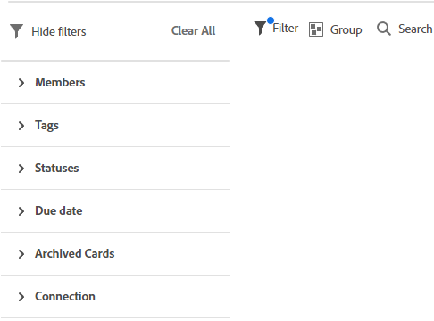
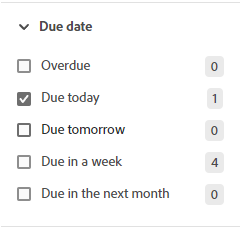

# 在展示板中筛选和搜索

您可以过滤展示板以显示：

* 分配给特定人员的卡片
* 具有特定标记的信息卡
* 具有特定状态的卡
* 在特定时间范围内到期的卡
* 存档的卡片
* 连接到特定项目的卡

搜索还可帮助您在展示板上找到特定的信息卡。

应用过滤器后，展示板上会显示一个指示器 . 单击 **[!UICONTROL 全部清除]** 要从展示板中删除所有过滤器，请单击 **[!UICONTROL 隐藏过滤器]** 来关闭过滤器面板。

## 访问要求

您必须具有以下访问权限才能执行本文中的步骤：

<table style="table-layout:auto"> 
 <col> 
 <col> 
 <tbody> 
  <tr> 
   <td role="rowheader"><strong>[!DNL Adobe Workfront] 计划*</strong></td> 
   <td> 
任意
 </td> 
  </tr> 
  <tr> 
   <td role="rowheader"><strong>[!DNL Adobe Workfront] 许可证*</strong></td> 
   <td> 
[!UICONTROL请求]或更高版本
 </td> 
  </tr> 
 </tbody> 
</table>

&#42;要了解您拥有的计划、许可类型或访问权限，请联系您的 [!DNL Workfront] 管理员。

## 按受分配者筛选展示板

1. 单击 **[!UICONTROL 主菜单]** 图标  的右上角 [!DNL Adobe Workfront]，然后单击 **[!UICONTROL 展示板]**.
1. 访问展示板。 有关信息，请参阅 [创建或编辑展示板](../../agile/get-started-with-boards/create-edit-board.md).
1. 单击过滤器图标 ，展开 [!UICONTROL 成员] ，然后选择要查看其卡片的人员。 您还可以显示未分配的卡。

   

## 按标记筛选展示板

1. 访问展示板。
1. 单击过滤器图标 ，展开 [!UICONTROL 标记] ，然后选择要查看的标记。

   

## 按状态筛选展示板

1. 访问展示板。
1. 单击过滤器图标 ，展开 [!UICONTROL 状态] ，然后选择要查看的状态类型。

   您还可以隐藏已完成的信息卡。

   

## 按截止日期筛选展示板

1. 访问展示板。
1. 单击过滤器图标 ，展开 [!UICONTROL 到期日期] ，然后选择要查看的日期选项。

   只显示选定日期范围内的卡。

   

## 筛选展示板以显示存档的信息卡

默认情况下，展示板中只显示活动信息卡。 您可以过滤展示板以显示任何存档的信息卡。

1. 访问展示板。
1. 单击过滤器图标 ，展开 [!UICONTROL 存档卡片] ，然后选择 **[!UICONTROL 存档的卡片]** 以显示任何已存档的卡。

   过滤器显示已存档的卡的数量。

   

1. 选择 **[!UICONTROL 存档的卡片]** 再次清除选项并仅显示活动卡。

## 按连接筛选展示板

1. 访问展示板。
1. 单击过滤器图标 ，展开 [!UICONTROL 连接] ，然后选择 [!DNL Workfront] 项目。

   您还可以显示未连接到项目的信息卡。

   

## 在展示板中搜索

1. 访问展示板。
1. 单击搜索图标  并键入搜索词。 然后，按Enter。

   将显示包含搜索词的所有卡片。

   单击X以清除搜索。

   ![[!UICONTROL 在展示板中搜索信息卡]](assets/boards-searchbox.png)
