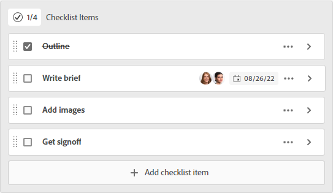

# 管理信息卡上的核对清单项目

通过在信息卡中使用核对清单，您可以将工作细分为较小的增量或在信息卡中添加注释。 临时卡和连接卡上都提供了核对清单项目。

有关信息卡的信息，请参阅 [向展示板添加临时信息卡](/help/quicksilver/agile/get-started-with-boards/add-card-to-board.md), [在主板上使用连接的卡](/help/quicksilver/agile/get-started-with-boards/connected-cards.md)和 [管理信息卡](/help/quicksilver/agile/get-started-with-boards/move-board-items.md).

## 访问要求

您必须具有以下访问权限才能执行本文中的步骤：

<table style="table-layout:auto"> 
 <col> 
 </col> 
 <col> 
 </col> 
 <tbody> 
  <tr> 
   <td role="rowheader"><strong>[!DNL Adobe Workfront] 计划*</strong></td> 
   <td> 
任意
 </td> 
  </tr> 
  <tr> 
   <td role="rowheader"><strong>[!DNL Adobe Workfront] 许可证*</strong></td> 
   <td> 
[!UICONTROL请求]或更高版本
 </td> 
  </tr> 
 </tbody> 
</table>

&#42;要了解您拥有的计划、许可类型或访问权限，请联系您的 [!DNL Workfront] 管理员。

## 向信息卡中添加核对清单

1. 单击 **[!UICONTROL 主菜单]** 图标  在Adobe Workfront的右上角，单击 **[!UICONTROL 展示板]**.
1. 访问展示板。 有关信息，请参阅 [创建或编辑展示板](../../agile/get-started-with-boards/create-edit-board.md).
1. 单击卡以打开 [!UICONTROL 卡片详细信息] 框中。

   或

   单击 **[!UICONTROL 更多]** 菜单  ，然后选择 **[!UICONTROL 编辑]**.

1. 要添加新项目，请单击 **[!UICONTROL 添加核对清单项目]**. 然后，键入项目的标题并按Enter。 另一个项目会自动添加。 继续输入标题以添加更多项目。

   清单顶部的计数器显示已完成项目的数量和项目总数。

1. 单击  打开 [!UICONTROL 核对清单项目详细信息] 框中。

   

1. （可选）为核对清单项目添加说明、受让人、到期日期和估计小时数。

   有关其中任何字段的信息，请参阅 [向展示板添加临时信息卡](/help/quicksilver/agile/get-started-with-boards/add-card-to-board.md) 或 [在主板上使用连接的卡](/help/quicksilver/agile/get-started-with-boards/connected-cards.md).

1. 单击 **[!UICONTROL 关闭]** 以返回卡片详细信息和完整的核对清单项目列表。

   任务分配人和到期日期显示在项目上。

1. 要复制项目，请单击 **[!UICONTROL 更多]** 菜单  并选择 **[!UICONTROL 复制]**.
1. 要删除核对清单项目，请单击 **[!UICONTROL 更多]** 菜单  并选择 **[!UICONTROL 删除]**.

## 完成核对清单项目

1. 访问展示板，并找到核对清单上的卡。
1. 单击卡以打开 [!UICONTROL 卡片详细信息] 框中。

   或

   单击 **[!UICONTROL 更多]** 菜单  ，然后选择 **[!UICONTROL 编辑]**.

1. 选中已完成项目旁边的复选框。

   计数器会更新以显示已完成的项目。

   如果需要将项目添加回列表，可以清除该复选框。

   

1. 单击 **[!UICONTROL 关闭]** 回到董事会。

   卡上的计数器也会更新。
