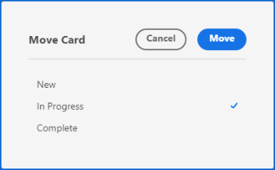

# 管理信息卡

您可以将信息卡移动到展示板上的任何列，或复制信息卡。

如果您启用了列策略来更新字段值，则在您将信息卡从一列移动到另一列时，状态、任务接受者和标记可能会自动更新。 有关详细信息，请参阅文章[管理展示板列](/help/quicksilver/agile/get-started-with-boards/manage-board-columns.md)中的“定义列设置和策略”。

>[!NOTE]
>
>无法将信息卡从一个展示板移动到另一个展示板。

## 访问要求

+++ 展开以查看本文中各项功能的访问要求。

<table style="table-layout:auto"> 
 <col> 
 <col> 
 <tbody> 
  <tr> 
   <td role="rowheader">Adobe Workfront包</td> 
   <td> 
任何
 </td> 
  </tr> 
  <tr> 
   <td role="rowheader">Adobe Workfront许可证</td> 
   <td> 
   
参与者或更高版本
 
   
请求或更高版本

   </td> 
  </tr> 
 </tbody> 
</table>

有关此表中信息的更多详细信息，请参阅Workfront文档中的[访问要求](/help/quicksilver/administration-and-setup/add-users/access-levels-and-object-permissions/access-level-requirements-in-documentation.md)。

+++

## 在列之间移动卡片

{{step1-to-boards}}

1. 访问展示板。 有关信息，请参阅[创建或编辑展示板](../../agile/get-started-with-boards/create-edit-board.md)。
1. 将信息卡拖放到另一列中，您要使其显示的位置。

   或

   单击卡片上的&#x200B;**[!UICONTROL 更多]**&#x200B;菜单，然后选择&#x200B;**[!UICONTROL 移动]**。 然后，在&#x200B;**[!UICONTROL 移动项]**&#x200B;框中，选择另一列并选择&#x200B;**[!UICONTROL 移动]**。

   

   >[!NOTE]
   >
   >当您使用&#x200B;**[!UICONTROL 移动项]**&#x200B;框时，卡片将始终移动到列的顶部。

## 将卡片移动到列的顶部或底部

1. 访问展示板。
1. 将卡片拖放到您希望它在列中显示的位置。

   或

   单击卡片上的&#x200B;**[!UICONTROL 更多]**&#x200B;菜单，然后选择&#x200B;**[!UICONTROL 列]**&#x200B;的顶部或&#x200B;**[!UICONTROL 列]**&#x200B;的底部。

   

## 复制信息卡

复制临时信息卡会复制该信息卡上的所有字段，包括清单项目。

>[!NOTE]
>
>无法复制连接的卡片。

1. 访问展示板。
1. 单击卡片上的&#x200B;**[!UICONTROL 更多]**&#x200B;菜单![[!UICONTROL 更多菜单]](assets/more-icon-spectrum.png)，然后选择&#x200B;**[!UICONTROL 复制]**。

   

   新信息卡添加到标题为“副本 — [原始信息卡名称]”的同一列中。
