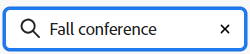

# 使用展示板功能板

<!-- Audited: 1/2024 -->

>[!IMPORTANT]
>
>工作流仅适用于特定的客户组。

讨论区信息板显示您可以访问的讨论区和工作流的列表，包括您创建的讨论区和已添加到其中的讨论区。 您有权访问的不属于工作流的各个展示板首先显示。

在操控板上，您可以为展示板和工作流执行以下操作：

* 存档展示板或工作流
* 过滤展示板和工作流
* 按讨论区名称或修改日期对讨论区列表排序
* 搜索讨论区或工作流
* 删除讨论区或工作流

有关创建新讨论区或编辑现有讨论区的信息，请参阅[创建或编辑讨论区](../../agile/get-started-with-boards/create-edit-board.md)。 有关创建新工作流的信息，请参阅[管理工作流](/help/quicksilver/agile/use-boards-agile-planning-tools/manage-collections.md)。

## 访问权限要求

+++ 展开可查看本文所述功能的访问权限要求。

<table style="table-layout:auto"> 
 <col> 
 <col> 
 <tbody> 
  <tr> 
   <td role="rowheader">Adobe Workfront 包</td> 
   <td> 
“任一”
 </td> 
  </tr> 
  <tr> 
   <td role="rowheader">Adobe Workfront许可证</td> 
   <td> 
   
投稿人或更高版本
 
   
请求或更高版本

   </td> 
  </tr> 
 </tbody> 
</table>

有关此表中的信息的更多详细信息，请参阅Workfront文档中的[访问要求](/help/quicksilver/administration-and-setup/add-users/access-levels-and-object-permissions/access-level-requirements-in-documentation.md)。

+++

## 过滤板和工作流 {#filter-boards}

您可以筛选展示板仪表板以显示活动、已存档或所有展示板或工作流。

1. 单击Adobe Workfront右上角的&#x200B;**[!UICONTROL 主菜单]**&#x200B;图标，或（如果可用）单击左上角的&#x200B;**[!UICONTROL 主菜单]**&#x200B;图标，然后单击&#x200B;**[!UICONTROL 展示板]**。
1. 在“展示板”区域或“工作流”区域中单击&#x200B;[!UICONTROL **筛选器**]，然后选择&#x200B;**[!UICONTROL 全部]**、**[!UICONTROL 活动]**&#x200B;或&#x200B;**[!UICONTROL 已存档]**。

   在仪表板上应用默认筛选器以外的筛选器时，筛选器图标上显示指示符。

## 对讨论区进行排序

1. 单击Adobe Workfront右上角的&#x200B;**[!UICONTROL 主菜单]**&#x200B;图标，或（如果可用）单击左上角的&#x200B;**[!UICONTROL 主菜单]**&#x200B;图标，然后单击&#x200B;**[!UICONTROL 展示板]**。
1. 要对讨论区列表进行排序，请单击&#x200B;[!UICONTROL **排序**]。 页面的默认排序选项为&#x200B;**[!UICONTROL 修改日期]**。 您还可以按讨论区&#x200B;**[!UICONTROL 名称]**&#x200B;对页面进行排序。

   选择&#x200B;**[!UICONTROL 反向顺序]**&#x200B;以反向修改日期或名称的顺序对展示板进行排序。 当排序图标上的箭头向上指向时，将应用反向顺序。 当箭头向下时，将应用标准顺序。

   在仪表板上应用非默认排序时，排序图标上会显示指示符。

## 搜索讨论区或工作流

您可以在“讨论区”区域中搜索特定讨论区，或在“工作流”区域中搜索特定工作流。

1. 单击Adobe Workfront右上角的&#x200B;**[!UICONTROL “主菜单”]**&#x200B;图标，或（如果可用）单击左上角的&#x200B;**[!UICONTROL “主菜单”]**&#x200B;图标，然后单击&#x200B;**[!UICONTROL “讨论区”]**。
1. 单击&#x200B;[!UICONTROL **搜索**]&#x200B;并键入搜索词。 然后按Enter键。

   此时将显示标题中包含搜索词的所有讨论区或工作流。

   单击X清除搜索。

   

## 存档讨论区或工作流

对主板或工作流进行存档会将其发送到存档中，您可以稍后进行恢复。

>[!NOTE]
>
>当您存档讨论区时，所有讨论区成员的讨论区都将存档。
>
>存档工作流时，会存档其所有展示板。

1. 单击Adobe Workfront右上角的&#x200B;**[!UICONTROL 主菜单]**&#x200B;图标，或（如果可用）单击左上角的&#x200B;**[!UICONTROL 主菜单]**&#x200B;图标，然后单击&#x200B;**[!UICONTROL 展示板]**。
1. 单击讨论区或工作流中的&#x200B;**[!UICONTROL 更多]**&#x200B;菜单，然后选择&#x200B;**[!UICONTROL 存档]**。

   在工作流中，菜单位于右侧，位于&#x200B;[!UICONTROL **查看工作流**]&#x200B;按钮旁边。

   讨论区或工作流上显示[!UICONTROL 存档]图标。 您无法编辑存档的讨论区或工作流。

   已存档的项目会在讨论区仪表板中隐藏，除非您应用筛选条件来显示它们。 有关详细信息，请参阅本文中的[[!UICONTROL 筛选讨论区]](#filter-boards)部分。

1. 要恢复已存档的讨论区或工作流，请单击讨论区或工作流上的&#x200B;**[!UICONTROL 更多]**&#x200B;菜单，然后选择&#x200B;**[!UICONTROL 恢复]**。

## 删除讨论区或工作流

删除讨论区后，该讨论区将从[!DNL Workfront]中永久删除，且无法恢复。 该讨论区中的任何卡片也会随讨论区一起删除。

删除工作流也会删除工作流中的所有讨论区。

>[!NOTE]
>
>您只能删除您创建的讨论区和工作流，而不能删除您添加到其中的讨论区和工作流。

1. 单击Adobe Workfront右上角的&#x200B;**[!UICONTROL “主菜单”]**&#x200B;图标，或（如果可用）单击左上角的&#x200B;**[!UICONTROL “主菜单”]**&#x200B;图标，然后单击&#x200B;**[!UICONTROL “讨论区”]**。
1. 单击讨论区或工作流上的&#x200B;**[!UICONTROL 更多]**&#x200B;菜单![[!UICONTROL 更多菜单]](assets/more-icon-spectrum.png)，然后选择&#x200B;**[!UICONTROL 删除]**。

   在工作流中，菜单位于右侧，位于&#x200B;[!UICONTROL **查看工作流**]&#x200B;按钮旁边。

1. 单击确认消息上的&#x200B;**[!UICONTROL 删除讨论区]**&#x200B;或&#x200B;[!UICONTROL **删除工作流**]。

<!-- ## Move a board to a workstream

You can move a standalone board into a workstream, or move a board from one workstream to another workstream.

>[!NOTE]
>
>You can only move boards that you created, not boards that you were added to.

1. Click the **[!UICONTROL Main Menu]** icon  in the upper-right corner of [!DNL Adobe Workfront], then click **[!UICONTROL Boards]**.
1. Click the **[!UICONTROL More]** menu ![[!UICONTROL More menu]](assets/more-icon-spectrum.png) on the board, and select [!UICONTROL **Move to workstream**].
1. Select which workstream to add the board to, and click [!UICONTROL **Move**].

   The board is moved into the workstream and no longer appears in the [!UICONTROL Boards] area.
   If you have not created a workstream yet, you are prompted to create one to move the board into.
-->
