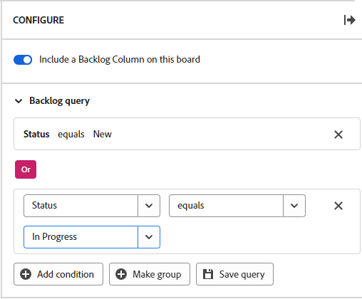

# 在工作流板上配置积压

>[!IMPORTANT]
>
>工作流仅适用于特定的客户组。

您可以选择在工作流中的讨论区上显示积压列，并定义对从工作流卡列表中拉入讨论区积压的卡的查询。

>[!NOTE]
>
>If you add a new card in the backlog column that does not match the query criteria, the card will disappear from the backlog when the board is refreshed and it will only be available in the card list. You can change the query at any time to adjust which cards appear in the backlog column.

The backlog column and query are not available on standalone boards. For information about adding an intake column to a standalone board, see [Add an intake column to a board](/help/quicksilver/agile/use-boards-agile-planning-tools/add-intake-column-to-board.md).

## 访问权限要求

+++ 展开可查看本文所述功能的访问权限要求。

<table style="table-layout:auto"> 
 <col> 
 <col> 
 <tbody> 
  <tr> 
   <td role="rowheader">Adobe Workfront 包</td> 
   <td> 
“任一”
 </td> 
  </tr> 
  <tr> 
   <td role="rowheader">Adobe Workfront许可证</td> 
   <td> 
   
投稿人或更高版本
 
   
请求或更高版本

   </td> 
  </tr> 
 </tbody> 
</table>

有关此表中的信息的更多详细信息，请参阅Workfront文档中的[访问要求](/help/quicksilver/administration-and-setup/add-users/access-levels-and-object-permissions/access-level-requirements-in-documentation.md)。

+++

## 在工作流展示板上配置积压

{{step1-to-boards}}

1. Open the workstream you want to work in. To open a workstream, click [!UICONTROL **View workstream**].
1. Click any board in the workstream to open it.
1. 单击展示板右侧的&#x200B;[!UICONTROL **配置**]&#x200B;以打开“配置”面板。
1. Turn on [!UICONTROL **Include a backlog column on this board**].

   The backlog column is added on the left of the board. It remains blank until you apply a query to it.

1. Expand [!UICONTROL **Backlog query**].

   >[!NOTE]
   >
   >默认查询可能已应用于积压工作，显示卡片列表中具有状态且状态不是“完成”的所有工作项。

1. 单击&#x200B;[!UICONTROL **添加条件**]，然后单击“空”字段。
1. 选择要作为查询依据的字段。

   The fields you can choose from are the default fields on a card.

1. Select the query modifier.

   The modifier options depend on the fields they can apply to. For example, the &quot;name&quot; field does not have &quot;greater than&quot; or &quot;less than&quot; as modifier choices because those modifiers only apply to numbers.

1. Select the value.

   The value is not available when you use &quot;exists&quot; or &quot;not exists&quot; as the modifier.

   For example, if you choose &quot;Due date&quot; and &quot;exists,&quot; the backlog will display cards with assigned due dates. Any card without a due date will not be pulled in to the backlog.

1. （可选）单击&#x200B;[!UICONTROL **添加条件**]&#x200B;向查询添加另一个条件。

   

1. （可选）单击&#x200B;[!UICONTROL **创建组**]&#x200B;以添加一组条件，这些条件通过OR运算符连接到第一个条件。
1. 单击&#x200B;[!UICONTROL **保存查询**]。

   The query is applied and cards meeting the criteria appear in the backlog column.
