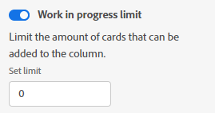

# 管理展示板上的[!UICONTROL 工作进行中] (WIP)限制

您可以为展示板上的每个列配置[!UICONTROL 正在进行的工作] (WIP)限制。

WIP限制只是一个视觉上的警告，不会限制每列中显示的项目数量超过设置的限制。

## 访问要求

+++ 展开以查看本文中各项功能的访问要求。

<table style="table-layout:auto"> 
 <col> 
 <col> 
 <tbody> 
  <tr> 
   <td role="rowheader">Adobe Workfront包</td> 
   <td> 
任何
 </td> 
  </tr> 
  <tr> 
   <td role="rowheader">Adobe Workfront许可证</td> 
   <td> 
   
参与者或更高版本
 
   
请求或更高版本

   </td> 
  </tr> 
 </tbody> 
</table>

有关此表中信息的更多详细信息，请参阅Workfront文档中的[访问要求](/help/quicksilver/administration-and-setup/add-users/access-levels-and-object-permissions/access-level-requirements-in-documentation.md)。

+++

## 设置列的WIP限制

{{step1-to-boards}}

1. 访问展示板。 有关信息，请参阅[创建或编辑展示板](../../agile/get-started-with-boards/create-edit-board.md)。
1. 找到要将WIP限制添加到的列。

   若要添加新列，请参阅[管理展示板列](/help/quicksilver/agile/get-started-with-boards/manage-board-columns.md)。

1. 单击该列上的&#x200B;**[!UICONTROL 更多]**&#x200B;菜单，然后选择&#x200B;**[!UICONTROL 编辑]**&#x200B;以打开“设置”区域。
1. 在[!UICONTROL 列策略]下，启用&#x200B;**[!UICONTROL 正在进行的工作]限制**&#x200B;策略以限制可添加到列的卡片数量。
1. 在&#x200B;**[!UICONTROL 设置限制]**&#x200B;字段中键入限制数。

   列WIP限制

   卡片的数量和限制将显示在列顶部。 如果列包含的卡片数超过限制，则计数器将变为红色。

   

1. 单击&#x200B;**[!UICONTROL 关闭]**&#x200B;以退出[!UICONTROL 设置]区域并查看该列及其卡片。
