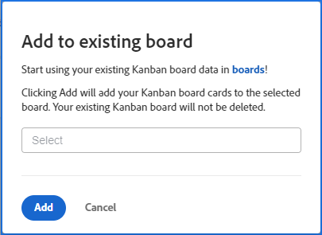

# 将敏捷团队看板卡迁移到Workfront展示板

{{highlighted-preview-article-level}}

您可以将工作项从敏捷的小组看板板迁移到新的或现有的Workfront板。 运行迁移时，看板板上的所有卡都会复制到Workfront板。 不允许您选择特定的卡。

在Workfront展示板上放置信息卡的方法基于栏策略。 (例如，策略可以将状态为“进行中”的所有信息卡移到特定列。 有关列策略的更多信息，请参阅 [管理展示板列](/help/quicksilver/agile/get-started-with-boards/manage-board-columns.md).) 如果没有策略或信息卡与策略不匹配，则信息卡会放置在展示板最左侧的列中。 目前，旧版展示板上“积压”列中的信息卡未添加到Workfront展示板。

卡不会从敏捷团队看板板中删除，并且卡状态更改将同步到两个看板板。 在您准备好切换到Workfront主板之前，您可以保持两个主板处于活动状态。

## 访问要求

您必须具有以下访问权限才能执行本文中的步骤：

<table style="table-layout:auto">
 <col>
 </col>
 <col>
 </col>
 <tbody>
  <tr>
   <td role="rowheader"><strong>[!DNL Adobe Workfront] 计划*</strong></td>
   <td> 
任意
 </td>
  </tr>
  <tr>
   <td role="rowheader"><strong>[!DNL Adobe Workfront] 许可证*</strong></td>
   <td> 
[!UICONTROL请求]或更高版本
 </td>
  </tr>
 </tbody>
</table>

&#42;要了解您拥有的计划、许可类型或访问权限，请联系您的 [!DNL Workfront] 管理员。

## 将看板卡迁移到新展示板

{{step1-to-team}}

1. 访问看板板。
1. 单击 [!UICONTROL **添加到展示板**] 选择 [!UICONTROL **新展示板**].
1. 在 [!UICONTROL 添加到新展示板] 对话框中，键入新展示板的名称(当前展示板的名称 [!UICONTROL 看板] 展示板自动显示)并单击 [!UICONTROL **添加**].

   

1. （可选）在显示成功消息时，单击链接以打开新展示板。

## 将看板卡迁移到现有看板卡

{{step1-to-team}}

1. 访问看板板。
1. 单击 [!UICONTROL **添加到展示板**] 选择 [!UICONTROL **现有展示板**].
1. 在 [!UICONTROL 添加到现有展示板] 对话框，搜索并选择展示板以将信息卡迁移到。 然后，单击 [!UICONTROL **添加**].

   

1. （可选）在显示成功消息时，单击链接以打开展示板。
