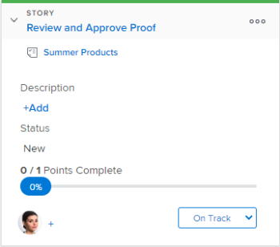

# 在[!UICONTROL Kanban]展示板上的故事上使用标志

在[!DNL Kanban]展示板上，标记提供故事何时可以移动到下一个状态的可视指示。 这使得[!UICONTROL Kanban]团队在跨状态移动故事时能够使用“拉取”方法而不是“推送”方法。

**示例：**&#x200B;考虑以下使用“拉取”方法的团队示例：团队中的图形设计师Olivia完成其工作，然后将故事标志设置为“[!UICONTROL 准备拉取]”。 这个旗帜向团队的文案撰稿人托尼提供了视觉暗示，表明故事已准备好让他进入下一个状态。 然后，当托尼准备开始编写故事时，他将故事转移到下一个状态。

在文章上使用标记时，请考虑以下事项：

* 标记不是状态，而是故事已准备好由团队其他成员移动到下一个状态的视觉指示。
* 标记未出现在[!UICONTROL Backlog]列或[!UICONTROL Complete]列（或列状态等于[!UICONTROL Complete]的任何列）的任何故事卡上。

  有关故事状态的更多信息，请参阅[在Kanban展示板上的故事上使用标志](#updating-the-status-of-stories-and-subtasks)

## 访问要求

+++ 展开以查看本文中各项功能的访问要求。

<table style="table-layout:auto"> 
 <col> 
 </col> 
 <col> 
 </col> 
 <tbody> 
  <tr> 
   <td role="rowheader">Adobe Workfront包</td> 
   <td> 
任何
 </td> 
  </tr> 
  <tr> 
   <td role="rowheader">Adobe Workfront许可证</td> 
   <td> 
标准
 
   
工作或更高
 </td> 
  </tr>
 </tbody> 
</table>

有关此表中信息的更多详细信息，请参阅Workfront文档中的[访问要求](/help/quicksilver/administration-and-setup/add-users/access-levels-and-object-permissions/access-level-requirements-in-documentation.md)。

+++

## 在[!UICONTROL Kanban]展示板上的故事上使用标志

要更改文章上的标志，请执行以下操作：

{{step1-to-team}}

1. （可选）单击&#x200B;**[!UICONTROL 切换团队]**&#x200B;图标，然后从下拉菜单中选择新的[!UICONTROL Kanban]团队或在搜索栏中搜索团队。

1. 转到[!UICONTROL Kanban]展示板，您要在该展示板上更改文章的标志。
1. 展开故事拼贴以查看标志。
默认情况下，每个文章的标志均设置为&#x200B;**[!UICONTROL 跟踪]**。
   

1. 单击当前标志，然后从以下标志选项中选择：

   * **[!UICONTROL 跟踪]：**&#x200B;故事处于适当的状态，此时无需执行任何操作。

     这是Kanban展示板上每个故事的默认标记。
     

   * **[!UICONTROL 被阻止]：**&#x200B;故事无法进入下一个状态。 当在文章上设置此标记时，文章不会计入WIP限制中。 （有关WIP限制的更多信息，请参阅文章[配置Kanban](../../agile/get-started-with-agile-in-workfront/configure-kanban.md)。）

     

   * **[!UICONTROL 准备提取]：**&#x200B;故事已准备好由团队的其他成员移动到下一个状态。

     
