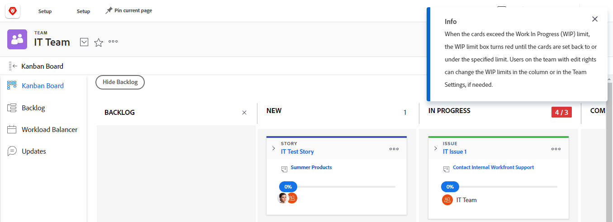

# 管理看板面板上的[!UICONTROL 在创作品] (WIP)限制

您可以为[!UICONTROL 看板]面板上的每个列配置[!UICONTROL 在制品] (WIP)限制，如文章[配置看板](../../agile/get-started-with-agile-in-workfront/configure-kanban.md)中所述。

WIP限制只是直观的警告，不会限制您的小组在每个状态列中拥有的物料数量超过您设置的限制。

## 访问权限要求

+++ 展开可查看本文所述功能的访问权限要求。

<table style="table-layout:auto"> 
 <col> 
 </col> 
 <col> 
 </col> 
 <tbody> 
  <tr> 
   <td role="rowheader">Adobe Workfront 包</td> 
   <td> 
“任一”
 </td> 
  </tr> 
  <tr> 
   <td role="rowheader">Adobe Workfront许可证</td> 
   <td> 
标准
 
   
工作版或更高版本
 </td> 
  </tr>
 </tbody> 
</table>

有关此表中的信息的更多详细信息，请参阅Workfront文档中的[访问要求](/help/quicksilver/administration-and-setup/add-users/access-levels-and-object-permissions/access-level-requirements-in-documentation.md)。

+++

## 查看[!UICONTROL 看板]面板上的[!UICONTROL 在创作品] (WIP)限制

为您的Agile团队配置WIP限制后，该限制会显示在看板面板上每列的右上角（[!UICONTROL 完成]列除外）。

每当超过[!UICONTROL 看板]面板上任何列的限制时，该限制都会以红色突出显示，并显示一条消息。

## 从[!UICONTROL 看板]讨论区更新[!UICONTROL 在制品] (WIP)限制

具有[!UICONTROL 编辑]权限的团队成员可以直接从[!UICONTROL 看板]讨论区更新每个状态列的WIP限制。 或者，您可以按照文章[配置看板](../../agile/get-started-with-agile-in-workfront/configure-kanban.md)中所述更新WIP限制。

{{step1-to-team}}

1. （可选）单击&#x200B;**[!UICONTROL 切换团队]**&#x200B;图标，然后从下拉菜单中选择新的[!UICONTROL 看板]团队，或在搜索栏中搜索团队。

1. 在[!UICONTROL 看板]板上，在看板板上各列的右上角找到WIP限制。
1. 单击要修改的WIP限制，然后指定新的限制。
1. 按&#x200B;**[!UICONTROL Enter]**。
