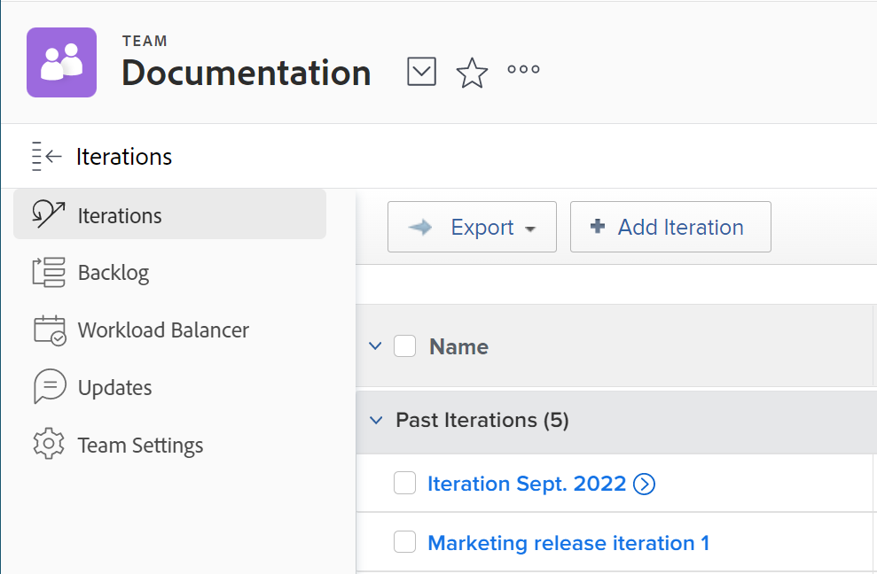

# 创建迭代

迭代是Scrum敏捷团队规划工作能力的关键组成部分。 [!DNL Adobe Workfront] 允许敏捷团队通过创建多个迭代来管理其工作，以满足团队需求。

## 访问要求

您必须具有以下访问权限才能执行本文中的步骤：

<table style="table-layout:auto"> 
 <col> 
 </col> 
 <col> 
 </col> 
 <tbody> 
  <tr> 
   <td role="rowheader"><strong>[!DNL Adobe Workfront] 计划*</strong></td> 
   <td> 
任意
 </td> 
  </tr> 
  <tr> 
   <td role="rowheader"><strong>[!DNL Adobe Workfront] 许可证*</strong></td> 
   <td> 
[!UICONTROL Review]或更高版本
 </td> 
  </tr> 
 </tbody> 
</table>

&#42;要了解您拥有的计划或许可证类型，请联系 [!DNL Workfront] 管理员。

## 添加迭代

使用 [!UICONTROL 添加迭代] 快速创建迭代并稍后添加任务和问题的功能。

1. 单击 **[!UICONTROL 主菜单]** 图标  的右上角 [!DNL Adobe Workfront]，然后单击 **[!UICONTROL 团队]**.

1. （可选）单击 **[!UICONTROL 切换组]** 图标 ，然后从下拉菜单中选择新的Scrum团队，或在搜索栏中搜索团队。

1. 在 **[!UICONTROL 迭代]** ，单击 **[!UICONTROL 添加迭代]**.\
   

1. 指定以下内容：

   <table style="table-layout:auto"> 
    <col> 
    <col> 
    <tbody> 
     <tr> 
      <td role="rowheader"><strong>[!UICONTROL迭代名称]</strong></td> 
      <td>输入小版本的名称。</td> 
     </tr> 
     <tr> 
      <td role="rowheader"><strong>[!UICONTROL目标]</strong></td> 
      <td>添加您对小版本拥有的任何目标。</td> 
     </tr> 
     <tr> 
      <td role="rowheader"><strong>[!UICONTROL开始日期]</strong></td> 
      <td>输入小版本应开始的日期。</td> 
     </tr> 
     <tr> 
      <td role="rowheader"><strong>[!UICONTROL结束日期]</strong></td> 
      <td>
输入小版本应结束的日期。 [!DNL Workfront] 建议将结束日期设置为自开始日期起不超过4周。

提示：确保选择工作日作为结束日期。 燃耗图在计算中只使用工作日。 默认情况下，燃耗图使用默认计划来定义工作日(如 <a href="../../../administration-and-setup/set-up-workfront/configure-timesheets-schedules/create-schedules.md" class="MCXref xref">创建计划</a>)。 或者，要合并特定于团队的非工作日，敏捷团队可以选择使用替代计划(如 <a href="../../../agile/get-started-with-agile-in-workfront/create-an-agile-team.md" class="MCXref xref">创建敏捷的团队</a>)。
</td> 
     </tr> 
     <tr> 
      <td role="rowheader"><strong>[!UICONTROL Capacity]</strong></td> 
      <td> 指定迭代的容量。 这是您的团队在迭代中能够完成的点数或小时数。 您输入的数字必须等于或大于小版本中所有文章的总和后的点数或小时数。 [!DNL Workfront] 默认情况下，会使用50个容量预填充此字段。 </td> 
     </tr> 
     <tr> 
      <td role="rowheader"><strong>[!UICONTROL Focus]</strong></td> 
      <td>指定团队的焦点百分比。 如果团队的所有成员都将完全专注于此迭代，则重点将是100%。 [!DNL Workfront] 默认情况下，使用100%预填充此字段。 </td> 
     </tr> 
    </tbody> 
   </table>

1. 单击 **[!UICONTROL 提交]**. 现在，您已创建小版本，接下来需要添加文章。 有关更多信息，请参阅 [将文章添加到现有小版本](../../../agile/use-scrum-in-an-agile-team/iterations/add-stories-to-existing-iteration.md).

## 在 [!UICONTROL 积压] 选项卡

使用 [!UICONTROL 计划迭代] 功能使用积压工作任务创建迭代。

1. 单击 **[!UICONTROL 主菜单]** 图标  的右上角 [!DNL Adobe Workfront]，然后单击 **[!UICONTROL 团队]**.

1. （可选）单击 **[!UICONTROL 切换组]** 图标 ，然后从下拉菜单中选择新的Scrum团队，或在搜索栏中搜索团队。

1. 选择 **[!UICONTROL 积压]** 中。 然后，单击 **[!UICONTROL 计划迭代]**.

1. 指定以下信息：

   <table style="table-layout:auto"> 
    <col> 
    <col> 
    <tbody> 
     <tr> 
      <td role="rowheader"><strong>[!UICONTROL迭代名称]</strong></td> 
      <td>指定小版本的名称。</td> 
     </tr> 
     <tr> 
      <td role="rowheader"><strong>[!UICONTROL开始日期]</strong></td> 
      <td> 指定小版本应开始的日期。</td> 
     </tr> 
     <tr> 
      <td role="rowheader"><strong>[!UICONTROL结束日期]</strong> </td> 
      <td>
指定小版本应结束的日期。 [!DNL Workfront] 建议将结束日期设置为自开始日期起不超过4周。

提示：确保选择工作日作为结束日期。 燃耗图在计算中只使用工作日。 默认情况下，燃耗图使用默认计划来定义工作日(如 <a href="../../../administration-and-setup/set-up-workfront/configure-timesheets-schedules/create-schedules.md" class="MCXref xref">创建计划</a>)。 或者，要整合特定于团队的非工作日，敏捷团队可以选择使用替代计划(如 <a href="../../../agile/use-scrum-in-an-agile-team/burndown/use-alt--team-schedule-burndown-charts.md" class="MCXref xref">为燃耗图使用备用团队计划</a>)。
</td> 
     </tr> 
     <tr> 
      <td role="rowheader"><strong>[!UICONTROL Focus]</strong></td> 
      <td>指定团队的焦点百分比。 如果团队的所有成员都将完全专注于此迭代，则重点将是100%。 [!DNL Workfront] 使用您团队过去迭代次数中的平均值预填充此字段。 如果这是您团队的第一个小版本，则默认情况下，此字段值为0。</td> 
     </tr> 
     <tr> 
      <td role="rowheader"> <strong>[!UICONTROL Capacity]</strong></td> 
      <td> 指定迭代的容量。 这是您的团队在迭代中能够完成的点数或小时数。 您输入的数字必须等于或大于小版本中所有文章的总和后的点数或小时数。 [!DNL Workfront] 使用您团队过去迭代次数中的平均值预填充此字段。 如果这是您团队的第一个小版本，则默认情况下，此字段值为0。</td> 
     </tr> 
     <tr> 
      <td role="rowheader"> <strong>[!UICONTROL目标]</strong></td> 
      <td> 指定迭代的目标。 此字段不是必填字段。</td> 
     </tr> 
    </tbody> 
   </table>

1. （可选）选择文章以立即将其添加到小版本中，或者您可以跳过此步骤，稍后再将文章添加到小版本中。 在积压工作最重要的是故事。 当故事适合容量时，会以绿色突出；如果没有，则会以红色突出显示它们。\
   您可以将任务和问题添加到单个小版本中：

   * **要向小版本添加任务，请执行以下操作：** 在 **[!UICONTROL 积压]** 选项卡，确保 **[!UICONTROL 故事]** 选项卡（默认情况下，在查看积压工作时会选中此选项卡）。 选择要添加到小版本的文章。\

      将任务添加到小版本时，会按 [[!UICONTROL 了解] 任务开始日期添加到迭代时的计算方式](#understand-how-task-start-dates-are-calculated-when-added-to-an-iteration).

   * **要向小版本添加问题，请执行以下操作：** 在 **[!UICONTROL 积压]** ，单击 **[!UICONTROL 问题]** 选项卡。 选择要添加到小版本中的问题。

1. 单击&#x200B;**[!UICONTROL 保存]。**
将创建小版本。

1. （可选）要向现有小版本添加文章，请参阅 [将文章添加到现有小版本](../../../agile/use-scrum-in-an-agile-team/iterations/add-stories-to-existing-iteration.md).

## 了解任务开始日期添加到小版本时的计算方式 {#understand-how-task-start-dates-are-calculated-when-added-to-an-iteration}

将任务作为文章添加到小版本时， [!UICONTROL 必须在任务时完成] 约束用于每个文章。 在大多数情况下，任务的计划起始日期是根据以下公式计算的：

[!UICONTROL 迭代结束日期] 减号(-) [!UICONTROL 任务持续时间] 等于(=) [!UICONTROL 任务计划的开始日期]

的 [!UICONTROL 项目结束日期] 如果项目开始日期晚于小版本开始日期，而项目结束日期晚于小版本结束日期，则使用而不使用。

您可以配置单个Scrum团队以使用默认项目日期，而不是迭代日期。 有关信息，请参阅 [配置在向小版本添加工作项时如何应用日期](../../../agile/get-started-with-agile-in-workfront/configure-scrum.md#configur5) 在文章中 [配置Scrum](../../../agile/get-started-with-agile-in-workfront/configure-scrum.md).
