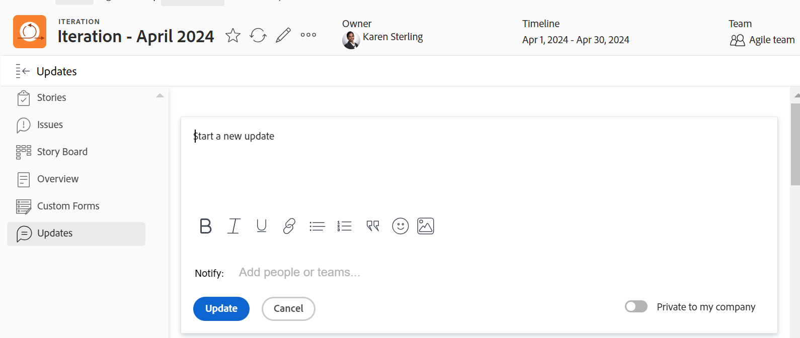

# 管理迭代更新

您可以将更新添加到开发周期，以便在Adobe Workfront中与他人协作。

## 管理迭代更新

1. 转到Agile团队，然后单击 **迭代** 在左侧面板中。
1. 单击小版本的名称以将其打开。
1. 单击 **更新** 以在左侧面板的部分中打开。

   
1. 单击 **开始新的更新，** 然后键入您的更新。
1. （可选）使用富文本工具栏中的选项设置文本格式，在更新中添加表情符号、链接或图像，以增强内容。 有关更多信息，请参阅文章中的“在Workfront更新中使用富文本”部分 [更新工作](/help/quicksilver/workfront-basics/updating-work-items-and-viewing-updates/update-work.md).
1. （可选）将更新添加到小版本时，可更新以下任一项：

   <table style="table-layout:auto"> 
    <col> 
    <col> 
    <tbody> 
     <tr> 
      <td role="rowheader"><strong>通知</strong></td> 
      <td>确定必须收到更新通知的用户。 
有关如何将其他人包含在更新中的信息，请参阅 <a href="/help/quicksilver/workfront-basics/updating-work-items-and-viewing-updates/tag-others-on-updates.md">为其他人标记更新</a>.
</td> 
     </tr> 
     <tr> 
      <td role="rowheader"><strong>我的公司私有</strong></td> 
      <td> 
禁用此选项可阻止公司外部的用户查看此更新。
 
      
<b>注释</b>

      
仅当Workfront用户配置文件与公司关联时，才会显示此选项。

      
此选项并非在所有可从中添加更新的区域都可用。 例如，这不适用于可从其中添加更新的第三方应用程序。 

      </td> 
     </tr> 
    </tbody> 
   </table>

1. 单击 **更新** 将更新添加到迭代。

   >[!NOTE]
   >
   >单击后会出现一个小型弹出窗口，持续七秒 **更新**，允许您单击 **撤消评论** 和撤消更新并在发布更新之前返回到编辑窗格。 如果您关闭撤消弹出窗口、等待其消失或导航离开页面，则会发布更新。
   >
   >如果您的Workfront管理员在访问级别选择“不允许用户删除评论”设置，则无法撤消评论。 有关更多信息，请参阅 [创建和修改自定义访问级别](/help/quicksilver/administration-and-setup/add-users/configure-and-grant-access/create-modify-access-levels.md).

1. 要回复更新，请单击 **回复**.

   有关更多信息，请参阅 [回复更新](/help/quicksilver/workfront-basics/updating-work-items-and-viewing-updates/reply-to-updates.md).

1. （可选）要复制评论的内容，请单击 **更多** 图标  更新右侧，然后单击以下选项之一：

   * **复制跟帖链接**
   * **复制正文文本**
   * **引用回复**

   

   有关更多信息，请参阅部分 [复制更新](#copy-an-update) 本文章中。
1. （可选）要删除评论，请单击 **更多** 图标  更新右侧，然后单击 **删除**.

## 复制更新

您可以复制更新的内容并通过以下方式重复使用：

* [复制跟帖链接](#copy-thread-link)
* [复制正文文本](#copy-body-text)
* [引用回复](#quote-reply)

### 复制跟帖链接

此选项将完整的线程链接复制到剪贴板，以便您可以与其他用户共享线程。

1. 转到要复制的更新跟帖。

1. 单击 **更多** 菜单，然后单击 **复制跟帖链接**.

1. 将您在上一步中复制的链接粘贴到电子邮件或其他应用程序中以便与其他人共享。 共享链接会打开您从中共享该链接的评论。

### 复制正文文本

此选项将文本从特定更新复制到剪贴板。

1. 转到要复制的更新或回复。
1. 单击 **更多** 菜单，然后单击 **复制正文文本**.

### 引用回复

Quote Reply选项将原始备注作为块备注复制到新回复中。

1. 转到要复制的更新或回复。
1. 单击 **更多** 菜单，然后单击 **引用回复**.

   将打开一个新注释框，引用回复将包括在新注释中，并标记为块引用。

1. 继续添加更新，然后单击 **回复** 以添加注释。