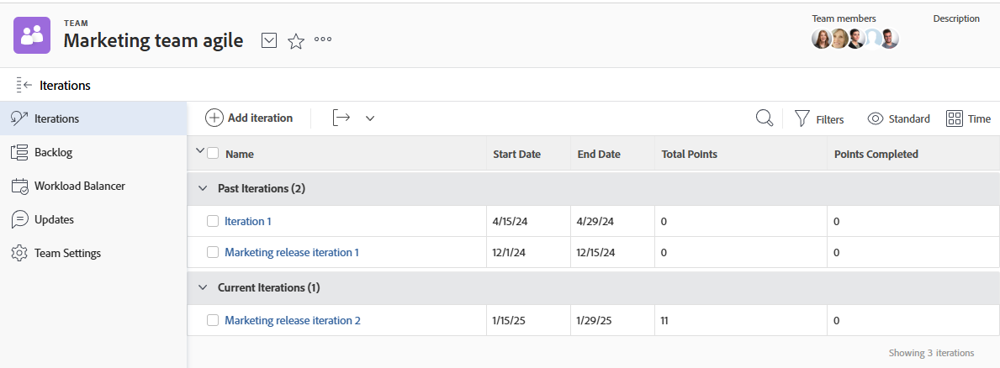

# 查看小版本

您可以查看给定团队的所有小版本，也可以查看单个小版本。 小版本显示有关小版本中包含的文章、问题和文档的数据。

## 访问权限要求

+++ 展开可查看本文所述功能的访问权限要求。

<table style="table-layout:auto"> 
 <col> 
 </col> 
 <col> 
 </col> 
 <tbody> 
  <tr> 
   <td role="rowheader">Adobe Workfront 包</td> 
   <td> 
“任一”
 </td> 
  </tr> 
  <tr> 
   <td role="rowheader">Adobe Workfront许可证</td> 
   <td> 
浅色或更高
 
   
审阅或更高版本
 </td> 
  </tr>
 </tbody> 
</table>

有关此表中的信息的更多详细信息，请参阅Workfront文档中的[访问要求](/help/quicksilver/administration-and-setup/add-users/access-levels-and-object-permissions/access-level-requirements-in-documentation.md)。

+++

## 查看分配给给定团队的小版本

{{step1-to-team}}

1. （可选）单击&#x200B;**[!UICONTROL 切换团队]**&#x200B;图标，然后从下拉菜单中选择新的Scrum团队，或在搜索栏中搜索团队。

1. 在左侧面板中，选择&#x200B;**[!UICONTROL 迭代]**&#x200B;以选择特定迭代，或选择&#x200B;**[!UICONTROL 当前迭代]**。

   

   >[!NOTE]
   >
   >仅当将当前迭代&#x200B;**[!UICONTROL 分配给布局模板，并且该迭代至少有一个任务或问题时，]**&#x200B;当前迭代才会显示在左侧面板中。 有关详细信息，请参阅[使用布局模板自定义左侧面板](/help/quicksilver/administration-and-setup/customize-workfront/use-layout-templates/customize-left-panel.md)。

1. （可选）单击要查看的特定小版本的名称。
小版本文章显示。

   ![[!UICONTROL 迭代中的故事]](assets/iteration-stories-list.png)
