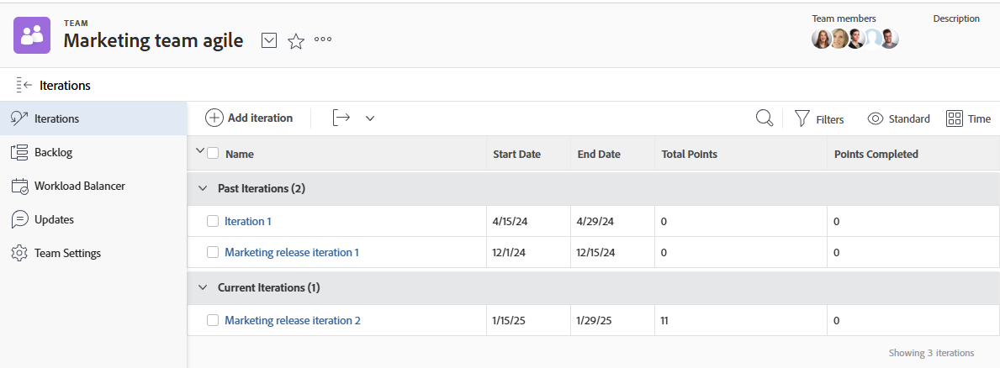

# 查看迭代

您可以查看给定团队的所有小版本，也可以查看单个小版本。 迭代显示有关迭代中包含的故事、问题和文档的数据。

## 访问权限要求

+++ 展开可查看本文所述功能的访问权限要求。

<table style="table-layout:auto"> 
 <col> 
 </col> 
 <col> 
 </col> 
 <tbody> 
  <tr> 
   <td role="rowheader">Adobe Workfront 包</td> 
   <td> 
“任一”
 </td> 
  </tr> 
  <tr> 
   <td role="rowheader">Adobe Workfront许可证</td> 
   <td> 
浅色或更高
 
   
审核或更高
 </td> 
  </tr>
 </tbody> 
</table>

有关信息，请参阅Workfront文档中的[访问要求](/help/quicksilver/administration-and-setup/add-users/access-levels-and-object-permissions/access-level-requirements-in-documentation.md)。

+++

## 查看分配给给定团队的迭代

{{step1-to-team}}

1. （可选）单击&#x200B;**[!UICONTROL 切换团队]**&#x200B;图标，然后从下拉菜单中选择新的Scrum团队或在搜索栏中搜索团队。

1. 在左侧面板中，选择&#x200B;**[!UICONTROL 迭代]**&#x200B;以选择特定迭代，或选择&#x200B;**[!UICONTROL 当前迭代]**。

   

   >[!NOTE]
   >
   >**[!UICONTROL 当前迭代]**&#x200B;仅在分配给布局模板且迭代上至少有一个任务或问题时才显示在左侧面板中。 有关详细信息，请参阅[使用布局模板自定义左侧面板](/help/quicksilver/administration-and-setup/customize-workfront/use-layout-templates/customize-left-panel.md)。

1. （可选）单击要查看的特定小版本的名称。
将显示迭代故事。

   迭代中的![[!UICONTROL 故事]](assets/iteration-stories-list.png)
