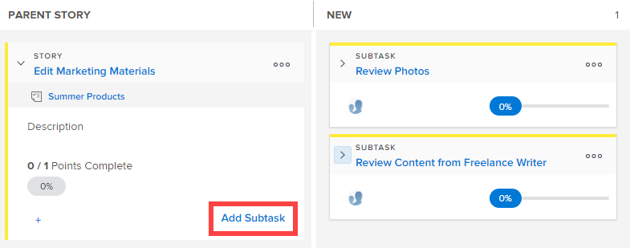

# 向[!UICONTROL Scrum]展示板上的现有故事添加子任务

在为现有文章创建子任务时，请牢记以下事项：

**当项目的[!UICONTROL 完成模式]设置设置为[!UICONTROL 手动]：**&#x200B;时

* 将包含子任务的父故事移动到[!UICONTROL 完成]会将父故事更新为100%，将[!UICONTROL 状态]更新为[!UICONTROL 完成]。 子任务未更新。
* 若要更新文章的[!UICONTROL 完成百分比]，必须从[!UICONTROL 故事]选项卡或对象的[!UICONTROL 详细信息]页面对其进行更新。

**当项目的[!UICONTROL 完成模式]设置设置为[!UICONTROL 自动]**&#x200B;时：

* 将包含子任务的父故事移动到[!UICONTROL 完成]会将父故事更新为100%，将[!UICONTROL 状态]更新为[!UICONTROL 完成]。 子任务也更新为100%，[!UICONTROL 状态]更新为[!UICONTROL 完成]。
* 要更新故事的[!UICONTROL 完成百分比]，您必须更新任何子任务的[!UICONTROL 完成百分比]。 故事的[!UICONTROL 完成百分比]是根据所有子任务的[!UICONTROL 完成百分比]计算的。

## 访问要求

+++ 展开以查看本文中各项功能的访问要求。

您必须具有以下权限才能执行本文中的步骤：

<table style="table-layout:auto"> 
 <tbody> 
  <tr> 
   <td role="rowheader">[!DNL Adobe Workfront] 计划</td> 
   <td> 
任何
 </td> 
  </tr> 
  <tr> 
   <td role="rowheader">[!DNL Adobe Workfront] 许可证</td> 
   <td> 
新文档： [！UICONTROL Standard]
 
   或
   
当前： [！UICONTROL Work]或更高版本
 </td> 
  </tr>
   <tr> 
   <td role="rowheader">对象权限</td> 
   <td>[！UICONTROL Contribute]或[！UICONTROL Manage]对子任务所在任务的访问权限 </td> 
  </tr>
 </tbody> 
</table>

有关此表中信息的更多详细信息，请参阅Workfront文档中的[访问要求](/help/quicksilver/administration-and-setup/add-users/access-levels-and-object-permissions/access-level-requirements-in-documentation.md)。

+++

## 将子任务添加到Scrum展示板上的现有故事

{{step1-to-team}}

1. （可选）单击&#x200B;**[!UICONTROL 切换团队]**&#x200B;图标，然后从下拉菜单中选择新的Scrum团队或在搜索栏中搜索团队。

1. 转到敏捷开发周期或项目，其中包含要添加子任务的故事。 有关如何导航到迭代的信息，请参阅[查看迭代](../../../agile/use-scrum-in-an-agile-team/iterations/view-iteration.md)。
1. 转到要添加子任务的故事板上的故事拼贴。
1. 单击主故事卡上的&#x200B;**[!UICONTROL 添加子任务]**&#x200B;以创建子任务到故事。

   

   或

   单击子任务拼贴上的&#x200B;**[!UICONTROL 添加子任务]**&#x200B;以创建子任务到子任务。

   [!DNL Workfront]支持无限级别的子任务，但敏捷故事板上只显示两个级别（子任务的子任务）。

   

   将子任务添加到当前没有泳道的文章时，父任务将提升到[!UICONTROL 父故事]列，并且子任务在泳道中移动。

1. 指定以下信息：

   <table style="table-layout:auto">
    <col>
    <col>
    <tbody>
     <tr>
      <td role="rowheader"><strong>[！UICONTROL子任务名称]</strong></td>
      <td> 指定子任务的名称。</td>
     </tr>
     <tr>
      <td role="rowheader"><strong>[！UICONTROL描述]</strong></td>
      <td>指定子任务的描述。</td>
     </tr>
     <tr>
      <td role="rowheader"><strong>[！UICONTROL估计]</strong></td>
      <td>指定子任务的估计值。 
创建估计时，请牢记以下事项：

       <ul>
        <li>如果您的敏捷团队配置为以点为单位估计故事，则默认情况下，1点等于8小时。 预计值将在故事中添加为[！UICONTROL计划小时数]。</li>
        <li>所有子任务的组合估计值确定父故事的估计值。 有关详细信息，请参阅<a href="../../../agile/use-scrum-in-an-agile-team/scrum-board/update-status-of-stories-and-subtasks.md" class="MCXref xref">在Scrum展示板上更新故事和子任务的状态</a>。</li>
        <li>创建新子任务时，已设置[！UICONTROL估计]字段。 如果重置子任务上的预计，则您将重置父文章上的预计（因为父文章是其所有子任务的总和）。</li>
       </ul> </td>
     </tr>
     <tr>
      <td role="rowheader"><strong>[！UICONTROL已计划小时数]</strong></td>
      <td> （仅在项目中可用）指定任务的计划小时数。</td>
     </tr>
     <tr>
      <td role="rowheader"><strong>[！UICONTROL赋值]</strong></td>
      <td>开始键入要为其分配子任务的团队名称，然后在子任务出现在下拉列表中时单击它。</td>
     </tr>
    </tbody>
   </table>

1. 单击&#x200B;**[!UICONTROL 创建]**。
