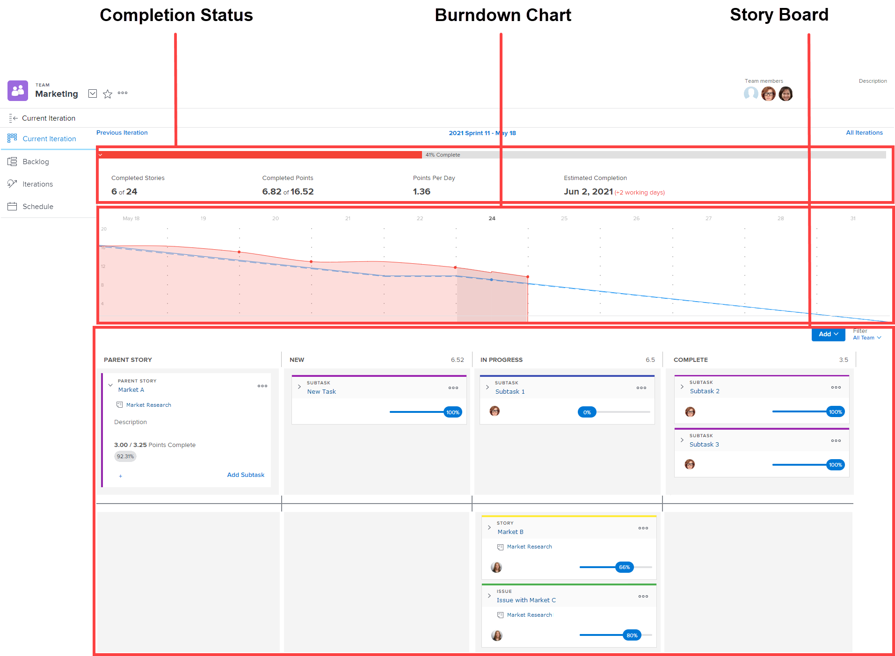
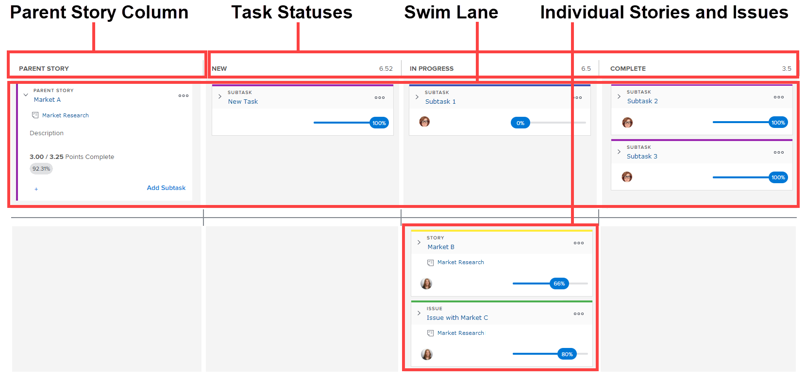

# [!UICONTROL Scrum]主板概述

<!-- Audited: 5/2025 -->

[!UICONTROL Scrum] Agile文章展示板与完成状态和燃耗图一起显示。 这些Agile组件在[!UICONTROL Adobe Workfront]中的以下情况下可用：

* Agile迭代。 有关在纯Agile环境中使用Agile文章展示板、燃尽图和完成状态（包含积压工作和小版本）的详细信息，请参阅[在Agile环境中工作](../../../agile/work-in-an-agile-environment/work-in-an-agile-environment.md)。
* 在“敏捷”视图中查看项目时。 有关如何在现有项目中利用敏捷(Agile)文章展示板、燃尽图和完成状态的信息，请参阅[在敏捷(Agile)视图中管理项目](../../../manage-work/projects/manage-projects/manage-projects-in-agile-view.md)。

## 文章板版式与功能

故事板由以下元素组成：

* **父故事列**：与故事板上的其他列不同，[!UICONTROL 父故事]列不是任务状态，而是为了容纳迭代或项目中包含子任务的任何故事而存在的。 只有故事板上至少有一个子任务的父故事才能位于此列中。 父故事本身不会在故事板中从状态移动到状态。

  在迭代中，仅当故事板上的一个或多个故事包含至少一个满足以下要求的子任务时，此列才会出现在故事板上：

   * 分配给与父任务相同的Agile团队。
   * 属于迭代。

     在项目中，每当任务至少有一个子任务时，就会显示此列。

     

* **任务状态**：根据文章所处的状态列，指示文章在迭代或项目中的进度。

  通过修改Agile视图，可以为项目自定义任务状态。

* **泳道**：当父故事及其子任务显示在故事板上时，将专门为故事及其子任务创建泳道。 这提供了视觉上的区别，以便更好地查看文章的子任务在整个文章中的进度。

  在迭代中，仅当文章展示板上的文章包含至少一个满足以下要求的子任务时，才会在文章展示板上出现泳道：

   * 已分配给与父任务相同的Agile团队。
   * 属于小版本。

  在项目中，每当任务至少具有一个子任务或父任务时，就会出现泳道。

* **个人故事**：个人故事和问题显示在故事板上的任何泳道下面。 这提供了与泳道中故事的视觉区别。

## 子任务与故事的关系

如果文章包含子任务，则无法更新父文章本身的任何信息（如点/小时或完成百分比）。 此外，您不能跨文章板移动文章来更新其状态。 相反，您对文章子任务所做的任何更改都会反映在文章中。 所有子任务的合并文章点数或小时数决定父文章的点数或小时数。

例如，如果文章只有一个子任务值4点，则文章本身也有4点。 如果将子任务点值更改为3，则父文章的点值将更改为3。 如果在同一内文中创建另一个子任务，并将该子任务的点值设置为4，则内文的点值将更改为7，以反映两个子任务的组合点值。

此逻辑同样适用于第二级子任务（子任务的子任务）。 如果子任务具有一个或多个第二级子任务，则根据第二级子任务计算子任务。

## 故事板和积压之间的关系

迭代积压事项仅显示可设置估算的故事或子任务。 如果父故事具有显示在故事板上的子任务（因为它们被分配到同一敏捷团队并属于迭代），则父任务不会显示在积压中。 在这种情况下，只有子任务显示在积压工作(backlog)上，而子任务和父文章显示在文章展示板上。

例如，假设故事A包含子任务1和子任务2（且这两个子任务都分配给同一个Agile团队）。 在这种情况下，故事A显示在包含子任务1和子任务2的泳道中的故事板上。 但是，积压中只显示子任务1和子任务2。

此逻辑同样适用于第二级子任务（子任务的子任务）。 如果子任务有一个或多个分配给同一Agile团队的第二级子任务且属于迭代，则积压中仅显示第二级子任务。

有关积压工作的详细信息，请参阅[管理Agile积压工作](../../../agile/work-in-an-agile-environment/manage-the-agile-backlog.md)。
