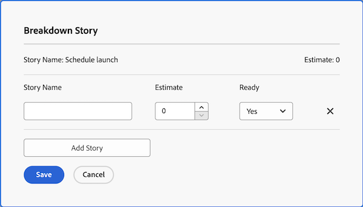

# 管理Agile积压

以下工作项可以分配给Agile团队，并作为故事添加到该团队的积压中，具体取决于团队使用的敏捷方法：

* **[!UICONTROL Scrum敏捷团队]：** 任务和问题可分配给Agile团队并添加到积压。
* **[!UICONTROL Kanban敏捷团队]：** 任务可以分配给Agile团队并添加到积压。 用户可直接从Agile故事板查看积压，如中所述 [[!UICONTROL 添加积压] 到Kanban板](../../agile/use-kanban-in-an-agile-team/view-the-backlog-on-the-kanban-board.md). 团队使用此积压事项来排列工作队列的优先顺序并管理其工作队列。

可以从中的任意位置将任务或问题分配给团队（并随后添加到团队积压） [!DNL Adobe Workfront]. 例如，一个团队可能从多个项目中分配了工作分派。

>[!NOTE]
>
>如果将多个团队添加到积压项目，则任务或问题仅显示在主要团队的积压中。 主要团队是首先分配的团队。

## 访问要求

+++ 展开以查看本文中各项功能的访问要求。

您必须具有以下权限才能执行本文中的步骤：

<table style="table-layout:auto"> 
 <col> 
 </col> 
 <col> 
 </col> 
 <tbody> 
  <tr> 
   <td role="rowheader"><strong>[!DNL Adobe Workfront] 计划</strong></td> 
   <td> 
任何
 </td> 
  </tr> 
  <tr> 
   <td role="rowheader"><strong>[!DNL Adobe Workfront] 许可证</strong></td> 
   <td> 
新文档： [！UICONTROL Standard]

或

当前： [！UICONTROL Work]或更高版本
 </td> 
  </tr> 
  <tr> 
   <td role="rowheader"><strong>访问级别配置</strong></td> 
   <td> 
新文档： [！UICONTROL Standard]

或

当前： [！UICONTROL Worker]或更高版本
 </td> 
  </tr> 
  <tr> 
   <td role="rowheader"><strong>对象权限</strong></td> 
   <td> 
[！UICONTROL Manage]对文章所在项目的访问权限
  </td> 
  </tr> 
 </tbody> 
</table>

有关此表中信息的更多详细信息，请参见 [Workfront文档中的访问要求](/help/quicksilver/administration-and-setup/add-users/access-levels-and-object-permissions/access-level-requirements-in-documentation.md).

+++

## 创建和管理积压中的故事

* [重新排序故事](#reorder-stories)
* [[!UICONTROL 划分] 故事](#break-down-stories)
* [编辑故事](#edit-stories)

### 重新排序故事 {#reorder-stories}

您可以使用拖放方法重新排序积压事项列表中的故事。

1. 转到要重新排序故事的Agile积压。
1. 在 **[!UICONTROL 视图]** 下拉菜单，选择 **[!UICONTROL 积压]** 视图或包含 **[!UICONTROL 订购]** 列。

   >[!NOTE]
   >
   >如果任务或问题分配了Agile团队，且项目未处于与当前相同的状态，则它们不会显示在积压中。 但是，它们仍会影响“顺序”列中的积压计数。

1. 选择一个或多个故事，然后将故事拖到您希望它们在积压中显示的顺序上。\
   

### 分解故事 {#break-down-stories}

由于积压中的故事大小不同，因此用户可以将其细分为开发周期的有效大小。 分解故事会在故事所代表的任务上创建子任务，并替换积压中的原始任务。 您可以将父任务或其子任务分配给Agile团队，但不能将两者同时分配给团队。

>[!NOTE]
>
>在划分故事时，请考虑以下限制：
>
>* 只有代表任务的故事才能细分。 您无法细分代表问题的故事。
>* 只有当故事与项目相关联时，才能对其进行划分。

要分解故事，请执行以下操作：

1. 转到包含要细分的故事的积压。
1. 选择要划分的故事，然后单击 **[!UICONTROL 分解故事]**.\
   此 [!UICONTROL 分解故事] 对话框随即显示。\
   

1. 指定文章的名称和估计值，然后选择文章是否已准备就绪。
1. 单击 **[!UICONTROL 添加故事]** 从原故事中创造另一个故事。
1. 单击&#x200B;**[!UICONTROL 保存]**。

### 编辑故事 {#edit-stories}

您可以直接从编辑故事 [!UICONTROL 故事] 或 [!UICONTROL 问题] 选项卡，就像批量编辑项目中的任何任务或问题一样，如中所述 [批量编辑任务](../../manage-work/tasks/manage-tasks/edit-tasks.md#edit-tasks-in-bulk) 在 [编辑任务](../../manage-work/tasks/manage-tasks/edit-tasks.md)、和 [编辑问题](../../manage-work/issues/manage-issues/edit-issues.md).

## 在积压工作中创建新故事 {#create-new-stories-on-the-backlog}

通过直接从积压创建故事，或将现有任务或问题分配给Agile团队，可以在积压中创建新故事。

* [从积压创建故事](#create-a-story-from-the-backlog)
* [将任务或问题分配给Agile团队](#assign-a-task-or-issue-to-an-agile-team)

### 从积压创建故事 {#create-a-story-from-the-backlog}

从积压创建故事时，故事将作为项目中的任务或问题创建。 无法从积压中创建故事作为问题。

要从积压创建故事，请执行以下操作：

1. 单击 **[!UICONTROL 主菜单]** 图标  单击Adobe Workfront右上角的或者（如果可用）单击 **[!UICONTROL 主菜单]** 图标  图标，然后单击 **[!UICONTROL 团队]**.

1. （可选）单击 **[!UICONTROL 切换组]** 图标 ，然后从下拉菜单中选择一个新的Scrum团队，或者在搜索栏中搜索某个团队并在它出现时将其选定。

1. 选择 **[!UICONTROL 积压]** 从左侧面板。
1. 执行以下操作之一，具体取决于您是要创建任务还是创建问题：

   * **要创建任务，请执行以下操作：** 单击 **[!UICONTROL 故事]**.

   * **要创建问题，请执行以下操作：** 单击 **[!UICONTROL 问题]**.

1. 单击 **[!UICONTROL 新建故事]** 或 **[!UICONTROL 新建问题]**.

1. 指定以下信息：

   <table style="table-layout:auto">
    <col>
    <col>
    <tbody>
     <tr>
      <td role="rowheader"><strong>[！UICONTROL文章名称]</strong></td>
      <td> 键入故事的名称。</td>
     </tr>
     <tr>
      <td role="rowheader"><strong>[！UICONTROL描述]</strong></td>
      <td>（可选）键入文章的描述。</td>
     </tr>
     <tr>
      <td role="rowheader"><strong>[！UICONTROL就绪]</strong></td>
      <td> 选择文章是否准备好添加到开发周期。 此设置仅供参考。 可以将故事添加到开发周期，而不管此设置的状态如何。</td>
     </tr>
     <tr>
      <td role="rowheader"><strong>[！UICONTROL估计]</strong></td>
      <td>指定文章的分值或每小时估计值。 估计值会影响燃尽图。 仅当每个故事都包含准确的估计值时，迭代的燃尽图才准确。 （如果提供点估计值，则必须在团队设置中指定每个点表示的小时数。）</td>
     </tr>
     <tr>
      <td role="rowheader"><strong>[！UICONTROL父项目]</strong></td>
      <td>开始键入将在其中创建此文章的项目名称，然后在名称出现在下拉列表中时单击该名称。 项目的状态必须设置为[！UICONTROL当前]。 如果项目的状态不是[！UICONTROL当前]，则它不会显示在下拉菜单中。</td>
     </tr>
     <tr>
      <td role="rowheader"><strong>[！UICONTROL父任务]</strong></td>
      <td>（可选）开始键入此文章从属的父任务的名称，然后在名称出现在下拉列表中时单击该名称。</td>
     </tr>
     <tr>
      <td role="rowheader"><strong>[！UICONTROL自定义Forms]</strong></td>
      <td> （可选）选择要添加到此文章的任何自定义表单。</td>
     </tr>
    </tbody>
   </table>

1. 单击 **[!UICONTROL 保存故事]**.

### 将任务或问题分配给Agile团队 {#assign-a-task-or-issue-to-an-agile-team}

您可以将任务或问题分配给Agile团队。 分配任务或问题后，该任务或问题会在团队积压中显示为新故事。

要向Agile团队分配任务或问题，请执行以下操作：

1. 转到包含要分配的任务的项目。
1. 在列表中选择任务或问题。
1. 单击 **[!UICONTROL 编辑]**.
1. 单击 **[!UICONTROL 指定任务]**.
1. （可选）删除任何现有的被分配人。
1. 单击 **[!UICONTROL 添加被分派人]**.
1. 开始键入要分配给任务或问题的Agile团队名称，然后单击出现在下拉列表中的团队名称。
1. 单击 **[!UICONTROL 保存更改]**.\
   任务或问题现在可在团队积压中找到。

## 将故事移入或移出积压

{#move-stories-from-the-backlog-to-an-iteration-or-kanban-board}

* [将故事从积压工作移动到迭代或+展示板](#move-stories-from-the-backlog-to-an-iteration-or--board)
* [将现有故事移至积压](#move-existing-stories-to-the-backlog)
* [从积压中导出故事](#export-stories-from-the-backlog)

### 将故事从积压工作移动到迭代或+展示板

1. 转到Agile团队的积压。
1. 选择要移动到开发周期或Kanban展示板的故事，然后单击 **[!UICONTROL 更多]** > **[!UICONTROL 移动到]**.\
   如果将故事移至 [!UICONTROL Kanban] 讨论区， [!UICONTROL 将故事移至Kanban] 显示展示板。\
   如果将故事移动到迭代，则 [!UICONTROL 将故事移动到迭代] 对话框随即显示。\
   

1. 执行以下任一操作：

   * **对于Scrum团队：** 在 **[!UICONTROL 选择迭代]** 字段中，选择要移动故事的迭代。

   * **对于Kanban团队：** 在 **[!UICONTROL 选择Kanban Board]** 字段，选择您的团队 [!UICONTROL Kanban] 展示板。 (Kanban团队只能有一个 [!UICONTROL Kanban] 展示板。)

1. 单击 **[!UICONTROL 移动故事]**.

### 将现有故事移至积压 {#move-existing-stories-to-the-backlog}

如果您确定您的团队尚未准备好处理故事，您可以将故事移至积压。

有关更多信息，请参阅 [移动敏捷故事](../../agile/work-in-an-agile-environment/move-an-agile-story.md).

### 从积压中导出故事 {#export-stories-from-the-backlog}

您可以直接从积压中导出一个或多个故事（包括任务和问题）。

从积压中导出故事的方式与在中导出其他数据的方式相同 [!DNL Workfront]，如中所述 [导出数据](../../reports-and-dashboards/reports/creating-and-managing-reports/export-data.md).
