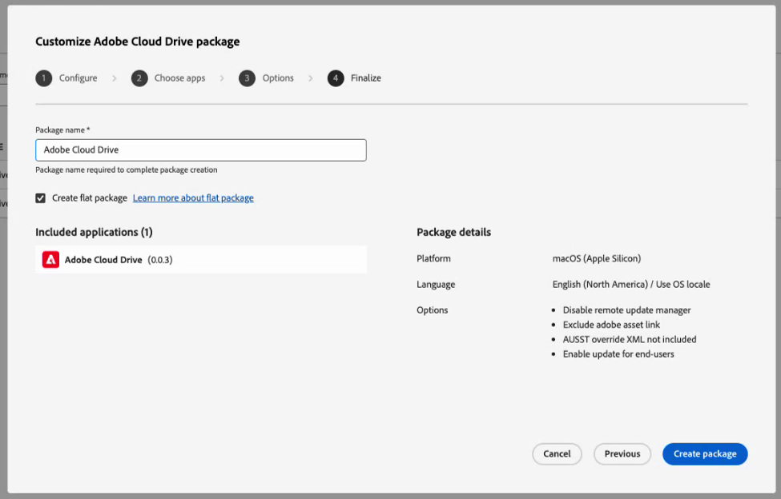

# 为您的组织设置和管理Adobe Cloud Drive

作为管理员，您可以设置Adobe Cloud Drive，以允许用户通过macOS上的Finder和Windows上的文件资源管理器直接桌面访问他们在Adobe Cloud Storage中的项目文件。 本文介绍如何在Adobe Admin Console中启用访问、将应用程序部署到用户设备以及持续管理访问。

Adobe Cloud Drive是一款企业桌面应用程序，可将Workfront文档作为虚拟驱动器挂载到Adobe云存储上的Mac和Windows计算机上。 安装后，用户可以在Finder或文件资源管理器中查看其Workfront项目文件夹，并且可以使用任何桌面应用程序打开、编辑和保存项目文件，而无需手动下载文件或通过浏览器工作。

要使用Adobe Cloud Drive，您的组织必须位于已启用Adobe云存储的工作流Ultimate包上。

有关Adobe Cloud驱动器的更多信息，请参阅以下文章：

* [Adobe Cloud Drive概述](/help/quicksilver/documents/adobe-cloud-drive/adobe-cloud-drive-overview.md)
* [安装Adobe云驱动器](/help/quicksilver/documents/adobe-cloud-drive/install-adobe-cloud-drive.md)
* [使用Adobe Cloud Drive](/help/quicksilver/documents/adobe-cloud-drive/use-adobe-cloud-drive.md)

## 访问权限要求

+++ 展开可查看本文所述功能的访问权限要求。

<table style="table-layout:auto"> 
 <col> 
 <col> 
 <tbody> 
  <tr> 
   <td role="rowheader">Adobe Workfront版本</td> 
   <td>工作流程Ultimate，启用了Adobe云存储</td> 
  </tr> 
  <tr> 
   <td role="rowheader">Adobe管理员权限</td> 
   <td>您必须是Adobe Admin Console中Workfront的系统管理员</td> 
  </tr> 
 </tbody> 
</table>

有关信息，请参阅Workfront文档中的[访问要求](/help/quicksilver/administration-and-setup/add-users/access-levels-and-object-permissions/access-level-requirements-in-documentation.md)。

+++

## 在Adobe Admin Console中分配对Adobe云驱动器的访问权限

启用Adobe Cloud Storage后，Workflow Ultimate包中会包含Adobe Cloud Drive。 它在Admin Console的&#x200B;**Products**&#x200B;部分中不显示为独立产品。 而是通过&#x200B;**用户**&#x200B;下的&#x200B;**角色**&#x200B;部分进行管理。

当您转到&#x200B;**用户** > **角色**&#x200B;时，您会看到两个与Workfront产品关联的角色：

| 角色 | 自动分配给 | 与Adobe Cloud Drive的关系 |
| --- | --- | --- |
| **成员** | 组织中的所有用户 | 包含组织级别的Adobe Cloud Drive功能开关。 默认开启。 |
| **ACD用户** | 无人，默认情况下 | 在组织级别开关关闭时授予个人访问权限。 |

Admin Console中的

### 访问控制

**控件1：组织级别功能控件（成员角色中）**

**成员**&#x200B;角色会自动分配给您组织中的每个用户。 在此角色中，有一个&#x200B;**Adobe Cloud Drive**&#x200B;功能开关。 当此开关打开时，每个具有Workflow Ultimate许可证的用户都可以访问Adobe Cloud Drive。 当它关闭时，任何用户都将无法访问Adobe Cloud Drive，无论其许可证如何。

当Adobe为您的组织激活Adobe Cloud Drive时，默认情况下会开启该开关。

**控件2： ACD用户角色**

仅当组织级别开关关闭时，**ACD用户**&#x200B;角色才相关。 如果关闭组织级开关以运行受控引导，则仍可通过将特定用户添加到&#x200B;**ACD用户**&#x200B;角色来授予其访问权限。 即使组织级别开关关闭，此角色的用户也可以访问Adobe云驱动器。 如果组织级别开关已打开，**ACD用户**&#x200B;角色无效。

**基本要求：工作流Ultimate许可证**

Adobe Cloud Drive仅在Workflow Ultimate包上可用。 角色选项在任何其他资源包中均不可用。

Workflow Ultimate包中的许可证可以是任何许可证类型：标准、精简或参与者。 有关许可证的信息，请参阅[许可证概述](/help/quicksilver/administration-and-setup/add-users/how-access-levels-work/licenses-overview.md)。

下表显示了这些控件的交互方式：

| 组织级交换机 | ACD用户角色中的用户 | 工作流Ultimate许可证 | 访问结果 |
| --- | --- | --- | --- |
| 打开 | 不必需 | 是 | 已授予 |
| 关闭 | 是 | 是 | 已授予 |
| 关闭 | 否 | 是 | 已拒绝 |
| 或者 | 或者 | 否 | 已拒绝 |

<!-- Sarah said to delete the second line. Commenting it out within the table messed up the display for the rest of the table, so keeping the line here until I can delete it. | On | Not required | No | Denied | -->

## 先决条件

在开始之前，请验证以下各项：

* 您计划预配的用户已分配Workfront工作流许可证。
* 您已与您的IT团队一起审查了[网络要求](#network-requirements)。
* 您起草了发送给用户的通信内容，其中说明了Adobe Cloud Drive显示的内容（仅限Workfront项目资源）以及如何安装。

  >[!NOTE]
  >
  >启用了访问权限但无权访问任何Workfront项目的用户在登录后看到空的已装载驱动器。 这是正常情况。 Workfront项目访问权限在Workfront中单独管理。 有关信息，请参阅[共享项目](/help/quicksilver/workfront-basics/grant-and-request-access-to-objects/share-a-project.md)。
  >
  >此外，Creative Cloud权利必须与Workfront位于同一个IMS组织中，项目才能显示在驱动器中。

## 在Adobe Admin Console中配置访问权限

Adobe Cloud驱动器访问权限是在Adobe Admin Console中配置的。 选择与您的转出策略匹配的选项。

### 选项A：启用整个组织的访问权限

当Adobe为您的组织激活Adobe云驱动器时，默认情况下会打开组织级别功能开关，并且所有用户都可以立即访问。 在部署应用程序之前，请使用此过程确认交换机已打开。

1. 登录到[adminconsole.adobe.com](https://adminconsole.adobe.com/)。
1. 单击顶部导航栏中的&#x200B;**用户**。
1. 单击左侧面板中的&#x200B;**角色**。
1. 单击角色列表中的&#x200B;**成员**。
1. 在右侧打开的&#x200B;**成员**&#x200B;面板中，确认&#x200B;**Adobe Cloud Drive**&#x200B;出现在&#x200B;**权限**&#x200B;下，并且其开关已打开。

   打开Adobe Cloud Drive的

   >[!NOTE]
   >
   >如果Adobe Cloud Drive未出现在&#x200B;**成员**&#x200B;角色的&#x200B;**权限**&#x200B;下，则可能尚未为您的组织激活Adobe Cloud Drive。 请联系Adobe支持部门以确认。

1. 如果您进行了任何更改，请单击&#x200B;**保存**。

### 选项B：为特定用户组启用访问权限

如果您希望限制对一组已定义用户的访问（例如，在试运行期间进行更广泛的转出），请使用此选项。 这包括关闭组织级别的开关，然后将您的引导用户添加到&#x200B;**ACD用户**&#x200B;角色。

>[!IMPORTANT]
>
>关闭组织级别的切换将会立即删除组织中所有用户（包括当前登录的用户）对Adobe Cloud Drive的访问权限。 您必须关闭组织级功能，并在同一会话中添加引导用户。

要关闭组织级功能，请执行以下操作：

1. 登录到[adminconsole.adobe.com](https://adminconsole.adobe.com/)。
1. 单击顶部导航栏中的&#x200B;**用户**，然后单击左侧面板中的&#x200B;**角色**。
1. 单击角色列表中的&#x200B;**成员**。
1. 在&#x200B;**成员**&#x200B;面板中，在&#x200B;**权限**&#x200B;下找到&#x200B;**Adobe Cloud Drive**&#x200B;并将其关闭。
1. 单击&#x200B;**保存**。

要将引导用户添加到ACD用户角色，请执行以下操作：

1. 在左侧面板中，单击&#x200B;**角色**&#x200B;以返回角色列表。
1. 单击角色列表中的&#x200B;**ACD用户**。

   

1. 单击&#x200B;**添加用户**。
1. 输入每个试点用户的电子邮件地址。
1. 单击&#x200B;**保存**。

   添加到&#x200B;**ACD用户**&#x200B;角色的用户将立即获得访问权限。 不在此角色中的用户将保持无访问权限，直到您将他们添加到角色或重新打开组织级别切换为止。

   >[!TIP]
   >
   >要随时间扩展访问权限，请返回&#x200B;**ACD用户**&#x200B;角色，并根据需要添加用户。 当您准备好进行完全转出时，请在&#x200B;**成员**&#x200B;角色中重新打开组织级别的开关。 一旦打开组织级别的开关，**ACD用户**&#x200B;角色将无效，无需维护。

## 部署Adobe Cloud Drive应用程序

在Adobe Admin Console中配置访问权限将建立权利。 部署应用程序会将其安装在用户的设备上。 这是两个独立的必需步骤。

Adobe Cloud Drive是一个独立的应用程序。 它不会通过Creative Cloud桌面应用程序分发，也不会显示在Creative Cloud包管理器中。 但是，Adobe Cloud Drive的用户配置文件关联到Creative Cloud应用程序权限。 这意味着用户要在驱动器中访问Workfront项目，Creative Cloud应用程序必须在与Workfront相同的IMS组织中拥有权限。

选择与贵组织的设备管理实践相匹配的部署方法。

### 方法A：通过Admin Console包进行IT管理的部署

当您的组织使用集中式部署工具（如Microsoft Intune、SCCM、Jamf Pro或Apple远程桌面）时，请使用此方法。 这是标准的Adobe企业部署工作流，它遵循与其他Adobe应用程序相同的包创建流程。

要在Adobe Admin Console中创建包，请执行以下操作：

1. 登录到[adminconsole.adobe.com](https://adminconsole.adobe.com/)。
1. 单击顶部导航栏中的&#x200B;**包**。
1. 单击左侧面板中的&#x200B;**预生成的包**。
1. 单击&#x200B;**模板**&#x200B;选项卡。

   Adobe Cloud Drive在模板列表中显示两次：一次用于macOS，一次用于Windows。

   

1. 找到与您的Target平台匹配的&#x200B;**Adobe Cloud Drive**&#x200B;行，然后单击该行上的详细信息图标。

   侧面板显示包元数据。

   

1. 单击&#x200B;**自定义**。

   包自定义向导打开，包含四个步骤：**配置**、**选择应用程序**、**选项**&#x200B;和&#x200B;**完成**。

1. 在&#x200B;**配置**&#x200B;步骤中，选择目标计算机的体系结构，然后确认语言设置并单击&#x200B;**下一步**。

   * **macOS：**&#x200B;选择&#x200B;**macOS（英特尔）**&#x200B;或&#x200B;**macOS(Apple Silicon)**。
   * **Windows：**&#x200B;选择&#x200B;**Windows （64位）**&#x200B;或&#x200B;**Windows (ARM)**。

   

1. 在&#x200B;**选择应用程序**&#x200B;步骤中，确认已使用所需的版本选择Adobe云驱动器。

   已使用最新可用版本预选择Adobe云驱动器。 若要使用旧版本，请单击&#x200B;**其他版本**&#x200B;并选择&#x200B;**旧版本**。

   

1. 单击&#x200B;**下一步**。
1. 在&#x200B;**选项**&#x200B;步骤中，单击&#x200B;**下一步**&#x200B;而不选择任何选项。

   这些设置适用于Creative Cloud桌面应用程序，而不适用于Adobe云驱动器。

   包向导中的

1. 在&#x200B;**Finalize**&#x200B;步骤中，键入包的名称，然后选择&#x200B;**平面包**。
1. 查看摘要并单击&#x200B;**创建包**。

   包向导中的

   向导关闭。 您的新包显示在包列表的顶部，在生成时具有&#x200B;**正在准备**&#x200B;状态。 准备就绪后，状态将更改为&#x200B;**最新**，并显示下载链接。

   

1. 单击&#x200B;**下载**&#x200B;并将包文件保存到您选择的位置。

### 方法B：从Software Distribution自助直接下载

对于较小的组织、自管理设备，或引导个人用户自行安装应用程序时，请使用此方法。

在开始之前，请确认以下事项：

* 在Adobe Admin Console中为用户启用了访问权限。
* 已通知用户软件分发URL和登录说明。
* 已验证到所需端点的网络连接。 有关详细信息，请参阅本文中的[网络要求](#network-requirements)。

要自行安装Adobe Cloud Drive，请执行以下操作：

1. 确认已在Adobe Admin Console中为用户启用了访问权限。
1. 将用户定向到[experience.adobe.com/#/downloads](https://experience.adobe.com/#/downloads)。

   >[!NOTE]
   >
   >用户必须在Adobe Admin Console中启用Adobe云驱动器访问权限，才能查看Adobe云驱动器安装程序。 没有访问权限的用户看不到列出的安装程序。

1. 用户使用其Enterprise ID或Federated ID登录。 Adobe Cloud Drive安装程序显示在Software Distribution的&#x200B;**Workfront**&#x200B;选项卡中。
1. 用户下载其平台的安装程序，并遵循[安装Adobe云驱动器](/help/quicksilver/documents/adobe-cloud-drive/install-adobe-cloud-drive.md)中的安装步骤。

   适用于Workfront的

部署后，在测试设备上完成此验证：

1. 从&#x200B;**Applications**&#x200B;文件夹(macOS)或&#x200B;**开始**&#x200B;菜单(Windows)启动Adobe云驱动器。
1. 使用已在Adobe Admin Console中启用Adobe云驱动器访问权限的用户帐户登录。
1. 确认Workfront项目文件夹出现在Finder或文件资源管理器的已装载驱动器中。

   >[!NOTE]
   >
   >成功登录但未看到文件夹的用户无权访问任何Workfront项目。 将用户添加到Workfront中的项目以填充驱动器。

1. 导航到项目文件夹并创建一个小型测试文件。
1. 在浏览器中打开Workfront，并确认测试文件显示在相应的项目中。
1. 验证后删除测试文件。

## 管理用户对Adobe Cloud Drive的持续访问

一旦您的组织使用Adobe Cloud Drive，请按照以下步骤添加新用户，或删除不再需要访问权限的用户。

### 添加新用户

如果组织级别开关处于打开状态，则无需执行Adobe Admin Console操作。 要求用户下载并安装Adobe云驱动器。 如果授权用户仍无法访问Adobe Cloud Drive，请联系Adobe支持部门以确认其帐户已正确迁移。

如果组织级交换机处于关闭状态：

1. 登录到[adminconsole.adobe.com](https://adminconsole.adobe.com/)。
1. 单击顶部导航栏中的&#x200B;**用户**，然后单击左侧面板中的&#x200B;**角色**。
1. 单击角色列表中的&#x200B;**ACD用户**。
1. 单击&#x200B;**添加用户**，输入用户的电子邮件地址，然后单击&#x200B;**保存**。

### 删除用户

如果组织级别开关已打开，则任何授权用户都可以访问Adobe云驱动器。 若要在不删除特定用户的Workfront许可证的情况下删除其访问权限，请关闭组织级别的开关，并将所有其他用户添加到&#x200B;**ACD用户**&#x200B;角色，但要阻止的用户除外。

如果组织级别开关已关闭，并且用户处于&#x200B;**ACD用户**&#x200B;角色：

1. 登录到[adminconsole.adobe.com](https://adminconsole.adobe.com/)。
1. 单击顶部导航栏中的&#x200B;**用户**，然后单击左侧面板中的&#x200B;**角色**。
1. 单击角色列表中的&#x200B;**ACD用户**。
1. 选择用户并单击&#x200B;**删除**。

用户将立即失去对已装入驱动器的访问权限。 存储在Workfront中的文件不会被删除。 用户的本地缓存将保留在其设备上，直到他们卸载应用程序为止。

>[!IMPORTANT]
>
>从&#x200B;**ACD用户**&#x200B;角色中删除用户不会从Workfront或任何Workfront项目中删除这些用户。 单独管理Workfront项目访问权限。

## 管理Workfront项目访问权限

Adobe Cloud Drive向用户显示他们有权访问的Workfront项目。 项目访问权限在Workfront中管理，而不是在Adobe Admin Console中管理。 具有Adobe云驱动器访问权限但不属于Workfront项目的用户在登录后看到空的已装载驱动器。 此是符合预期的行为。

有关管理项目访问权限的信息，请参阅[管理项目](/help/quicksilver/manage-work/projects/manage-projects/manage-projects-overview.md)和[共享项目](/help/quicksilver/workfront-basics/grant-and-request-access-to-objects/share-a-project.md)。

## 网络要求

Adobe Cloud Drive要求对一组Adobe端点进行出站HTTPS（端口443）访问。 不需要入站防火墙规则。 有关端点的列表，请参阅[Adobe网络端点](https://helpx.adobe.com/in/enterprise/kb/network-endpoints.html)。

Adobe Cloud Drive可读取macOS和Windows上的系统级代理配置。 支持经过身份验证的代理。

## 安全性注意事项

### 身份验证

Adobe Cloud Drive通过Adobe IMS (Identity Management System)对用户进行身份验证。 用户使用其Enterprise ID或Federated ID登录。 如果您的组织使用Adobe Admin Console中配置的SSO，则用户将通过您的身份提供商进行身份验证，并且不需要单独的Adobe凭据。

>[!NOTE]
>
>Adobe Cloud Drive不支持在企业部署中使用个人Adobe ID（单独创建、非托管帐户）。 用户必须使用贵组织目录中的Enterprise ID或Federated ID登录。

### 正在传输和静止的数据

* Adobe Cloud Drive与Adobe服务之间的所有通信均使用TLS 1.2或更高版本。
* 存储在Adobe云存储中的文件将进行静态加密。
* 在本地缓存的文件在设备上启用FileVault (macOS)或BitLocker (Windows)时会使用操作系统级别的磁盘加密。

### 文件访问控制

文件访问权限遵循Workfront项目权限。 用户只能查看和交互他们有权访问的项目，因为他们的Workfront访问级别允许。

在桌面视图中，每个Workfront项目的根文件夹均为只读。 用户无法从“访达”或“文件资源管理器”中重命名、移动或删除项目根文件夹。 根据他们的Workfront权限，他们可以在项目文件夹内的任何深度创建文件夹、子文件夹和文件。

## 常见问题疑难解答

有关最终用户疑难解答步骤，请参阅[Adobe Cloud驱动器疑难解答](/help/quicksilver/documents/adobe-cloud-drive/troubleshoot-adobe-cloud-drive.md)。 下面列出的问题特定于管理员。

### 用户在软件分发中找不到Adobe Cloud Drive安装程序

**原因：**&#x200B;未在Adobe Admin Console中为用户启用Adobe云驱动器访问。

**分辨率：**

1. 登录到[adminconsole.adobe.com](https://adminconsole.adobe.com/)，然后单击&#x200B;**用户**。
1. 搜索用户并单击其名称。
1. 单击&#x200B;**角色**&#x200B;选项卡，并验证是否已启用Adobe Cloud Drive。

**原因：** Creative Cloud所有应用程序配置在与Workfront不同的IMS组织中。

**分辨率：**&#x200B;当前无分辨率可用。

### 用户安装了应用程序并登录，但驱动器中没有看到文件夹

**原因：**&#x200B;用户无权访问任何Workfront项目。

**分辨率：**

1. 在Workfront中，确认用户有权访问至少一个项目。
1. 如果没有，则与用户共享项目。
1. 要求用户最多等待五分钟，以便显示项目文件夹。
1. 如果文件夹在五分钟后仍未显示，请要求用户退出Adobe Cloud Drive并重新启动。

### 用户无法登录到Adobe Cloud Drive

**原因：**&#x200B;用户的Adobe Admin Console帐户处于非活动状态，或其标识配置不正确。

**分辨率：**

1. 在Adobe Admin Console中，单击&#x200B;**用户**&#x200B;并搜索该用户。
1. 确认用户的帐户状态为&#x200B;**活动**。
1. 确认用户的电子邮件域是您的Admin Console目录中声明的域。
1. 如果贵组织使用SSO，请确认用户帐户在您的身份提供程序中处于活动状态。
1. 要求用户尝试重新登录。

### 用户保存后文件未同步

**原因：**&#x200B;文件未显式保存，或者存在网络连接问题。

**分辨率：**

1. 与用户确认他们使用应用程序中的&#x200B;**文件** > **保存**&#x200B;保存了文件。 关闭应用程序或依赖自动保存不会触发同步。
1. 确认用户具有Internet访问权限，可以访问`*.adobe.com`和`*.workfront.com`。
1. 要求用户检查菜单栏(macOS)或系统任务栏(Windows)中的Adobe Cloud Drive图标是否有错误指示器。
1. 如果出现错误，请要求用户退出Adobe Cloud驱动器，重新启动该驱动器，然后再次保存文件。
1. 如果问题仍然存在，请收集应用程序日志：

   * **macOS：** `~/Library/Logs/Adobe/AdobeCloudDrive/`
   * **Windows：** `C:\Users\<username>\AppData\Local\Temp\Adobe\AdobeCloudDrive\`

### 项目文件夹中出现一个冲突的文件副本

**原因：**&#x200B;在将任一版本同步到云之前，两个用户将更改保存到同一文件。 Adobe Cloud Drive会自动保留两个版本。

冲突的副本使用此命名格式： `filename (Conflicted copy from device_name on date_time).extension`
例如： `project_brief (Conflicted copy from jsmith's MacBook Pro on 2026-06-15-10-45-19).docx`

**分辨率：**

1. 询问两个用户哪个版本具有权威性。
1. 将冲突副本中任何所需的内容复制到主文件中。
1. 协调两个版本后删除冲突的副本。

   >[!NOTE]
   >
   >Adobe Cloud Drive不使用文件锁定。 要在多个用户编辑同一文件时防止发生冲突，请在多个用户从桌面访问同一文件之前，通过Workfront任务分配或审批工作流协调编辑。

### 用户无法在项目中创建文件夹或文件

**原因A：**&#x200B;用户正在尝试在项目根级别创建文件夹或文件。 Adobe Cloud Drive中的项目根文件夹当前为只读。 根级别文件夹表示在Workfront中创建和管理的Workfront项目。

**分辨率：**

1. 要求用户导航到项目中的任何现有子文件夹，并在其中创建文件或文件夹。
1. 如果用户需要在项目中包含新的顶级文件夹，请要求他们先在Workfront中创建它。 然后，它会显示在Adobe Cloud Drive中。

**原因B：**&#x200B;用户对Workfront项目没有编辑权限。

**分辨率：**

1. 在Workfront中，检查用户在项目上的权限（**查看**、**Contribute**&#x200B;或&#x200B;**管理**）。
1. 更新用户&#x200B;**Contribute**&#x200B;或&#x200B;**管理**&#x200B;的权限（如果他们需要创建或编辑文件）。
