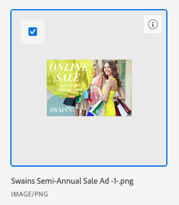

# 从Experience Manager Assets或Assets Essentials链接资源和文件夹

您可以将Experience Manager Assets或Assets Essentials中的资源或文件夹链接到支持文档的任何Adobe Workfront对象。 从Assets Essentials发送的Assets不计入Workfront中的整体文档存储。 从Workfront上传并发送到Assets Essentials的文档确实会计入总体存储中。

在将资源从Workfront发送到Experience Manager Assets或Assets Essentials时，首先映射元数据字段。 如果您的Workfront管理员启用了对象元数据同步，则在任一应用程序中更改了某些字段后，这些字段将保持最新状态。

## 访问要求

+++ 展开以查看本文中各项功能的访问要求。

您必须具备以下条件：

<table style="table-layout:auto"> 
 <col> 
 <col> 
 <tbody> 
  <tr> 
   <td role="rowheader">Adobe Workfront计划*</td> 
   <td> 
 任何
 </td> 
  </tr> 
  <tr> 
   <td role="rowheader">Adobe Workfront许可证*</td> 
   <td> 
请求或更高版本
 </td> 
  </tr> 
  <tr> 
   <td role="rowheader">产品</td> 
   <td>您必须安装了Experience Manager as a Cloud Service或Assets Essentials，并且您必须作为用户添加到Admin Console的产品中。</td> 
  </tr> 
   <tr> 
    <td role="rowheader">Experience Manager权限</td> 
    <td>您必须具有此文件夹的写入权限。</td> 
   </tr>
  <tr> 
   <td role="rowheader">访问级别配置*</td> 
   <td> 
编辑对文档的访问权限
 
注意：如果您仍然没有访问权限，请咨询Workfront管理员是否对您的访问级别设置了其他限制。 有关Workfront管理员如何修改您的访问级别的信息，请参阅<a href="../../administration-and-setup/add-users/configure-and-grant-access/create-modify-access-levels.md" class="MCXref xref">创建或修改自定义访问级别</a>。
 </td> 
  </tr> 
  <tr> 
   <td role="rowheader">对象权限</td> 
   <td> 
查看访问权限或更高版本
 
有关请求其他访问权限的信息，请参阅<a href="../../workfront-basics/grant-and-request-access-to-objects/request-access.md" class="MCXref xref">请求访问对象</a>。
 </td> 
  </tr> 
 </tbody> 
</table>

&#42;要了解您拥有什么计划、许可证类型或访问权限，请与Workfront管理员联系。

+++

## 先决条件

开始之前，

* 您的Workfront管理员必须配置Experience Manager集成。 有关详细信息，请参阅[配置Experience Manager Assets as a Cloud Service集成](/help/quicksilver/administration-and-setup/configure-integrations/configure-aacs-integration.md)或[配置Experience Manager Assets Essentials集成](/help/quicksilver/documents/adobe-workfront-for-experience-manager-assets-essentials/setup-asset-essentials.md)。

## 从Experience Manager Assets或Assets Essentials链接资源

您可以将Experience Manager Assets或Assets Essentials中的资源链接到Workfront。 链接资产后，您可以

* [校对链接的Experience Manager Assets或Assets Essentials资源](../../documents/adobe-workfront-for-experience-manager-assets-essentials/proof-linked-asset-aem.md)
* [上载文档的新版本](../../documents/managing-documents/upload-new-document-version.md)

1. 转到Workfront中要添加文档的&#x200B;**文档**&#x200B;区域。
1. 选择&#x200B;**新增**，然后选择管理员设置的Experience Manager集成。

   >[!NOTE]
   >
   >Workfront管理员可以选择此集成的任何名称，因此可能没有特别提及Assets或Assets Essentials。

1. 选择所需的资源。

   

1. 单击&#x200B;**选择**。

## 从Experience Manager Assets或Assets Essentials链接文件夹

查看文件夹内各个资产的权限取决于Experience Manager Assets或Assets Essentials权限。

1. 转到Workfront中要放置文件夹的&#x200B;**文档**&#x200B;区域。
1. 选择&#x200B;**新增**，然后选择管理员设置的Experience Manager集成。

   >[!NOTE]
   >
   >Workfront管理员可以选择此集成的任何名称，因此可能没有特别提及Assets或Assets Essentials。

1. 选择所需的文件夹。

   

1. 单击&#x200B;**选择**。

## 从Experience Manager Assets或Assets Essentials链接新版本

您可以从Assets Essentials中提取新资源，并将其作为新版本添加到现有资源。 如果文档已链接，并且在Assets Essentials中添加了新版本，则新版本会自动显示在Workfront中。

要从Assets Essentials链接新版本，请执行以下操作：

1. 转到Workfront中要添加文档的&#x200B;**文档**&#x200B;区域。
1. 选择要替换为新版本的资产。 您无法在链接的文件夹中创建资产的新版本。
1. 选择&#x200B;**新增** > **版本**，然后选择管理员设置的Experience Manager集成。

   >[!NOTE]
   >
   >Workfront管理员可以选择此集成的任何名称，因此可能没有特别提及Assets或Assets Essentials。

1. 选择所需的资源。

   

1. 单击&#x200B;**选择**。

>[!TIP]
>
>如果您转到&#x200B;**文档详细信息** > **版本**，则可以查看资产的所有版本。
