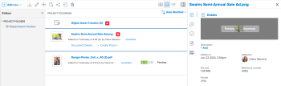

# 查看或下载从Experience Manager Assets或Assets Essentials链接的资源

您可以在Adobe Workfront中查看或下载从Experience Manager Assets或Assets Essentials链接的资源。

## 访问权限要求

+++ 展开可查看本文所述功能的访问权限要求。

<table style="table-layout:auto"> 
 <col> 
 <col> 
 <tbody> 
  <tr> 
   <td role="rowheader">Adobe Workfront 包</td> 
   <td> 
 “任一”
 </td> 
  </tr> 
  <tr> 
   <td role="rowheader">Adobe Workfront 许可证</td> 
   <td>
   
参与者或更高版本

   
请求或更高版本
 </td> 
  </tr> 
  <tr> 
   <td role="rowheader">其他产品</td> 
   <td>您必须安装了Experience Manager as a Cloud Service或Assets Essentials，并且您必须作为用户添加到Admin Console的产品中。</td> 
  </tr> 
  <tr> 
   <td role="rowheader">访问级别配置</td> 
   <td> 
编辑对文档的访问权限
  </td> 
  </tr> 
  <tr> 
   <td role="rowheader">对象权限</td> 
   <td> 
查看访问权限或更高版本
 </td> 
  </tr> 
 </tbody> 
</table>

有关此表中信息的更多详细信息，请参阅Workfront文档中的[访问要求](/help/quicksilver/administration-and-setup/add-users/access-levels-and-object-permissions/access-level-requirements-in-documentation.md)。

+++

## 先决条件

开始之前，

* 您的Workfront管理员必须配置Experience Manager集成。 有关详细信息，请参阅[配置Experience Manager Assets as a Cloud Service集成](/help/quicksilver/administration-and-setup/configure-integrations/configure-aacs-integration.md)或[配置Experience Manager Assets Essentials集成](/help/quicksilver/documents/adobe-workfront-for-experience-manager-assets-essentials/setup-asset-essentials.md)。

## 查看或下载链接的资源

1. 找到要查看或下载的文档。
1. 从文档列表中，选择文档。
1. 在右侧的文档摘要中，将鼠标悬停在顶部的缩略图上，然后选择&#x200B;**预览**&#x200B;或&#x200B;**下载**。

   
