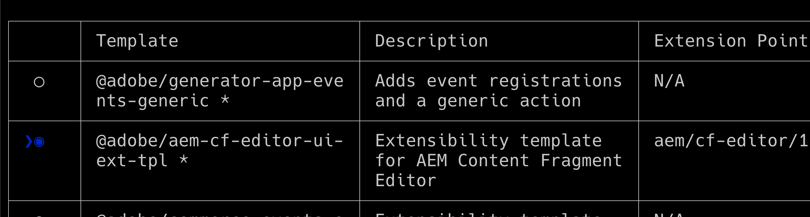

# Workfront中的AppBuilder文档详细信息

您可以在文档详细信息中安装AppBuilder。

## 先决条件

您必须具备以下条件：

* 启用了IMS的Workfront帐户
* 具有节点v18和npm的开发计算机

## 将开发人员添加到管理控制台

>[!IMPORTANT]
>
>请确保为以下所有步骤选择了正确的IMS组织。 如果您属于多个组织，则可能会选择错误的组织。 确保您在正确的组织下操作，该组织通常位于右上角。


1. 导航到以下任一项：

* 暂存： [https://stage.adminconsole.adobe.com/](https://stage.adminconsole.adobe.com/)
* 产品： [https://adminconsole.adobe.com/](https://adminconsole.adobe.com/)

1. 在用户部分中，单击 **开发人员** > **添加开发人员**.

   

   >[!NOTE]
   >
   >如果您看不到用于管理开发人员的选项，则说明您没有任何产品允许进行开发访问。 Workfront不提供开发人员访问权限，但AEM提供。 如果您没有看到此内容，我们将需要了解如何将Workfront包含在允许开发人员的应用程序列表中。

1. 添加用户的电子邮件。 它应该搜索已从Admin Console中添加的现有用户。

1. 将必要的产品添加到开发人员配置文件，然后单击 **保存**.


## 获取对AppBuilder的访问权限

组织需要与其客户经理合作才能购买AppBuilder。 具体操作过程尚不清楚，因为我们不需要为POC执行此操作。

如果要测试AppBuilder集成，您可以在此处请求您的IMS组织的免费试用：
[https://developer.adobe.com/app-builder/trial/#](https://developer.adobe.com/app-builder/trial/#)

我的印象是，尽管这是30天的免费试用，但在此时间之后，他们实际上不会停用此试用。

如果正确配置了AppBuilder，则在创建新项目时（下节将介绍此内容），您应该会看到“从模板创建项目”。

## 在开发控制台中创建新项目

1. 单击 **从模板创建项目**.

   >[!IMPORTANT]
   >
   >如果没有看到此选项，则表明您在Admin Console中的配置有误，并且无权访问App Builder目录。 仅当您有权访问AppBuilder时，才会显示此选项。

   

1. 选择 **App Builder**.

1. 输入 **项目标题** 和 **应用程序名称**. 两者都有默认值，但如果您自定义值，则以后可以更轻松地识别所需的项目。

   >[!NOTE]
   >
   >有一个选项，可用于在此步骤中添加其他工作区。 建议我们为每个开发人员创建一个工作区。 这样可在开发人员工作时将秘密和部署彼此分开。 您应该使用使用使用工作区的开发人员的名称来命名工作区。 AIO cli具有用于切换工作区的选项，我们将在后面介绍。


1. 离开 **包含运行时** 已选定。 我不知道为什么，真的，但不要改变它！

1. 单击&#x200B;**保存**。

## AdobeIO (aio) CLI

Adobe提供了一个开源CLI，可用于帮助创建App Builder应用程序。 文档可在此处找到： [https://github.com/adobe/aio-cli](https://github.com/adobe/aio-cli) 以及Adobe应用程序生成器说明 [https://developer.adobe.com/app-builder/docs/getting_started/first_app/](https://developer.adobe.com/app-builder/docs/getting_started/first_app/).

1. 安装
   1. 要安装该工具，（确保您首先在节点v18上）运行： `npm install -g @adobe/aio-cli `.

1. 在终端中进行身份验证
   1. 启动终端并使用以下命令登录AIO： `aio login`.

1. 初始化应用程序
   1. 通过运行以下命令开始设置应用程序： `aio app init example-app`.

1. 配置选择
   1. 继续从提供的选项中选择您的组织和项目。\
      
      

1. 模板选择和设置
   1. 浏览所有可用的模板，然后选择 **@adobe/aem-cf-editor-ui-ext-tpl** 项目模板。
      
      

1. 定义扩展
   1. 命名扩展。
   1. 提供扩展功能的描述性摘要。
   1. 选择要开始的初始版本号。
   1. 通过选择确认完成 **我已完成**.
      

1. 导航到您的项目文件夹
   1. 访问src文件夹
   1. 重命名文件夹 `aem-cf-editor-1` 到 `workfront-doc-details-1`.

1. 修改配置文件
   1. 打开app.config.yaml
   1. 更新行，从 `aem/cf-editor/1` 到 `workfront/doc-details/1`.
   1. 调整包含路径，从 `src/aem-cf-editor-1/ext.config.yaml` 到 `src/workfront-doc-details-1/ext.config.yaml`.

1. 编辑扩展注册组件
   1. 打开 `src/workfront-doc-details-1/web-src/src/components/ExtensionRegistration.js`.
   1. 在方法部分中，添加一个函数 `secondaryNav` 包含异步函数 `getButtons`.
   1. `getButtons` 应接收具有以下结构的对象：

      ```
          {
          docId: "String",  // Document ID
          docvId: "String", // Document version ID
          sharedContext: {
              hostname: "String",
              protocol: "String",
              auth: {
              imsOrgID: "String",    // Customer's IMS Org ID
              imsToken: "String",    // User's IMS token
              imsClientId: "String"
              }
          }
          }
      ```

1. 此函数返回将在导航中显示的按钮对象数组：

   ```
       methods: {
       secondaryNav: {
           async getButtons({docId, docvId, sharedContext}) {
           return [
               { label: 'Registration', url: '/index.html' },
               { label: 'Review', url: '/index.html#review' }
           ];
           }
       }
       }
   ```

1. 配置应用程序路由
   1. 打开App.js文件并配置路由以包含新开发的功能。 您需要为默认视图和任何其他视图（如审阅页面）设置路由。 下面是定义这些路由的方法：

      ```
          <Route index element={<ExtensionRegistration />} />
          <Route exact path="index.html" element={<ExtensionRegistration />} />
          <Route exact path="review" element={<Review />} />
      ```

1. 访问文档详细信息
   1. 实施提供的函数 `document.getDocumentDetails` 以提取基本文档详情。 此函数检索一个包含 `docId` 和 `docvId`，以及 `sharedContext` 对象 `hostname`， `protocol`和身份验证详细信息。 确保您的应用程序可正确处理此数据。

1. 在组件中集成数据提取
   1. 将新组件添加到应用程序的components文件夹中。 在此组件中，建立与Workfront的连接，以使用与主机应用程序建立的连接检索文档信息和身份验证数据。 以下是如何构建组件以处理此问题的示例：

      ```
          import { useEffect, useState } from 'react';
          import { attach } from "@adobe/uix-guest";
          import { extensionId } from "./Constants";
      
          function Review() {
              const [conn, setConn] = useState();
      
              useEffect(() => {
              const iife = async () => {
                  // "attach" the guest application to the host. This creates a "tunnel" from the host app that allows data to be passed to the iframe running this app.
                  const connection = await attach({
                  id: extensionId,
                  });
                  setConn(connection);
              };
      
              iife();
              }, []);
      
              useEffect(() => {
                  if (conn) {
                      // Using the connection created above, grab the document details from the host tunnel.
                      conn?.host?.document?.getDocumentDetails().then(setDocDetails);
                      // Pull the auth tokens from the sharedContext (see host app for details)
                      setAuth(conn?.sharedContext?.get("auth"));
                      setHostname(conn?.sharedContext?.get("hostname"));
                      setProtocol(conn?.sharedContext?.get("protocol"));
                  }
              }, [conn]);
      
          return (<>Text</>);
          }
      
          export default Review;
      ```

## 现有AIO项目的配置

1. 更新配置文件
   1. 打开 `app.config.yaml`.
   1. 通过更新引用，修改配置 `aem/cf-editor/1` 到 `workfront/doc-details/1`. 此调整会将文件路径与当前项目结构保持一致。

1. 修订扩展注册组件
   1. 找到并打开名为的文件 `ExtensionRegistration.js`.
   1. 在方法部分中，添加一个函数 `secondaryNav` 包含异步函数 `getButtons`.
   1. `getButtons` 应接收具有以下结构的对象：

      ```
          {
          docId: "String",  // Document ID
          docvId: "String", // Document version ID
          sharedContext: {
              hostname: "String",
              protocol: "String",
              auth: {
              imsOrgID: "String",    // Customer's IMS Org ID
              imsToken: "String",    // User's IMS token
              imsClientId: "String"
              }
          }
          }
      ```

1. 此函数返回将在导航中显示的按钮对象数组：

   ```
       methods: {
       secondaryNav: {
           async getButtons({docId, docvId, sharedContext}) {
           return [
               { label: 'Registration', url: '/index.html' },
               { label: 'Review', url: '/index.html#review' }
           ];
           }
       }
       }
   ```

1. 配置应用程序路由
   1. 打开您的 `App.js`归档并配置路由以包含新开发的功能。 您需要为默认视图和任何其他视图（如审阅页面）设置路由。 下面是定义这些路由的方法：

      ```
          <Route index element={<ExtensionRegistration />} />
          <Route exact path="index.html" element={<ExtensionRegistration />} />
          <Route exact path="review" element={<Review />} />
      ```

1. 访问文档详细信息
   1. 实施提供的函数 `document.getDocumentDetails` 以提取基本文档详情。 此函数检索一个包含 `docId` 和 `docvId`，以及 `sharedContext` 对象 `hostname`， `protocol`和身份验证详细信息。 确保您的应用程序可正确处理此数据。

1. 在组件中集成数据提取
   1. 将新组件添加到应用程序的components文件夹中。 在此组件中，建立与Workfront的连接，以使用与主机应用程序建立的连接检索文档信息和身份验证数据。 以下是如何构建组件以处理此问题的示例：

      ```
          import { useEffect, useState } from 'react';
          import { attach } from "@adobe/uix-guest";
          import { extensionId } from "./Constants";
      
          function Review() {
              const [conn, setConn] = useState();
      
              useEffect(() => {
              const iife = async () => {
                  // "attach" the guest application to the host. This creates a "tunnel" from the host app that allows data to be passed to the iframe running this app.
                  const connection = await attach({
                  id: extensionId,
                  });
                  setConn(connection);
              };
      
              iife();
              }, []);
      
              useEffect(() => {
                  if (conn) {
                      // Using the connection created above, grab the document details from the host tunnel.
                      conn?.host?.document?.getDocumentDetails().then(setDocDetails);
                      // Pull the auth tokens from the sharedContext (see host app for details)
                      setAuth(conn?.sharedContext?.get("auth"));
                      setHostname(conn?.sharedContext?.get("hostname"));
                      setProtocol(conn?.sharedContext?.get("protocol"));
                  }
              }, [conn]);
      
          return (<>Text</>);
          }
      
          export default Review;
      ```

## 发布应用程序

>[!IMPORTANT]
>
>确保您为以下每个步骤选择了正确的IMS组织。

要在Workfront中加载来宾应用程序，需要将该应用程序推送到生产工作区并提交以供审批。

1. 将应用程序部署到生产工作区
   1. `aio app use -w Production `
   1. `aio app deploy `

1. 导航到 [https://developer-stage.adobe.com/](https://developer-stage.adobe.com/) 或 [https://developer.adobe.com/](https://developer.adobe.com/).
   1. 单击 **控制台** 在右上角。

1. 查找用于创建AppBuilder应用程序的项目。

1. 选择生产工作区。
   

1. 提交隐私审查申请（您会收到我们未发布到App Exchange Marketplace的警告，没有问题）。

1. 填写表单（标题、描述、图标和审阅人注释）。
   

>[!IMPORTANT]
>
>提交后，组织的系统管理员需要批准提交。

## 批准提交

1. 作为系统管理员，导航至 [https://stage.exchange.adobe.com/](https://stage.exchange.adobe.com/) 或 [https://exchange.adobe.com/](https://exchange.adobe.com/).

1. 单击 **管理** > **Experience Cloud应用程序**. 您应该会看到提交的应用程序，其中包含用于批准/拒绝的选项。
批准后，发布的应用程序扩展应会在您的Workfront环境中自动加载。

   

## 其他帮助

Adobe提供了有关如何开始为AppBuilder构建应用程序并进行部署的精彩文档。

下面是一些有用链接：

* [https://developer.adobe.com/app-builder/docs/getting_started/first_app/#4-bootstrapping-new-app-using-the-cli](https://developer.adobe.com/app-builder/docs/getting_started/first_app/#4-bootstrapping-new-app-using-the-cli)

* [https://developer.adobe.com/uix/docs/guides/publication/](https://developer.adobe.com/uix/docs/guides/publication/)

* [https://developer.adobe.com/uix/docs/services/aem-cf-console-admin/extension-development/](https://developer.adobe.com/uix/docs/services/aem-cf-console-admin/extension-development/)

## 本地开发

在为Workfront开发App Builder应用程序时，您可能会发现需要在Workfront中测试应用程序而不发布该应用程序。 幸运的是，我们有一个解决方案。

在App Builder应用程序中，您可以启动 `aio app run` 用于本地发展。 这将为您提供一个URL，通常类似于 `https://localhost:9080`. 或者，您可以执行 `aio app deploy` 以获取静态Adobe域。 请务必记下这些URL以供将来使用。

接下来，导航到您希望在浏览器中针对其开发的特定文档详细信息页面。 打开开发人员工具并访问workfront.com或workfront.adobe.com的本地存储。 在此，您需要添加一个条目。 使用 `appBuilderDocDetailsOverride` ，并将之前注明的app builder URL作为值。

重新加载页面时，您会注意到显示了App Builder应用程序中的按钮。 单击这些按钮可查看正在运行的应用程序。