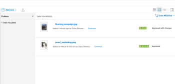

# 文档区域

在“文档”区域中，您可以组织、管理和查看已上传到Adobe Workfront的文档的元数据。 您还可以查看验证决策。

“文档”区域有两种类型。 两者的特性和功能是相同的：

* **项目、任务或问题中的文档区域：** 列出您有权访问的特定项目、任务或问题的所有文档。 要访问此区域，请单击 **文档**  查看项目、任务或问题时显示在左侧面板中。

* **全局文档区域：** 列出您有权在Workfront中访问的所有文档。 要访问此区域，请单击 **文档**  在主菜单中 .

有关将文档上传到Workfront的信息，请参阅 [从文件系统将文档添加到Adobe Workfront](../../documents/adding-documents-to-workfront/add-documents-from-file-system.md).

## “摘要”面板

在文档区域中选择文档时，可以使用右侧的“摘要”来查看文档详细信息、管理文档更新和批准、查看文档版本以及为文档添加和编辑自定义Forms。

如果为文档设置了校样，则“详细信息”部分包含校样到期日期和当前校样进度等信息。

如果需要有关文档的所有信息，可以单击“详细信息”(Details)标题以转到完整的“文档详细信息”(Document Details)区域。

有关“摘要”的信息，请参阅 [文档摘要概述](../../documents/managing-documents/summary-for-documents.md).

## 证明决定

一旦做出验证决策，该决策就会显示在“文档”列表中。

## 文件夹

在上传文档的项目、任务或问题上，您可以设置文件夹来组织文档。 有关更多信息，请参阅 [创建文档文件夹](../../documents/organizing-documents/create-documents-folder.md).

在全局“文档”区域中，您可以设置两种类型的文件夹来组织您有权访问的文档：

* **智能文件夹：** 仅显示您想要查看的文档。 有关更多信息，请参阅 [创建和管理智能文件夹](../../documents/organizing-documents/create-manage-smart-folders.md).

* **我的文件夹：** 按您需要的方式组织文档。 有关更多信息，请参阅 [创建文档文件夹](../../documents/organizing-documents/create-documents-folder.md).

## 扩展的文档详细信息

“文档详细信息”页面在右侧的“摘要”中提供了文档详细信息的更完整版本。
