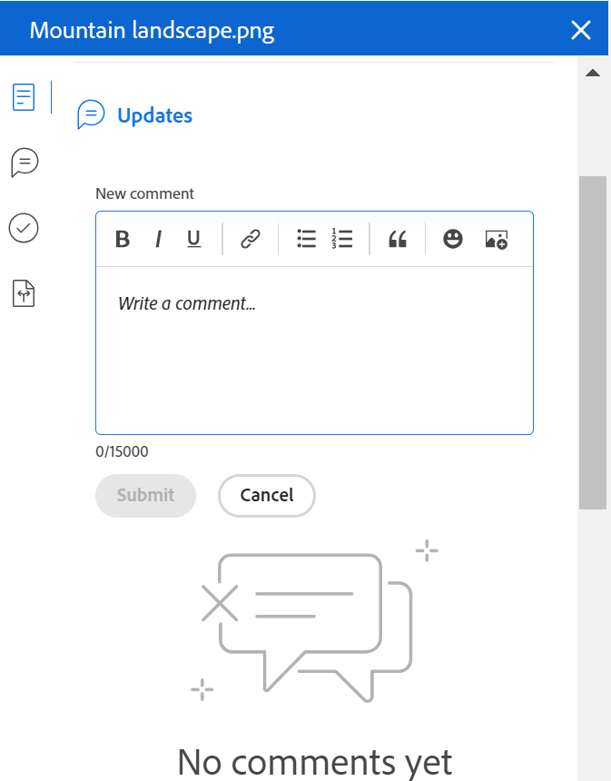

# 文档摘要概述

{{preview-and-fast-release}}

利用“摘要”，可直接与文档列表中的重要信息交互。

## 访问要求

您必须具备以下条件：

<table style="table-layout:auto"> 
 <col> 
 </col> 
 <col> 
 </col> 
 <tbody> 
  <tr> 
   <td role="rowheader">Adobe Workfront计划*</td> 
   <td> 
 任何
 </td> 
  </tr> 
  <tr> 
   <td role="rowheader">Adobe Workfront许可证*</td> 
   <td> 
请求或更高版本
 </td> 
  </tr> 
  <tr data-mc-conditions=""> 
   <td role="rowheader">访问级别配置*</td> 
   <td> 
编辑对文档的访问权限
 
注意：如果您仍然没有访问权限，请咨询Workfront管理员是否对您的访问级别设置了其他限制。 有关Workfront管理员如何修改您的访问级别的信息，请参阅 <a href="../../administration-and-setup/add-users/configure-and-grant-access/create-modify-access-levels.md" class="MCXref xref">创建或修改自定义访问级别</a>.
 </td> 
  </tr> 
  <tr data-mc-conditions=""> 
   <td role="rowheader">对象权限</td> 
   <td> 
查看对与文档关联的对象的访问权限
 
有关请求其他访问权限的信息，请参阅 <a href="../../workfront-basics/grant-and-request-access-to-objects/request-access.md" class="MCXref xref">请求访问对象 </a>.
 </td> 
  </tr> 
 </tbody> 
</table>

&#42;要了解您拥有的计划、许可证类型或访问权限，请联系您的Workfront管理员。

## 打开摘要视图

1. 转到 **文档** 区域，然后在列表中选择一个项目。
1. 单击 **“打开摘要”图标** .

   打开“摘要”后，在单击其它文档时，它保持打开状态，直到手动关闭它为止。

   

## 详细信息

使用“详细信息”部分可查看概要性概述信息并与自定义表单交互。 单击 **详细信息** 转到完整的文档详情页面。

* [概述](#overview)
* [自定义表单](#custom-forms)

### 概述 {#overview}

展开概述部分以查看或下载图像缩略图、打开验证、更新基本描述、签出文档等。

### 自定义表单 {#custom-forms}

使用自定义Forms部分添加、编辑或查看与文档关联的任何自定义表单。 开始键入自定义表单的名称以将其添加到文档。 有关更多信息，请参阅 [在文档中添加或编辑自定义表单](../../documents/managing-documents/add-custom-form-documents.md).

## 更新

使用更新部分读取某人对文档或验证所做的更新。 此摘要显示前2条评论。 有关更新的更多信息，请参阅 [对验证进行评论](../../review-and-approve-work/proofing/reviewing-proofs-within-workfront/comment-on-a-proof/comment-on-proof.md).

## 审批

使用“审批”部分请求文档审批。 您还可以提醒某人已获得批准、重新提交批准并取消上一个决策或删除批准。 文档批准者可以使用摘要做出决策。

必须在验证工作流中添加验证审批。 有关审批的详细信息，请参阅

* [审批工作](../../review-and-approve-work/manage-approvals/approving-work.md)
* [请求文件审批](../../review-and-approve-work/manage-approvals/request-document-approvals.md)

## 版本

使用“版本”部分可查看为特定文档创建的版本数。 单击 **更多菜单** 到

* 打开验证
* 下载验证或文档
* 预览浏览器支持的文档
* 转到文档详细信息
* 删除验证或文档

