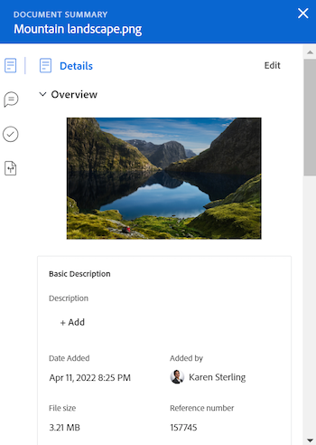
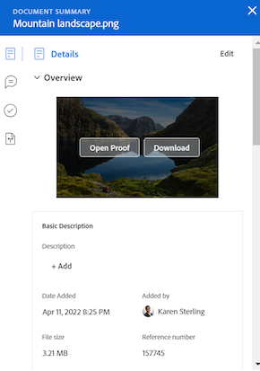

# 文档摘要概述

<!--Audited: April, 2024-->

您可以使用“摘要”面板直接从文档列表中访问和更新重要信息。

+++ 展开可查看本文所述功能的访问权限要求。

## 访问权限要求

您必须具有以下权限才能执行本文中的步骤：

<table style="table-layout:auto"> 
 <col> 
 </col> 
 <col> 
 </col> 
 <tbody> 
  <tr> 
   <td role="rowheader">Adobe Workfront 包</td> 
   <td> 
 “任一”
 </td> 
  </tr> 
  <tr> 
   <td role="rowheader">Adobe Workfront 许可证</td> 
   <td> 
参与者或更高版本
 
   
请求或更高版本

   </td> 
  </tr> 
  <tr data-mc-conditions=""> 
   <td role="rowheader">访问级别配置</td> 
   <td> 
编辑对文档的访问权限
  </td> 
  </tr> 
  <tr data-mc-conditions=""> 
   <td role="rowheader">对象权限</td> 
   <td> 
查看对与文档关联的对象的访问权限
 </td> 
  </tr> 
 </tbody> 
</table>

有关此表中信息的更多详细信息，请参阅Workfront文档中的[访问要求](/help/quicksilver/administration-and-setup/add-users/access-levels-and-object-permissions/access-level-requirements-in-documentation.md)。

+++

## 旧版文档体验中的文档摘要

如果您的组织位于旧版Workfront存储中，则当您访问Workfront中的文档时，将会看到旧版文档区域。 有关旧版Workfront存储的详细信息，请参阅[旧版Workfront存储与Adobe企业级存储之间的差异](/help/quicksilver/review-and-approve-work/esm-overview.md)。

### 在旧版文档体验中打开“摘要”视图

{{step1-to-documents}}

1. 在&#x200B;**文档**&#x200B;页面上，选择列表中的文档。

1. 在页面的右上角，单击&#x200B;**打开摘要**&#x200B;图标。 **文档摘要**&#x200B;侧面板打开。

   

   打开“摘要”后，它将保持在此页面上处于打开状态（即使您单击了其他文档），直到您手动将其关闭为止。

### 详细信息

使用“详细信息”部分可查看概要性概述信息并与自定义表单交互。 单击部分顶部的详细信息，转到完整的“文档详细信息”页面。

* [概述](#overview)
* [自定义表单](#custom-forms)

#### 概述 {#overview}

展开概述部分以查看或下载图像缩略图、打开验证、更新基本描述、签出文档等。

#### 自定义表单 {#custom-forms}

使用自定义Forms部分添加、编辑或查看与文档关联的任何自定义表单。 开始键入自定义表单的名称以将其添加到文档。 有关详细信息，请参阅[在文档中添加或编辑自定义表单](../../documents/managing-documents/add-custom-form-documents.md)。

### 更新

使用更新部分查看某人对文档或验证所做的更新。 此摘要显示前2条评论。 有关更新的详细信息，请参阅[对校对的评论](../../review-and-approve-work/proofing/reviewing-proofs-within-workfront/comment-on-a-proof/comment-on-proof.md)。

摘要面板中的

### 审批

使用“审批”部分请求文档审批。 您还可以提醒某人已获得批准、重新提交批准并取消上一个决策或删除批准。 文档批准者可以使用摘要做出决策。

必须在验证工作流中添加验证审批。 有关审批的详细信息，请参阅

* [审批工作](../../review-and-approve-work/manage-approvals/approving-work.md)
* [请求文件审批](../../review-and-approve-work/manage-approvals/request-document-approvals.md)

### 版本

使用“版本”部分可查看为特定文档创建的版本数。 单击“更多”图标可执行以下操作：

* 打开验证。
* 下载验证或文档。
* 预览浏览器支持的文档。
* 转到文档详细信息。
* 删除验证或文档。

## 新文档体验中的文档摘要

如果您的组织使用企业存储，则当您访问Workfront中的文档时，将会看到“新建文档”区域。 有关企业存储的更多信息，请参阅[Adobe企业存储概述](/help/quicksilver/review-and-approve-work/esm-overview.md)。

### 详细信息

使用“详细信息”部分可查看概要性概述信息并与自定义表单交互。

### 审批

使用“审批”部分创建审批工作流。 您还可以提醒参与者有关批准或删除批准。 文档批准者可以访问Frame.io查看器或使用“摘要”做出决策。

有关批准和Frame.io的详细信息，请参见

* [Frame.io集成入门](/help/quicksilver/review-and-approve-work/native-integrations/frame-io/get-started-with-frame-integration.md)
* [创建文档审阅或审批请求](/help/quicksilver/review-and-approve-work/document-reviews-and-approvals/manage-document-approvals/create-a-document-approval.md)。

<!-- resubmit the approval and cancel the previous decision, or delete the approval. Document approvers can use the Summary to make a decision.-->

### 版本

使用“版本”部分可查看为特定文档创建的版本数。 单击更多图标以执行以下操作：

* 重命名版本
* 查看文档详细信息
* 请求审批特定版本
* 在 Frame.io 中打开
* 下载版本
* 共享版本
* 删除版本

### 历史记录

使用“历史记录”部分可查看与文档相关的所有活动的列表。

