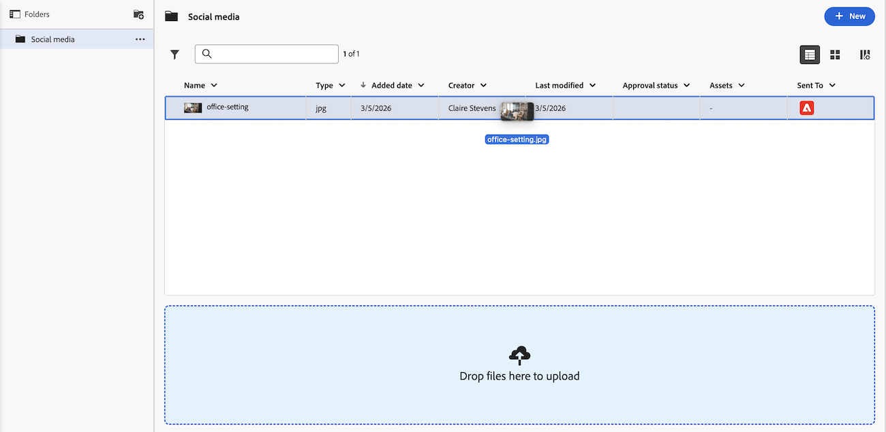

# 上载文档的新版本

您可以添加先前上载到Adobe Workfront的文档的新版本。

如果新版本的文件名与先前版本的文件名不同，则Workfront显示具有新文件名的文档。

如果文档包含校对，而您想创建校对文档的新版本，请参阅[为文档创建校对](../../review-and-approve-work/proofing/creating-proofs-within-workfront/generate-proof-for-a-document.md)一文中的[上传文档并创建新版本的校对](../../review-and-approve-work/proofing/creating-proofs-within-workfront/generate-proof-for-a-document.md#uploading-a-document-and-creating-a-new-version-of-a-proof)部分。

有关从外部应用程序添加链接到Workfront的文档的新版本的信息，请参阅[链接来自外部应用程序的文档](../../documents/adding-documents-to-workfront/link-documents-from-external-apps.md)中的[添加链接文档的新版本](../../documents/adding-documents-to-workfront/link-documents-from-external-apps.md#add)。

## 访问权限要求

+++ 展开可查看本文所述功能的访问权限要求。

<table style="table-layout:auto"> 
 <col> 
 </col> 
 <col> 
 </col> 
 <tbody> 
  <tr> 
   <td role="rowheader">Adobe Workfront 包</td> 
   <td> 
使用旧版Workfront存储管理文档的任何Workfront软件包

用于使用Adobe企业存储管理文档的任意工作流包
</td> 
  </tr> 
  <tr> 
   <td role="rowheader">Adobe Workfront 许可证</td> 
   <td> 
   
参与者或更高版本

   
请求或更高版本
 </td> 
  </tr> 
  <tr data-mc-conditions=""> 
   <td role="rowheader">访问级别配置*</td> 
   <td> 
编辑对文档的访问权限
  </td> 
  </tr> 
  <tr data-mc-conditions=""> 
   <td role="rowheader">对象权限</td> 
   <td> 
编辑对与文档关联的对象的访问权限
 </td> 
  </tr> 
 </tbody> 
</table>

有关此表中信息的更多详细信息，请参阅Workfront文档中的[访问要求](/help/quicksilver/administration-and-setup/add-users/access-levels-and-object-permissions/access-level-requirements-in-documentation.md)。
+++

## 在旧文档区域上传新文档版本

如果您的组织位于旧版Workfront存储中，则当您访问Workfront中的文档时，将会看到旧版文档区域。 有关旧版Workfront存储的详细信息，请参阅[旧版Workfront存储与Adobe企业级存储之间的差异](/help/quicksilver/review-and-approve-work/esm-overview.md)。

### 使用拖放操作添加新版本

>[!NOTE]
>
>Internet Explorer无法执行拖放操作。

1. 转到文档上传所在的文档区域。
1. 从桌面或单独的浏览器选项卡中，将文档的新版本拖动到Workfront中现有版本的上方。

   

   拖动新版本时，您可以将鼠标悬停在Workfront文档文件夹上以将其打开。 You can then scroll up and down by dragging the files to the top or bottom of the screen.

1. Drop the new version on top of the existing file on the **Documents** tab.

   For information about managing document versions, see [Manage document versions](../../documents/managing-documents/manage-document-versions.md).

### Use the More menu to add a new version

1. Select the document where you want to add a new version.
1. Click **Add New** > **Version**.

   

1. Select the type of document you want to upload, then follow the prompts.

## Upload a new document version in the new documents area

如果您的组织使用企业存储，则当您访问Workfront中的文档时，将会看到“新建文档”区域。 有关企业存储的更多信息，请参阅[Adobe企业存储概述](/help/quicksilver/review-and-approve-work/esm-overview.md)。

### 使用拖放操作添加新版本

>[!NOTE]
>
>Internet Explorer无法执行拖放操作。

1. 转到文档上传所在的文档区域。
1. Drag the new version of the document on top of the existing version in Workfront.

   

1. Drop the new version on top of the existing file on the **Documents** tab.

   For information about managing document versions, see [Manage document versions](../../documents/managing-documents/manage-document-versions.md).

### Use the More menu to add a new version

1. Select the document where you want to add a new version.
1. Open the Show versions icon  on the right.
1. Click **Add New Version**.

   

1. Find your document, then click **Open**.

