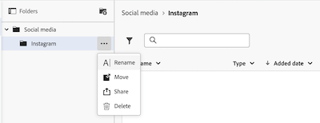

# 创建文档文件夹

Documents can be organized into folders. Workfront当前具有两个版本的文档区域：旧版文档区域和新版文档区域。 您的企业使用的版本取决于您的企业使用的是旧版Workfront存储还是企业级存储。 有关这些存储类型的详细信息，请参阅[Adobe企业存储概述](/help/quicksilver/review-and-approve-work/esm-overview.md)。

## 访问权限要求

+++ 展开可查看本文所述功能的访问权限要求。

<table style="table-layout:auto"> 
 <col> 
 <col> 
 <tbody> 
  <tr> 
   <td role="rowheader">Adobe Workfront 包</td> 
   <td> 
使用旧版Workfront存储管理文档的任何Workfront软件包

用于使用Adobe企业存储管理文档的任意工作流包
 </td> 
  </tr> 
  <tr> 
   <td role="rowheader">Adobe Workfront许可证</td> 
   <td> 
   
参与者或更高版本

   
Review or higher
 </td> 
  </tr> 
  <tr> 
   <td role="rowheader">Access level configurations*</td> 
   <td> 
编辑对文档的访问权限
 </td> 
  </tr> 
 </tbody> 
</table>

有关此表中信息的更多详细信息，请参阅Workfront文档中的[访问要求](/help/quicksilver/administration-and-setup/add-users/access-levels-and-object-permissions/access-level-requirements-in-documentation.md)。

+++

## Create document folders in the legacy documents area

If your organization is on legacy Workfront storage, you will see the legacy documents area when you access documents in Workfront. For more information about legacy Workfront storage, see [Differences between Adobe enterprise storage and legacy Workfront storage](/help/quicksilver/review-and-approve-work/esm-overview.md#differences-between-adobe-enterprise-storage-and-legacy-workfront-storage).

>[!NOTE]
>
>Organizing documents simply creates links between the documents and the objects you associate them with. It does not relocate them in the system.

### Display folders

You can display folders in thumbnail, standard, or list view. To change the view, use the view options in the upper-right corner.

{{step1-to-documents}}

或

With a Workfront object open, click **Documents** in the left panel.

1. 单击右侧面板上方的查看选项可更改文档的显示方式。

   

### 创建文件夹和子文件夹

创建文件夹以更好地组织您的文档。 在一个对象上最多可创建2,000个文件夹，在每个文件夹中最多可创建50个子文件夹。 子文件夹将计为最大文件夹2,000个。

{{step1-to-documents}}

或

打开Workfront对象后，单击左侧面板中的&#x200B;**文档**。

1. 要创建顶级文件夹，请确保未选择任何内容，然后单击&#x200B;**新增** > **文件夹**。

   或

   若要创建子文件夹，请选择要从中创建子文件夹的文件夹，然后单击&#x200B;**新增** > **文件夹**。

### 共享文件夹

有关共享文件夹的信息，请参阅[共享文档文件夹](../../workfront-basics/grant-and-request-access-to-objects/share-a-document-folder.md)。

## 在新文档区域创建文档文件夹

如果您的组织使用企业存储，则当您访问Workfront中的文档时，将会看到“新建文档”区域。 有关企业存储的更多信息，请参阅[Adobe企业存储概述](/help/quicksilver/review-and-approve-work/esm-overview.md)。

### 系统生成的文件夹

在将文档上传到任务或问题时，Workfront会自动创建一个系统生成的文件夹，该文件夹以任务或问题的名称命名。 此文件夹链接到任务或问题并继承其权限。 系统生成的文件夹在项目级文档区域可见。

有关文件夹权限的详细信息，请参阅[文档权限的工作方式](/help/quicksilver/review-and-approve-work/esm-access-permissions.md#how-document-permissions-work)。

### 创建子文件夹

可在系统生成的文件夹中创建子文件夹以进一步组织文档。 所有子文件夹都从父文件夹继承权限。

1. 转到包含文档的项目、任务或问题，然后在左侧面板中选择&#x200B;**文档**。
1. 单击到要在其中创建子文件夹的文件夹，然后单击&#x200B;**添加文件夹** 图标。
   
1. 输入子文件夹的名称，然后单击&#x200B;**创建**。

### 重命名文件夹

系统生成的文件夹自动继承任务或问题的名称。 通过单击文件夹名称并对其进行编辑，可以重命名这些文件夹。

要重命名文件夹，请执行以下操作：

1. 转到包含文档的项目、任务或问题，然后在左侧面板中选择&#x200B;**文档**。
1. 找到要重命名的文件夹，然后单击&#x200B;**更多** 图标。
1. 单击&#x200B;**重命名**，然后输入文件夹的新名称。

   

1. 单击&#x200B;**重命名**。

### 移动文件夹

系统生成的文件夹可以移动到其他项目、任务或问题。 如果将系统生成的文件夹移动到其他位置，则其链接对象将更新为新对象，并且权限继承自新的父对象。 您还可以将子文件夹移动到另一个项目、任务或问题。

>[!NOTE]
>
>只有使用相同存储类型的项目、任务和问题才会在移动对话框中可用。 例如，如果您正在企业存储项目中移动文件夹，则只有使用企业存储的项目、任务和问题才可移动到该位置。

要移动文件夹，请执行以下操作：

1. 转到包含文档的项目、任务或问题，然后在左侧面板中选择&#x200B;**文档**。
1. 找到要移动的文件夹，然后单击&#x200B;**更多** 图标。
1. 单击&#x200B;**移动**，然后选择要将该文件夹移动到的项目、任务或问题。

   

<!-- STEPS PLACEHOLDER: Add steps for moving a folder in the new documents area -->

### 删除文件夹

要删除文件夹，请执行以下操作：

1. 转到包含文档的项目、任务或问题，然后在左侧面板中选择&#x200B;**文档**。
1. 找到要删除的文件夹，然后单击&#x200B;**更多** 图标。
1. 单击&#x200B;**删除**。

   
