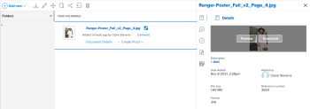

# 使用增强的连接器查看或下载链接的资产

您可以在Adobe Workfront中查看或下载从Experience Manager Assets链接的资产。

## 访问要求

您必须具备以下条件：

<table style="table-layout:auto"> 
 <col> 
 <col> 
 <tbody> 
  <tr> 
   <td role="rowheader">Adobe Workfront计划*</td> 
   <td> 
 任意
 </td> 
  </tr> 
  <tr> 
   <td role="rowheader">Adobe Workfront许可证*</td> 
   <td> 
请求或更高版本
 </td> 
  </tr> 
  <tr> 
   <td role="rowheader">产品</td> 
   <td>您必须具有Experience Manager Assets Essentials实例。</td> 
  </tr> 
  <tr> 
   <td role="rowheader">访问级别配置*</td> 
   <td> 
编辑对文档的访问
 
注意：如果您仍然没有访问权限，请咨询Workfront管理员，他们是否在您的访问级别设置了其他限制。 有关Workfront管理员如何修改访问级别的信息，请参阅 <a href="../../../administration-and-setup/add-users/configure-and-grant-access/create-modify-access-levels.md" class="MCXref xref">创建或修改自定义访问级别</a>.
 </td> 
  </tr> 
  <tr> 
   <td role="rowheader">对象权限</td> 
   <td> 
查看访问权限或更高权限
 
有关请求其他访问权限的信息，请参阅 <a href="../../../workfront-basics/grant-and-request-access-to-objects/request-access.md" class="MCXref xref">请求对对象的访问 </a>.
 </td> 
  </tr> 
 </tbody> 
</table>

&#42;要了解您拥有的计划、许可证类型或访问权限，请联系您的Workfront管理员。

## 先决条件

在开始之前，您必须

* 安装Workfront for Experience Manager增强连接器

## 从Experience Manager Assets查看或下载链接的资产

1. 找到要查看或下载的文档。
1. 从文档列表中，选择文档。
1. 在右侧的“文档摘要”中，将鼠标悬停在顶部的缩略图上，然后选择 **预览** 或 **下载**.

   
