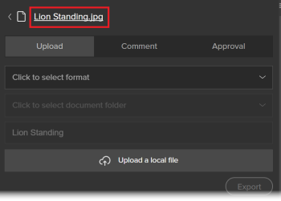

# 使用适用于Illustrator和InDesign的Workfront扩展

<!--Audited: 01/2024-->

>[!IMPORTANT]
>
>我们正在将适用于Illustrator的Workfront扩展替换为[已更新的Creative Cloud插件](/help/quicksilver/workfront-integrations-and-apps/adobe-workfront-for-creative-cloud/wf-cc-install-toc.md)，并将InDesign插件替换为。 自2022年末开始，将不再支持此扩展，并且此扩展将按原样可用。

您可以使用Workfront扩展将您在Adobe Illustrator和Adobe InDesign中保存并创建的数字内容导出到Workfront。 这加快了文档审阅和批准过程。

以下应用程序支持Workfront扩展的Adobe Creative Cloud 2017及更高版本：

* InDesign
* Illustrator
* Photoshop

  >[!NOTE]
  >
  >我们建议使用适用于Photoshop](/help/quicksilver/workfront-integrations-and-apps/adobe-workfront-for-creative-cloud/wf-cc-install-ps.md)的新[Adobe Workfront插件。

## 访问要求

+++ 展开以查看本文中各项功能的访问要求。

您必须具有以下权限才能执行本文中的步骤：

<table style="table-layout:auto"> 
 <col> 
 <col> 
 <tbody> 
  <tr> 
   <td role="rowheader">Adobe Workfront计划*</td> 
   <td> 
当前： Pro或更高版本

   或
   
新建：任何计划
 </td> 
  </tr> 
  <tr data-mc-conditions=""> 
   <td role="rowheader">Adobe Workfront许可证*</td> 
   <td> 
当前：工作或更高

   或
   
新增：标准
 </td> 
  </tr> 
  <tr> 
   <td role="rowheader">产品</td> 
   <td>除了Adobe Creative Cloud许可证之外，您必须具有Workfront许可证。</td> 
  </tr> 
  <tr> 
   <td role="rowheader">对象权限</td> 
   <td> 
编辑对要与之交互的对象的访问权限。
  </td> 
  </tr> 
 </tbody> 
</table>

&#42;要了解您拥有什么计划、许可证类型或访问权限，请与Workfront管理员联系。 有关详细信息，请参阅Workfront文档中的[访问要求](/help/quicksilver/administration-and-setup/add-users/access-levels-and-object-permissions/access-level-requirements-in-documentation.md)。

+++

## 从Illustrator或InDesign登录Workfront扩展 {#log-in-to-workfront-extension-from-illustrator-or-indesign}

当您从某个受支持的Adobe应用程序登录到Workfront时，您已登录到所有受支持的Adobe应用程序。

1. 转到要在其中使用Workfront扩展的Adobe应用程序。

   有关每个支持的应用程序支持的格式列表，请参阅本文中的[支持的导出文件格式](#supported-exported-file-formats)。

1. 单击&#x200B;**窗口** > **扩展** > Workfront。

1. （可选）将Workfront面板拖动到您希望Adobe应用程序中显示该面板的位置。
1. 按照提示登录Workfront。

   >[!NOTE]
   >
   >* Workfront使用OAuth 2.0连接到Adobe Creative Cloud，这是大多数基于Web的集成用于用户身份验证和授权的安全标准。
   >* 当提示您输入Workfront帐户的[域或主机]时，请使用此格式键入它： `yourCompany'sDomain.my.workfront.com`。 您公司的域通常是您公司的名称。

   如果项目处于当前状态，则会显示分配给您的工作项列表。 如果未显示列表，请登录到Workfront。

   个人任务列在&#x200B;**无项目**&#x200B;下。

## 将文件上传到Workfront项目、任务或问题 {#upload-a-file-to-a-workfront-project-task-or-issue}

您可以从计算机文件系统上传文件，或将当前在Adobe Creative Cloud应用程序中打开的文件导出到Workfront项目、任务或问题。 

从Adobe Creative Cloud上传或导出文件时，请考虑以下事项：

* 您的访问级别必须允许将文档上传到Workfront。 有关详细信息，请参阅[授予对文档的访问权限](../../administration-and-setup/add-users/configure-and-grant-access/grant-access-documents.md)。
* 您必须具有将文档上传到所需项目的权限。 有关详细信息，请参阅[对象权限共享概述](../../workfront-basics/grant-and-request-access-to-objects/sharing-permissions-on-objects-overview.md)。
* 文件会上载到您选择的Workfront对象的“文档”区域。
* 无法从Adobe Creative Cloud应用程序将文档导出到主菜单中的文档区域。

以下各节将说明以下内容：

* [上载文件](#upload-a-file)
* [导出当前在Illustrator或InDesign中打开的文件](#export-a-file-currently-open-in-illustrator-or-indesign)
* [从Illustrator或InDesign上传文件的新版本](#upload-a-new-version-of-a-file-from-illustrator-or-indesign)

### 上传文件 {#upload-a-file}

您可以在不离开Adobe Creative Cloud应用程序的情况下将文件上传到项目、任务或问题。

1. 如果在打开Workfront应用程序时没有看到Adobe Creative Cloud扩展，请单击&#x200B;**窗口** > **扩展** > **Workfront**。

   如果项目处于当前状态，则会显示分配给您的工作项列表。 如果未显示列表，请登录到Workfront。

   个人任务列在&#x200B;**无项目**&#x200B;下。

1. 单击要向其上传文件的项目、任务或问题的名称。

   您可以通过在&#x200B;**搜索**&#x200B;框中键入名称并从&#x200B;**搜索**&#x200B;框右侧的下拉菜单中选择&#x200B;**项目**、**任务**&#x200B;或&#x200B;**问题**&#x200B;来搜索此内容。 如果工作项的名称未出现在列表中，请按&#x200B;**Enter**&#x200B;搜索您有权查看的所有Workfront项。

1. 单击Workfront扩展右下角的&#x200B;**选择**。
1. 在&#x200B;**单击以选择格式**&#x200B;下拉菜单中，单击要将文件保存到Workfront中的格式。

   有关每个支持的应用程序支持的格式列表，请参阅本文中的[支持的导出文件格式](#supported-exported-file-formats)。

1. （视情况而定）如果要上载文件的工作项具有文档文件夹，请在&#x200B;**单击以选择文档文件夹**&#x200B;字段中选择文档文件夹，然后单击&#x200B;**选择**。

1. 单击&#x200B;**上载本地文件**。
1. 在&#x200B;**打开文件**&#x200B;框中，找到文件系统中的文件，然后单击&#x200B;**打开**。

1. （可选）为文件键入新名称。

   

1. 单击&#x200B;**上传**。

   在Workfront中，文档现在列在您选择的项目、任务或问题的文档区域中。

1. （可选）单击文档名称以在Workfront中打开其“文档详细信息”页面。

   Workfront将在一个新的浏览器选项卡中打开。

### 导出当前在Illustrator或InDesign中打开的文件 {#export-a-file-currently-open-in-illustrator-or-indesign}

1. 在受支持的Adobe Creative Cloud应用程序中，打开要导出到Workfront的文件。
1. 如果未显示Workfront扩展，请单击&#x200B;**窗口** > **扩展** > **Workfront**。

   如果项目处于当前状态，则会显示分配给您的工作项列表。 如果未显示列表，请登录到Workfront。

   个人任务列在&#x200B;**无项目**&#x200B;下。

1. 单击要导出文件的项目、任务或问题的名称。

   您可以通过在&#x200B;**搜索**&#x200B;框中键入名称并从&#x200B;**搜索**&#x200B;框右侧的下拉菜单中选择&#x200B;**项目**、**任务**&#x200B;或&#x200B;**问题**&#x200B;来搜索此内容。 如果工作项的名称未出现在列表中，请按&#x200B;**Enter**&#x200B;搜索您有权查看的所有Workfront项。

1. 在&#x200B;**单击以选择格式**&#x200B;下拉菜单中，单击要将文件保存到Workfront中的格式。

   有关每个支持的应用程序支持的格式列表，请参阅本文中的[支持的导出文件格式](#supported-exported-file-formats)。

1. （视情况而定）如果要上载文件的工作项具有文档文件夹，请在&#x200B;**单击以选择文档文件夹**&#x200B;字段中选择文档文件夹，然后单击&#x200B;**选择**。
1. （可选）要重命名文档，请单击文档名称并键入新名称。

   

1. 单击&#x200B;**导出**。

   此时将显示一条消息，确认文档已成功导出到Workfront。

   在Workfront中，该文档列在您在Workfront中指定的对象的文档区域中。

1. （可选）单击文档名称以在Workfront中访问文档。

   

   Workfront将在一个新的浏览器选项卡中打开。

### 从Illustrator或InDesign上传文件的新版本 {#upload-a-new-version-of-a-file-from-illustrator-or-indesign}

1. 如果要将正在支持的Adobe应用程序中处理的文件导出为Workfront中文件的新版本，请在Adobe应用程序中打开该文件。
1. 如果未显示Workfront扩展，请单击&#x200B;**窗口** > **扩展** > **Workfront**。

   如果项目处于当前状态，则会显示分配给您的工作项列表。 如果未显示列表，请登录到Workfront。

   个人任务列在&#x200B;**无项目**&#x200B;下。

1. 单击列出现有文档的项目、任务或问题的名称。

   您可以通过在&#x200B;**搜索**&#x200B;框中键入名称并从&#x200B;**搜索**&#x200B;框右侧的下拉菜单中选择&#x200B;**项目**、**任务**&#x200B;或&#x200B;**问题**&#x200B;来搜索此内容。 如果工作项的名称未出现在列表中，请按&#x200B;**Enter**&#x200B;搜索您有权查看的所有Workfront项。

   上传到项目、任务或问题的所有文档都会显示在列表中，无论它们是否从Adobe应用程序上传。

1. 在&#x200B;**单击以选择格式**&#x200B;下拉菜单中，单击要将文件保存到Workfront中的格式。

   如果要导出已在Adobe应用程序中打开的文件，则需要此操作。 有关每个支持的应用程序支持的格式列表，请参阅本文中的[支持的导出文件格式](#supported-exported-file-formats)。

1. 如果要将已在Adobe应用程序中打开的文件导出为所选Workfront文档的新版本，请单击&#x200B;**导出**。

   或

   如果要从计算机文件系统上载文件作为所选Workfront文档的新版本，请单击&#x200B;**上载本地文件**，在显示的框中查找该文件，单击&#x200B;**打开**，然后单击&#x200B;**上载**。

1. （可选）单击文档名称可查看其在Workfront中的新版本。

   >[!NOTE]
   >
   >默认情况下，Workfront中的文档名称会被填充，且无法编辑。 它也不会更改您上传或导出为新版本的文件名称。
   >
   >
   >

## 对Illustrator或InDesign中的Workfront文档进行评论 {#comment-on-a-workfront-document-from-illustrator-or-indesign}

您可以在Adobe应用程序中直接向Workfront文档添加注释。 在Workfront中，您的注释将显示在文档的更新区域以及保存文档的Workfront项目的更新区域中。

1. 打开一个受支持的Adobe应用程序。
1. 如果未显示Workfront扩展，请单击&#x200B;**窗口** > **扩展** > **Workfront**。

   如果项目处于当前状态，则会显示分配给您的工作项列表。 如果未显示列表，请登录到Workfront。

   个人任务列在&#x200B;**无项目**&#x200B;下。

1. 单击列出现有文档的项目、任务或问题。

   您可以通过在&#x200B;**搜索**&#x200B;框中键入名称并从&#x200B;**搜索**&#x200B;框右侧的下拉菜单中选择&#x200B;**项目**、**任务**&#x200B;或&#x200B;**问题**&#x200B;来搜索此内容。 如果工作项的名称未出现在列表中，请按&#x200B;**Enter**&#x200B;搜索您有权查看的所有Workfront项。

1. 单击现有文档的名称，然后单击Workfront扩展右下角的&#x200B;**选择**。
1. 单击&#x200B;**评论**&#x200B;选项卡，然后在框中键入您的更新。

1. （可选）要在评论中包含其他Workfront用户或团队，请在&#x200B;**通知人员或团队**&#x200B;框中开始键入用户或团队的名称，然后在该名称出现在下拉列表中时单击它。
1. （可选）要请求批准文档，请选择&#x200B;**发出批准请求**。
1. 单击&#x200B;**更新**。

   更新发布在文档的更新选项卡中。 您包含在评论中的Workfront用户将会收到应用程序内通知，并且根据Workfront的配置方式，这些用户还可能收到电子邮件通知。

   有关Workfront中通知的更多信息，请参阅[查看和管理应用程序内通知](../../workfront-basics/using-notifications/view-and-manage-in-app-notifications.md)。

   有关接收电子邮件通知的详细信息，请参阅[Adobe Workfront通知](../../workfront-basics/using-notifications/wf-notifications.md)。

## 从Illustrator或InDesign请求文档审批

您可以直接从Adobe应用程序中请求Workfront文档审批。

您可以从以下实体请求文档审批：

* Workfront用户
* 没有Workfront帐户的外部用户

您可以通过以下方式从Adobe申请请求批准文档：

* 通过将审批者附加到文档。
* 通过在文档中添加注释，在添加注释时通知用户，并将用户作为批准者附加到文档。

  有关在评论文档时请求审批的信息，请参阅本文中[来自Illustrator或InDesign的Workfront文档评论](#comment-on-a-workfront-document-from-illustrator-or-indesign)部分。

要从Adobe申请请求批准单据，请执行以下操作：

1. 打开一个受支持的Adobe应用程序。
1. 如果未显示Workfront扩展，请单击&#x200B;**窗口** > **扩展** > **Workfront**。

   如果项目处于当前状态，则会显示分配给您的工作项列表。 如果未显示列表，请登录到Workfront。

   个人任务列在&#x200B;**无项目**&#x200B;下。

1. 单击列出现有文档的项目、任务或问题，然后单击现有文档的名称。

   您可以通过在&#x200B;**搜索**&#x200B;框中键入名称并从&#x200B;**搜索**&#x200B;框右侧的下拉菜单中选择&#x200B;**项目**、**任务**&#x200B;或&#x200B;**问题**&#x200B;来搜索此内容。 如果工作项的名称未出现在列表中，请按&#x200B;**Enter**&#x200B;搜索您有权查看的所有Workfront项。

1. 单击现有文档的名称，然后单击Workfront扩展右下角的&#x200B;**选择**。
1. 单击&#x200B;**批准**&#x200B;选项卡。
1. 要添加审批者，请在&#x200B;**开始键入名称框**&#x200B;中执行以下操作之一：

   * 键入审批者的名称，然后在列表中显示该名称时将其选定。

     

   * 键入外部用户的电子邮件地址。

1. 单击&#x200B;**请求审批**。

   您包含在评论中或添加为批准者的Workfront用户将会收到应用程序内通知，并且根据Workfront的配置方式，这些用户还可能收到电子邮件通知。\
   外部用户会收到电子邮件通知，以便他们做出批准决策。

   有关Workfront中通知的信息，请参阅[查看和管理应用程序内通知](../../workfront-basics/using-notifications/view-and-manage-in-app-notifications.md)。 有关接收电子邮件通知的信息，请参阅[Adobe Workfront通知](../../workfront-basics/using-notifications/wf-notifications.md)。

## 从Illustrator或InDesign生成验证 {#generate-a-proof-from-illustrator-or-indesign}

如果贵组织使用自动工作流模板，则无需离开该应用程序，即可为在Adobe应用程序中创建的文档生成验证。 有关创建验证的信息，请参阅[创建验证](../../review-and-approve-work/proofing/creating-proofs-within-workfront/create-proofs-in-wf.md)。 有关自动化工作流模板的信息，请参阅[自动化工作流概述](../../review-and-approve-work/proofing/proofing-overview/automated-workflow.md)中的[自动化工作流模板](../../review-and-approve-work/proofing/proofing-overview/automated-workflow.md#automate)。

1. 打开一个受支持的Adobe应用程序。
1. 如果未显示Workfront扩展，请单击&#x200B;**窗口** > **扩展** > Workfront。

   如果项目处于当前状态，则会显示分配给您的工作项列表。 如果未显示列表，请登录到Workfront。

   个人任务列在&#x200B;**无项目**&#x200B;下。

1. 如果文档已上载到Workfront，请在Workfront扩展中选择列出了该文档的项目、任务或问题，然后单击文档的名称。

   或

   将Adobe文档上载到Workfront对象，如本文中的[将文件上载到Workfront项目、任务或问题](#upload-a-file-to-a-workfront-project-task-or-issue)部分所述，然后单击文档的名称。

1. 在&#x200B;**单击以选择格式**&#x200B;下拉菜单中，单击要将文件保存到Workfront中的格式。

   在此格式后面的步骤中启用校对功能后，某些格式将不可用。 有关详细信息，请参阅本文中的[支持的导出文件格式](#supported-exported-file-formats)。

1. 单击&#x200B;**作为新校对上传**&#x200B;以启用它。
1. 选择您希望人们在查看文档时使用的&#x200B;**工作流模板**。

   您的Workfront管理员设置了自动工作流模板，如[创建和管理自动工作流模板](/help/quicksilver/administration-and-setup/manage-workfront/configure-proofing/create-manage-automated-workflow-templates.md)中所述。 如有疑问，请咨询管理员。

   1. 向工作流模板中的每个阶段至少添加一个&#x200B;**新收件人**。

      您可以开始键入名称，然后在显示的下拉列表中看到该名称时将其选中。

   1. 为您添加的每个收件人指定&#x200B;**验证角色**&#x200B;和&#x200B;**电子邮件提醒**&#x200B;的频率。

   1. （可选）在&#x200B;**电子邮件通知**&#x200B;部分，选择是否将包含有关验证的可选自定义消息的电子邮件通知发送给您添加的所有验证收件人。

1. 单击&#x200B;**创建校对**。

   您可以查看验证创建过程的进度。 警报在生成完成后显示。 您可以打开您在其中创建验证的任务，该任务会在此处列出。

## 在不离开Illustrator或InDesign的情况下上传新版本的验证

1. 单击具有校对的现有文档，然后单击右下角的&#x200B;**选择**。
1. 单击&#x200B;**作为新验证版本**&#x200B;上载以启用它。
1. （可选）选择您希望用户查看新版本时使用的&#x200B;**工作流模板**。

   如果不选择其他模板，则为早期版本选择的模板将保持有效。 此外，如果您已经为早期版本修改了模板，则更改对新版本有效。

   您的Workfront管理员设置了自动工作流模板，如[创建和管理自动工作流模板](/help/quicksilver/administration-and-setup/manage-workfront/configure-proofing/create-manage-automated-workflow-templates.md)中所述。 如有疑问，请咨询管理员。

   1. 向工作流模板中的每个阶段至少添加一个&#x200B;**新收件人**。

      您可以开始键入名称，然后在显示的下拉列表中看到该名称时将其选中。

   1. 为您添加的每个收件人指定&#x200B;**验证角色**&#x200B;和&#x200B;**电子邮件提醒**&#x200B;的频率。
   1. （可选）在&#x200B;**电子邮件通知**&#x200B;部分，选择是否将包含有关验证的可选自定义消息的电子邮件通知发送给您添加的所有验证收件人。

1. 单击&#x200B;**新建校对版本**。

   您可以查看验证创建过程的进度。 警报在生成完成后显示。 您可以打开您在其中创建验证的任务，该任务会在此处列出。

## 注销Workfront扩展

1. 在Adobe应用程序中，单击&#x200B;**窗口** > **扩展** > **Workfront**。

1. 单击面板右上角的&#x200B;**更多**&#x200B;菜单。

1. （可选）单击&#x200B;**反馈**&#x200B;以打开简短的调查并向Workfront发送您有关Workfront for Adobe Creative Cloud的反馈。
1. 单击&#x200B;**注销**。\
   此时将显示“登录”屏幕。 有关登录的信息，请参阅本文中的[从Illustrator或InDesign登录Workfront扩展](#log-in-to-workfront-extension-from-illustrator-or-indesign)。

## 支持的导出文件格式 {#supported-exported-file-formats}

* [支持的Adobe InDesign导出文件格式](#supported-exported-file-formats-for-adobe-indesign)
* [Adobe Illustrator支持的导出文件格式](#supported-exported-file-formats-for-adobe-illustrator)

### Adobe InDesign支持的导出文件格式  {#supported-exported-file-formats-for-adobe-indesign}

Workfront支持将文件从InDesign导出到Workfront的以下文件格式：

* EPS — 封装的PostScript
* ePub — 固定版面电子出版物
* ePub — 可重播的电子出版物&#42;
* HTML- HyperText标记语言
* IDML -InDesign标记语言&#42;
* JPG、JPEG — 联合摄影专家组
* PDF-Adobe可移植文档文件
* PNG — 可移植网络图形
* SWF-Flash Player&#42;
* XML — 可扩展标记语言&#42;

&#42;启用&#x200B;**上传新校对**&#x200B;时，此文件格式不可用(有关此选项的信息，请参阅本文中的[从Illustrator或InDesign生成校对](#generate-a-proof-from-illustrator-or-indesign))。 如果在启用&#x200B;**上传新校对**&#x200B;之前已选择此文件格式，则系统会将文件格式更改为PDF。 您可以从列表中选择不同的格式。

### Adobe Illustrator支持的导出文件格式  {#supported-exported-file-formats-for-adobe-illustrator}

Workfront支持以下文件格式，可将文件从Illustrator导出到Workfront：

* DWG - AutoCAD绘图，AutoCAD交换文件&#42;
* JPG、JPEG — 联合摄影专家组
* PNG — 可移植网络图形
* PSD- Photoshop文档
* SWF-Flash Player&#42;
* TIFF — 标记图像文件格式

&#42;启用&#x200B;**上传新校对**&#x200B;时，此文件格式不可用(有关此选项的信息，请参阅本文中的[从Illustrator或InDesign生成校对](#generate-a-proof-from-illustrator-or-indesign))。 如果在启用&#x200B;**上传新校对**&#x200B;之前已选择此文件格式，则系统会将文件格式更改为PNG。 您可以从列表中选择不同的格式。
