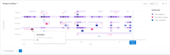

# 在Enhanced Analytics中查看项目活动可视化

“项目”活动可视化显示了在特定时间范围内发生的项目级别活动（指分配给项目的每个人员的活动）的汇总视图。 您可以缩小焦点范围以了解项目中的活动，也可以将项目活动与Adobe Workfront中的其他项目进行比较。

>[!NOTE]
>
>“按团队划分的活动”可视化图表的行为与此可视化图表类似，但“按团队划分的活动”可视化图表显示所有项目的主团队活动。\
>有关“按团队划分的活动”可视化的信息，请参阅 [在增强型分析中按团队查看活动可视化图表](../enhanced-analytics/activity-by-team-overview.md).

<!--WRITER bad link; there is no Activity by Team.png

-->

## 访问要求

您必须具备以下条件：

<table style="table-layout:auto"> 
 <col> 
 <col> 
 <tbody> 
  <tr> 
   <td role="rowheader"><a href="https://www.workfront.com/plans" target="_blank">Workfront计划</a>*</td> 
   <td> 
业务或更高版本
 </td> 
  </tr> 
  <tr> 
   <td role="rowheader"><a href="../administration-and-setup/add-users/access-levels-and-object-permissions/wf-licenses.md" class="MCXref xref">Adobe Workfront许可证概述</a>*</td> 
   <td> 
审阅或更高版本
 </td> 
  </tr> 
  <tr> 
   <td role="rowheader">访问级别配置*</td> 
   <td> 
查看项目访问权限
 
注意：如果您仍然没有访问权限，请咨询Workfront管理员，他们是否在您的访问级别设置了其他限制。 有关Workfront管理员如何更改访问级别的信息，请参阅 <a href="../administration-and-setup/add-users/configure-and-grant-access/create-modify-access-levels.md" class="MCXref xref">创建或修改自定义访问级别</a>.
 </td> 
  </tr> 
  <tr> 
   <td role="rowheader">对象权限</td> 
   <td> 
查看
 
有关请求其他访问权限的信息，请参阅 <a href="../workfront-basics/grant-and-request-access-to-objects/request-access.md" class="MCXref xref">请求对对象的访问 </a>.
 </td> 
  </tr> 
 </tbody> 
</table>

&#42;要了解您拥有的计划、许可证类型或访问权限，请联系您的Workfront管理员。

## 先决条件

有关使用Enhanced Analytics的先决条件，请参阅 [增强的分析概述](../enhanced-analytics/enhanced-analytics-overview.md).

## 了解项目活动可视化图表

项目活动以不同的颜色显示，以汇总项目一段时间内的特定事件：

* **已登录的用户**:紫色的框显示分配给该项目的人员在当天登录。 较深的阴影表示登录的人数较高。

   

* **任务状态更改**:粉红色框显示当天用户更改了项目任务的状态。 颜色较深表示任务状态发生更多更改。

   

* **任务已完成**:蓝色方框表示用户已完成项目的任务。 颜色较深表示已完成的任务数较多。

   

将鼠标悬停在框上可显示在给定日期内完成操作的确切次数。 您可以选择一个项目，以查看该项目中每个参与者划分的这些活动。

查看此信息可帮助您确定：

* 特定项目的活动。
* 一个项目与其他项目相比的活动。
* 哪些用户正在处理项目以及频率。

要了解如何获取此可视化图表的最佳数据，请参阅 [增强的分析概述](../enhanced-analytics/enhanced-analytics-overview.md).

## 查看项目活动可视化

1. 单击主菜单图标 ，然后选择 **Analytics**.
1. （可选）要使用其他日期范围，请从日期范围筛选器中选择新的开始日期和结束日期。

   

   有关使用日期范围过滤器的信息，请参阅 [在增强的分析中应用过滤器](../enhanced-analytics/use-enhanced-analytics-filters.md).

   >[!NOTE]
   >
   >如果您选择的日期范围超过3个月，则项目活动可视化不会显示任何数据。

1. （视情况而定）如果您需要限制项目数据集，请选择并应用您要使用的过滤器。

   有关在Enhanced Analytics中添加过滤器的更多信息，请参阅 [在增强的分析中应用过滤器](../enhanced-analytics/use-enhanced-analytics-filters.md).

   添加过滤器后，最多会显示50个项目的数据，并且即使您离开页面或注销Workfront后，这些过滤器仍保持活动状态。

1. （可选）要放大日期范围，请在可视化中选择一个点以表示日期范围的开始日期，然后拖到日期范围的结束日期。

   所有其他可视化图表将更新至同一日期范围，并创建时间范围过滤器。

   

1. （可选）要更改项目的排序方式，请单击 **排序依据** ，然后选择新的排序选项：

   * **A - Z**
   * **Z - A**
   * **计划的完成日期**
   * **计划的开始日期**

   页面上的所有其他可视化图表将进行更新，以匹配您的排序选择。

1. （视情况而定）如果数据集中有50个以上的项目，请使用可视化左下角的箭头从一组50个项目导航到下一个项目。

   页面上的所有其他可视化图表都会进行更新，以匹配您选择的页面。

   

1. 单击可视化中的某个项目可查看该项目的更多详细信息。

   此时会展开列表，以显示项目中每个参与者的活动。

1. 将鼠标悬停在框上可查看用户完成某项操作的日期以及该日期完成该操作的次数。

   

1. （可选）要导出可视化数据，请单击 **导出图标**  在可视化的右上角，选择导出格式：

   * **图表 (PNG)**
   * **数据表(XSLX)**

